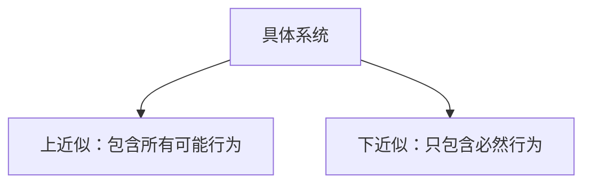

# PRISM 抽象解释

## 介绍

抽象解释（Abstract Interpretation）是程序分析中的一种理论框架，用于在保证安全性的前提下简化复杂系统的验证。在PRISM中，抽象解释通过将具体状态空间映射到更小的抽象域来加速模型检查，同时提供可证明的近似结果。对于初学者来说，可以将其理解为"用简化的模型代替复杂模型进行计算"的技术。

:::note 为什么需要抽象解释？
当系统状态空间过大时（如10^100状态），精确模型检查会变得不可行。抽象解释通过牺牲部分精度换取可计算性。
:::

## 核心原理

PRISM抽象解释包含两个关键操作：

1. **抽象化（Abstraction）**：将具体状态转换为抽象表示
2. **具体化（Concretization）**：将抽象结果解释回具体域


## PRISM 中的实现

PRISM通过以下步骤实现抽象解释：

1. 定义状态变量的抽象域
2. 构建抽象转移关系
3. 在抽象模型上执行属性验证

### 示例：温度控制系统抽象

假设我们有一个温度控制器，具体温度范围是0-100℃。我们可以将其抽象为三个区间：

```prism
// 具体模型
module TemperatureController
    temp : [0..100] init 50;
    [] temp < 50 -> (temp' = temp + 1);
    [] temp > 50 -> (temp' = temp - 1);
endmodule

// 抽象模型
abstract module AbstractTemperature
    temp : {low, normal, high} init normal;
    [] temp = low -> (temp' = normal);
    [] temp = high -> (temp' = normal);
    [] temp = normal -> 0.5:(temp' = low) + 0.5:(temp' = high);
endmodule
```

## 抽象精度控制

PRISM支持不同抽象精度级别：

1. **区间抽象**：将连续值映射为区间（如[0,50], [51,100]）
2. **谓词抽象**：使用布尔谓词描述状态（如temp > threshold）
3. **多面体抽象**：使用线性不等式描述关系

:::tip 精度选择建议
- 简单属性：使用区间抽象足够
- 复杂关系：考虑谓词或多面体抽象
:::

## 实际案例：网络协议验证

验证一个重传协议的正确性，具体模型可能有无限状态（因理论上可无限重传）。通过抽象解释：

1. 将重传次数抽象为：`{none, few, many}`
2. 定义抽象转移：
   ```prism
   [] state=working & retrans=few -> 0.9:(state'=done) + 0.1:(retrans'=many);
   [] state=working & retrans=many -> 0.1:(state'=done) + 0.9:(state'=failed);
   ```
3. 验证抽象模型上的属性：`P>=0.95 [ F state=done ]`

## 验证结果解释

抽象解释提供两种结果保证：

1. **上近似（Over-approximation）**：结果可能包含假阳性
   - 如果抽象模型满足属性，具体系统一定满足
2. **下近似（Under-approximation）**：结果可能包含假阴性
   - 如果抽象模型不满足属性，具体系统一定不满足



## 总结与练习

### 关键点总结
- 抽象解释通过简化模型加速验证
- PRISM支持多种抽象技术
- 结果需要根据近似类型谨慎解释

### 练习建议
1. 尝试将以下具体模型抽象为3个状态：
   ```prism
   module Battery
       level : [0..100] init 100;
       [] level > 0 -> (level' = level - 10);
   endmodule
   ```
2. 在抽象模型上验证属性："最终电量不会低于20%"

### 扩展阅读
- PRISM手册中"Abstraction Techniques"章节
- 《Abstract Interpretation in Probabilistic Systems》学术论文