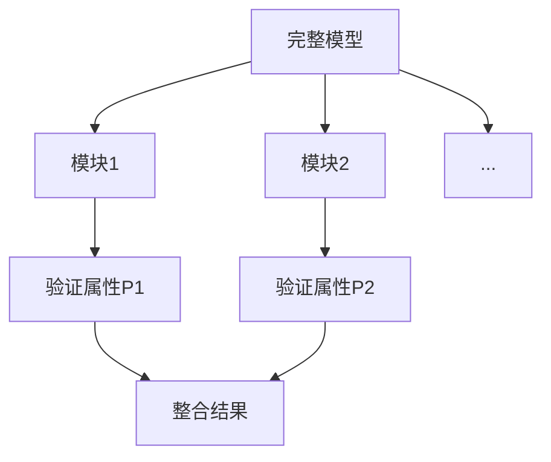

# PRISM 增量验证

## 介绍
增量验证（Incremental Verification）是PRISM中用于高效分析大型或复杂模型的技术。其核心思想是将验证过程分解为多个阶段，逐步验证系统属性，避免一次性处理全部状态空间带来的性能问题。对于初学者，理解这一技术能显著提升处理实际问题的能力。

:::note 为什么需要增量验证？
当模型状态空间过大时，直接验证可能导致内存不足或计算时间过长。增量验证通过"分而治之"的策略解决这一问题。
:::

## 基本原理
PRISM增量验证通常分为以下步骤：
1. **模型分割**：将完整模型划分为多个逻辑模块
2. **阶段验证**：按顺序验证各模块属性
3. **结果整合**：组合各阶段结果得到最终结论



## 代码示例
以下展示如何在PRISM中使用增量验证：

```prism
// 模块1定义 (module1.sm)
module Mod1
    x : [0..5] init 0;
    [act] x < 5 -> (x'=x+1);
endmodule

// 验证属性 (props.csl)
const int K;
P=? [ F x=K ]
```

分阶段验证步骤：
1. 首先验证K=1时的属性
```bash
prism module1.sm props.csl -const K=1
```
2. 然后逐步增加K值
```bash
prism module1.sm props.csl -const K=2
```

## 实际应用案例
**物联网设备网络验证**：
假设需要验证"至少90%的设备能在5分钟内完成固件更新"：
1. 先验证单个设备的更新概率
2. 逐步增加设备数量，验证群体属性
3. 组合结果得出整体结论

:::tip 实践建议
对于复杂系统，可以先验证简化模型，再逐步添加细节：
1. 验证核心功能模块
2. 添加辅助组件
3. 最终验证完整系统
:::

## 常见问题解决
遇到验证失败时：
1. **缩小范围**：减少同时验证的模块数量
2. **调整精度**：修改PRISM的数值计算参数
   ```prism
   // 在命令行添加
   -epsilon 1e-6 -maxiters 100000
   ```
3. **使用近似**：对非关键属性采用统计验证

## 总结
PRISM增量验证通过以下方式提升验证效率：
- 降低单次验证的计算复杂度
- 允许并行处理不同模块
- 提供中间调试机会

## 延伸学习
推荐练习：
1. 对3状态模型手动实现增量验证
2. 比较增量与非增量验证的内存使用差异
3. 尝试用组合属性验证多个模块

进阶资源：
- PRISM手册第8章"大型模型验证策略"
- 学术论文《Incremental Probabilistic Model Checking》