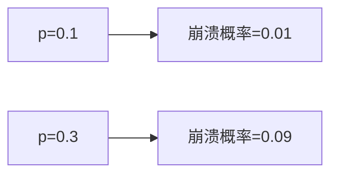

# PRISM 参数化马尔可夫模型

## 介绍

参数化马尔可夫模型（Parametric Markov Models）是PRISM工具中的一项高级技术，允许用户通过**符号化参数**定义概率或速率，而非固定数值。这种模型特别适用于分析系统行为对参数的依赖性，例如研究“故障概率如何影响系统可靠性”。

与传统的马尔可夫模型不同，参数化模型通过代数表达式（如 `p`、`q`）表示转移概率，PRISM会自动推导这些参数的约束条件，并支持参数化验证（如“最大故障概率不超过多少时系统满足需求”）。

:::tip 适用场景
- 系统参数未知或需探索不同配置时
- 分析概率/速率变化对系统的影响
- 避免为每个参数值重复建模
:::

---

## 核心概念

### 1. 参数定义
在PRISM模型中，参数通过 `const` 关键字声明，并赋予符号名称（如 `const double p;`）。参数范围可通过 `where` 子句约束（如 `where p >= 0 & p <= 1`）。

**示例：定义参数化概率**
```prism
const double p; // 故障概率参数
where p >= 0 & p <= 1; // 约束条件

module System
    state: [0..1] init 0;
    [action] state=0 -> p : (state'=1) + (1-p) : (state'=0);
endmodule
```

### 2. 参数化验证
PRISM支持对参数化模型进行以下分析：
- **参数扫描**：计算属性（如“系统可靠性”）随参数变化的曲线。
- **参数合成**：自动寻找满足属性的参数值范围。

**示例：验证“最终状态为1的概率”**
```prism
P=? [ F state=1 ] // 结果将表示为p的函数
```

---

## 实际案例：容错系统分析

### 场景描述
假设一个容错系统包含两个冗余组件，每个组件独立失效的概率为 `p`。系统仅在两个组件均失效时崩溃。

### PRISM 模型
```prism
const double p; // 组件失效概率
where p >= 0 & p <= 0.5; // 假设失效概率不超过50%

module Component1
    state1: [0..1] init 0; // 0=运行, 1=失效
    [fail] state1=0 -> p : (state1'=1) + (1-p) : (state1'=0);
endmodule

module Component2
    state2: [0..1] init 0;
    [fail] state2=0 -> p : (state2'=1) + (1-p) : (state2'=0);
endmodule

// 系统崩溃条件
label "system_failed" = state1=1 & state2=1;
```

### 验证问题
计算系统在100步内崩溃的概率上限：
```prism
Pmax=? [ F<=100 "system_failed" ]
```

:::note 输出结果
PRISM会返回一个关于 `p` 的表达式，例如 `p^2`。通过参数扫描，可绘制崩溃概率随 `p` 变化的曲线：

:::

---

## 进阶技巧

### 1. 多参数交互
定义多个参数并分析其关系：
```prism
const double p1; const double p2;
where p1 + p2 <= 1;

module Interaction
    s: [0..2] init 0;
    [step] s=0 -> p1:(s'=1) + p2:(s'=2) + (1-p1-p2):(s'=0);
endmodule
```

### 2. 参数约束求解
使用PRISM的 `-param` 选项进行参数合成：
```bash
prism model.prism props.props -prop 1 -param 'p<=0.1:0.01,p2>=0.5'
```

---

## 总结

参数化马尔可夫模型通过符号化表示概率/速率，显著提升了建模灵活性。关键要点：
1. 使用 `const` 定义参数，`where` 约束范围。
2. 验证结果可以是参数的函数或数值范围。
3. 适用于灵敏度分析、参数优化等场景。

**练习建议**：
1. 修改容错系统案例，增加第三个组件并重新计算崩溃概率。
2. 尝试用 `Pmin` 和 `Pmax` 比较参数边界的影响。

---

## 扩展资源
- PRISM官方文档：[参数化模型章节](https://www.prismmodelchecker.org/manual/ParametricModels)
- 《Principles of Model Checking》第10章（MIT Press）