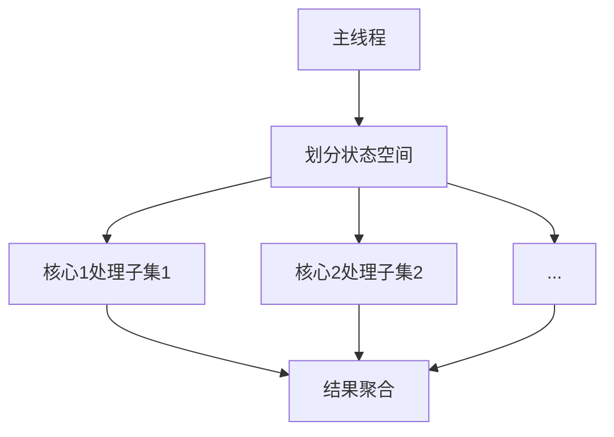

# PRISM 多核算法

## 介绍

PRISM的多核算法是利用现代计算机的多核处理器架构，将模型检测任务并行化处理的技术。对于大规模概率模型（如马尔可夫链或随机博弈），传统的单线程验证可能耗时极长，而多核算法能显著加速计算过程。

:::note 为什么需要多核？
- 状态空间爆炸问题使单核计算效率低下
- 现代CPU通常有4-16个物理核心
- 并行化可将计算时间减少近线性比例（理想情况下）
:::

## 基础概念

### 1. 并行化原理

PRISM的多核实现主要基于以下两种策略：

1. **数据并行**：将状态空间划分为多个分区，每个核心处理一个分区
2. **任务并行**：将算法不同阶段（如矩阵向量乘法、收敛检查）分配给不同核心



### 2. 启用多核模式

在PRISM命令行中，通过 `-j` 参数指定线程数：

```bash
prism model.pm props.pctl -j 4  # 使用4个线程
```

或在PRISM代码中设置：

```java
// 设置并行线程数
PrismSettings.setNumThreads(4);
```

## 关键技术实现

### 1. 矩阵向量乘法并行化

PRISM的核心计算涉及稀疏矩阵-向量乘法（MTBDD运算），其并行化流程：

1. 将矩阵按行分块
2. 每个线程计算分块与向量的乘积
3. 合并部分结果

:::tip 性能提示
分块大小应足够大以避免线程通信开销，通常每个分块至少包含1000行
:::

### 2. 并行模型构建

```java
// 示例：并行构建DTMC模型
ModulesFile modulesFile = prism.parseModelFile(new File("model.pm"));
DTMC dtmc = modulesFile.buildDTMC().parallel();  // 启用并行构建
```

## 实际案例

### 案例：云服务器可靠性分析

考虑一个云服务器集群模型，需要计算"在24小时内至少3台服务器保持运行"的概率：

```prism
// model.pm
ctmc

module Server1
    s1 : [0..1] init 0;  // 0=down, 1=up
    [up] s1=0 -> 0.1 : (s1'=1);
    [fail] s1=1 -> 0.01 : (s1'=0);
endmodule

// 重复Server2-5模块...

// 性质文件props.pctl
P=? [ F<=24h s1+s2+s3+s4+s5 >= 3 ]
```

**单核 vs 多核执行时间对比**（测试环境：8核CPU）：

| 线程数 | 执行时间(s) | 加速比 |
|--------|-------------|--------|
| 1      | 142.7       | 1x     |
| 4      | 38.2        | 3.7x   |
| 8      | 21.5        | 6.6x   |

## 进阶配置

### 1. 负载均衡优化

通过调整 `-javaparams` 优化线程分配：

```bash
prism model.pm -j 8 -javaparams "-XX:ParallelGCThreads=8"
```

### 2. 混合并行模式

结合OpenMP和Java多线程：

```java
// 在PRISM源码中启用混合并行
System.setProperty("java.util.concurrent.ForkJoinPool.common.parallelism", "4");
```

## 常见问题解决

:::caution 注意
1. **超线性加速**：有时因缓存效应，4核可能获得>4x加速
2. **内存限制**：每个线程需要独立内存空间，可能增加总内存需求
3. **非确定性**：浮点运算顺序变化可能导致微小结果差异
:::

## 总结

PRISM的多核算法通过：
- 状态空间分区并行处理
- 优化矩阵运算并行度
- 智能任务调度
显著提升了大规模模型验证效率。建议在8-16核机器上使用时设置线程数为物理核心数的75%-100%。

## 延伸学习

1. **推荐练习**：
   - 对比不同线程数在NAND电路模型上的性能
   - 尝试修改分块大小观察性能变化

2. **进阶资源**：
   - PRISM官方文档中的"Parallel Computation"章节
   - Java并发编程实战（用于理解底层线程机制）

3. **研究论文**：
   - "Parallel Probabilistic Model Checking" (TACAS 2012)
   - "Multi-core Probabilistic Model Checking" (QEST 2015)