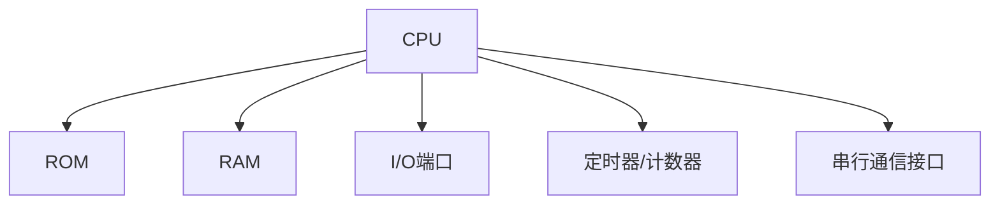

# 51单片机简介

## 什么是51单片机？

51单片机（也称为8051单片机）是一种基于Intel 8051架构的8位微控制器。它由Intel公司于1980年推出，因其简单易用、成本低廉且功能强大，迅速成为嵌入式系统开发中的主流选择。51单片机广泛应用于工业控制、家用电器、汽车电子等领域。

51单片机的核心特点包括：
- **8位CPU**：处理8位数据。
- **4KB ROM**：用于存储程序代码。
- **128B RAM**：用于存储临时数据。
- **32个I/O引脚**：用于与外部设备通信。
- **定时器/计数器**：用于时间控制和事件计数。
- **串行通信接口**：支持UART通信。

:::tip
51单片机的“51”来源于其最初的型号8051，后续的兼容型号（如AT89C51、STC89C52等）都遵循相同的架构。
:::

## 51单片机的架构

51单片机的核心架构包括以下几个部分：

1. **CPU（中央处理器）**：负责执行指令和处理数据。
2. **存储器**：
   - **ROM（只读存储器）**：存储程序代码。
   - **RAM（随机存取存储器）**：存储运行时数据。
3. **I/O端口**：用于与外部设备通信。
4. **定时器/计数器**：用于精确计时和事件计数。
5. **串行通信接口**：支持与其他设备的数据交换。

以下是一个简单的51单片机架构图：



## 51单片机的编程

51单片机的编程通常使用C语言或汇编语言。以下是一个简单的C语言程序示例，用于点亮连接到P1.0引脚的LED灯：

```c
#include <reg51.h> // 包含51单片机的寄存器定义

void main() {
    while (1) { // 无限循环
        P1 = 0xFE; // 将P1.0置低，点亮LED
    }
}
```

### 代码解析
- `#include <reg51.h>`：引入51单片机的寄存器定义文件。
- `P1 = 0xFE;`：将P1端口的第0位设置为低电平（0），其余位设置为高电平（1），从而点亮连接到P1.0的LED。

:::note
在实际开发中，通常需要根据具体的硬件电路调整代码。例如，如果LED连接到P2.3引脚，则需要修改代码为 `P2 = 0xF7;`。
:::

## 实际应用场景

51单片机广泛应用于以下领域：
1. **家用电器**：如洗衣机、微波炉的控制系统。
2. **工业控制**：如PLC（可编程逻辑控制器）中的核心控制器。
3. **汽车电子**：如车载音响、空调控制系统。
4. **智能设备**：如智能门锁、温湿度传感器。

以下是一个简单的温湿度监控系统的示例：

```c
#include <reg51.h>
#include <stdio.h>

sbit DHT11 = P3^2; // 温湿度传感器连接到P3.2引脚

void readDHT11() {
    // 读取温湿度数据的代码
}

void main() {
    while (1) {
        readDHT11(); // 读取温湿度数据
        // 处理并显示数据
    }
}
```

:::caution
在实际开发中，温湿度传感器的读取需要遵循特定的通信协议，代码实现可能较为复杂。
:::

## 总结

51单片机是一种功能强大且易于学习的微控制器，适合初学者入门嵌入式开发。通过本文，您已经了解了51单片机的基本概念、架构、编程方法以及实际应用场景。接下来，您可以尝试编写更多代码，探索51单片机的更多功能。

## 附加资源与练习

1. **推荐资源**：
   - 《51单片机C语言程序设计》——一本适合初学者的经典教材。
   - [8051单片机教程](https://www.8051projects.net/)——在线学习资源。
2. **练习**：
   - 编写一个程序，控制8个LED灯依次点亮。
   - 尝试使用定时器实现1秒的延时功能。

祝您学习愉快！