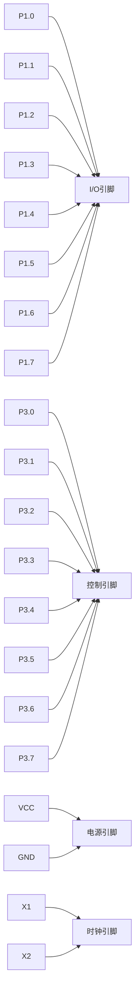

## 介绍

51单片机（如AT89C51）是一种广泛使用的8位微控制器，因其简单易用、成本低廉而深受初学者和工程师的喜爱。要充分利用51单片机，首先需要了解其引脚图及其功能。引脚是单片机与外部设备进行通信的桥梁，掌握引脚的功能是学习单片机编程的基础。

本文将详细介绍51单片机的引脚图，包括每个引脚的功能、用途以及实际应用场景。

## 51单片机引脚图

51单片机通常有40个引脚，分为四类：电源引脚、时钟引脚、控制引脚和I/O引脚。以下是51单片机的引脚图及其功能说明：



### 1. 电源引脚
- **VCC（40引脚）**：接电源正极，通常为+5V。
- **GND（20引脚）**：接地，接电源负极。

:::tip
确保电源引脚连接正确，否则单片机无法正常工作。
:::

### 2. 时钟引脚
- **X1（18引脚）**：接外部晶振的一个引脚。
- **X2（19引脚）**：接外部晶振的另一个引脚。

:::note
时钟引脚用于提供单片机的工作时钟信号，通常使用11.0592MHz或12MHz的晶振。
:::

### 3. 控制引脚
- **RST（9引脚）**：复位引脚，高电平时复位单片机。
- **EA/VPP（31引脚）**：外部访问使能引脚，高电平时从内部程序存储器执行程序，低电平时从外部程序存储器执行程序。
- **ALE/PROG（30引脚）**：地址锁存使能引脚，用于外部存储器访问时锁存地址。
- **PSEN（29引脚）**：程序存储使能引脚，用于外部程序存储器的读取。

### 4. I/O引脚
- **P0（32-39引脚）**：8位双向I/O端口，开漏输出，需外接上拉电阻。
- **P1（1-8引脚）**：8位双向I/O端口，内部带上拉电阻。
- **P2（21-28引脚）**：8位双向I/O端口，内部带上拉电阻。
- **P3（10-17引脚）**：8位双向I/O端口，内部带上拉电阻，部分引脚具有第二功能。

:::caution
P0端口在使用时需要外接上拉电阻，否则无法正常输出高电平。
:::

## 实际应用案例

### 案例1：LED闪烁
以下是一个简单的LED闪烁程序，使用P1.0引脚控制LED的亮灭。

```c
#include <reg51.h>

void delay(unsigned int time) {
    unsigned int i, j;
    for(i = 0; i < time; i++)
        for(j = 0; j < 120; j++);
}

void main() {
    while(1) {
        P1_0 = 0;  // LED亮
        delay(1000);
        P1_0 = 1;  // LED灭
        delay(1000);
    }
}
```

**输入**：无<br />
**输出**：P1.0引脚上的LED以1秒间隔闪烁。

### 案例2：按键控制LED
以下是一个按键控制LED的程序，使用P3.2引脚检测按键状态，控制P1.0引脚上的LED。

```c
#include <reg51.h>

void main() {
    while(1) {
        if(P3_2 == 0) {  // 按键按下
            P1_0 = 0;  // LED亮
        } else {
            P1_0 = 1;  // LED灭
        }
    }
}
```

**输入**：P3.2引脚上的按键状态<br />
**输出**：P1.0引脚上的LED根据按键状态亮灭。

## 总结

通过本文，您已经了解了51单片机的引脚图及其功能。掌握引脚的功能是学习单片机编程的基础，希望本文能帮助您更好地理解和使用51单片机。

## 附加资源与练习

1. **练习1**：尝试修改LED闪烁程序，使LED以不同的频率闪烁。
2. **练习2**：设计一个程序，使用P2端口控制8个LED，实现流水灯效果。
3. **资源**：查阅51单片机的数据手册，了解更多关于引脚功能的详细信息。

:::warning
在进行实验时，务必注意电源和引脚的连接，避免短路或损坏单片机。
:::