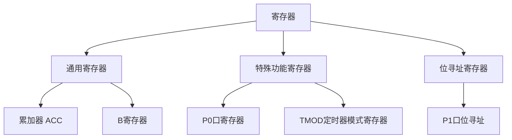

## 介绍

在51单片机编程中，寄存器是一个非常重要的概念。寄存器是单片机内部用于存储数据、控制硬件操作的存储单元。通过操作寄存器，我们可以直接控制单片机的各种功能，例如输入输出、定时器、串口通信等。理解寄存器的使用是掌握51单片机编程的基础。

## 寄存器的分类

51单片机的寄存器可以分为以下几类：

1. **通用寄存器**：用于存储临时数据，例如累加器（ACC）、B寄存器等。
2. **特殊功能寄存器（SFR）**：用于控制单片机的特定功能，例如定时器、串口、中断等。
3. **位寻址寄存器**：某些寄存器可以按位操作，方便对单个位进行控制。

### 通用寄存器

通用寄存器是单片机中最常用的寄存器之一。例如，累加器（ACC）用于存储算术运算的结果，B寄存器用于存储乘法和除法运算的辅助数据。

```c
unsigned char a = 10;
unsigned char b = 20;
unsigned char result;

result = a + b;  // 使用累加器（ACC）进行加法运算
```

### 特殊功能寄存器（SFR）

特殊功能寄存器用于控制单片机的硬件功能。例如，`P0`寄存器用于控制P0口的输入输出状态，`TMOD`寄存器用于配置定时器的工作模式。

```c
P0 = 0xFF;  // 将P0口设置为高电平
TMOD = 0x01;  // 配置定时器0为模式1
```

### 位寻址寄存器

某些寄存器支持位寻址操作，例如`P1`寄存器。通过位寻址，我们可以单独控制某个引脚的状态。

```c
P1_0 = 1;  // 将P1口的第0位设置为高电平
P1_1 = 0;  // 将P1口的第1位设置为低电平
```

## 寄存器的实际应用

### 控制LED灯

假设我们使用P1口控制8个LED灯，通过操作`P1`寄存器，我们可以轻松控制每个LED的亮灭状态。

```c
P1 = 0x55;  // 将P1口设置为01010101，LED灯交替亮灭
```

### 定时器配置

通过配置`TMOD`和`TH0`、`TL0`寄存器，我们可以实现定时器功能。例如，配置定时器0为模式1，并设置定时时间为50ms。

```c
TMOD = 0x01;  // 配置定时器0为模式1
TH0 = 0x3C;   // 设置定时器高字节
TL0 = 0xB0;   // 设置定时器低字节
TR0 = 1;      // 启动定时器0
```

## 总结

寄存器是51单片机编程中的核心概念，掌握寄存器的使用可以帮助我们更好地控制单片机的硬件功能。通过本文的学习，你应该已经了解了寄存器的基本分类、使用方法以及实际应用场景。

:::tip 提示
在实际编程中，建议多查阅单片机的数据手册，了解每个寄存器的具体功能和配置方法。
:::

## 附加资源与练习

1. **练习**：尝试编写一个程序，使用定时器控制LED灯的闪烁频率。
2. **资源**：查阅51单片机的数据手册，了解更多关于寄存器的详细信息。
3. **进阶**：学习如何使用中断寄存器（IE、IP）实现中断功能。



通过以上内容的学习，你应该对51单片机的寄存器有了更深入的理解。继续实践和探索，你将能够更好地掌握单片机的编程技巧。