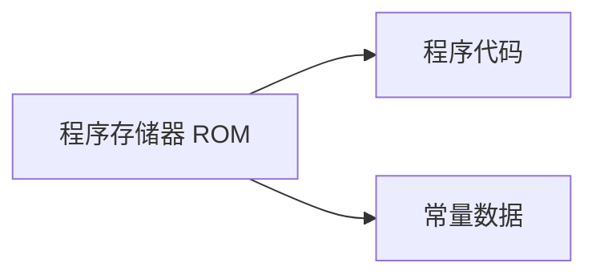
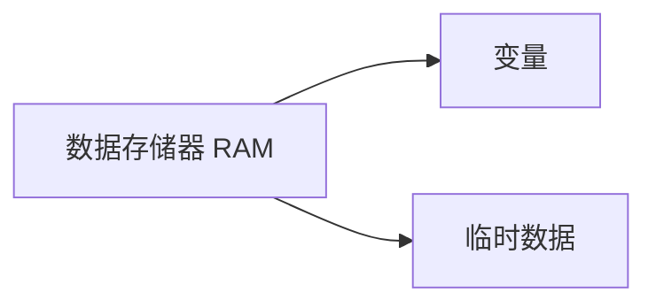
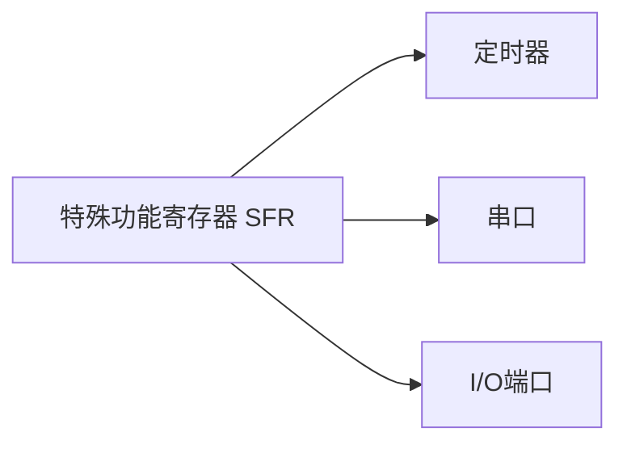

# 51单片机内存组织

51单片机是一种广泛使用的8位微控制器，其内存组织是理解其工作原理的关键。本文将详细介绍51单片机的内存结构，包括程序存储器（ROM）、数据存储器（RAM）和特殊功能寄存器（SFR），并通过实际案例帮助初学者更好地掌握这些概念。

## 1. 内存结构概述

51单片机的内存分为三个主要部分：

1. **程序存储器（ROM）**：用于存储程序代码和常量数据。
2. **数据存储器（RAM）**：用于存储程序运行时的变量和临时数据。
3. **特殊功能寄存器（SFR）**：用于控制和配置单片机的各种功能模块。

### 1.1 程序存储器（ROM）

程序存储器是只读存储器，用于存储程序代码和常量数据。51单片机的程序存储器通常为4KB到64KB不等，具体取决于型号。



### 1.2 数据存储器（RAM）

数据存储器是随机存取存储器，用于存储程序运行时的变量和临时数据。51单片机的数据存储器通常为128字节到256字节不等。



### 1.3 特殊功能寄存器（SFR）

特殊功能寄存器用于控制和配置单片机的各种功能模块，如定时器、串口、I/O端口等。每个SFR都有特定的地址和功能。



## 2. 程序存储器（ROM）详解

程序存储器用于存储程序代码和常量数据。51单片机的程序存储器通常为4KB到64KB不等，具体取决于型号。程序存储器的地址空间从0x0000到0xFFFF。

### 2.1 程序代码存储

程序代码是单片机执行的主要指令集。这些指令通常由编译器生成，并存储在程序存储器中。

```c
#include <reg51.h>

void main() {
    P1 = 0xFF;  // 将P1端口设置为高电平
    while(1);   // 无限循环
}
```

### 2.2 常量数据存储

常量数据是指在程序运行期间不会改变的数据，如字符串、表格等。这些数据通常存储在程序存储器中。

```c
const unsigned char table[] = {0x01, 0x02, 0x03, 0x04};
```

## 3. 数据存储器（RAM）详解

数据存储器用于存储程序运行时的变量和临时数据。51单片机的数据存储器通常为128字节到256字节不等。

### 3.1 变量存储

变量是程序运行期间可以改变的数据。这些数据存储在数据存储器中。

```c
unsigned char count = 0;
```

### 3.2 临时数据存储

临时数据是指在程序运行期间临时使用的数据，如函数参数、局部变量等。这些数据也存储在数据存储器中。

```c
void delay(unsigned int ms) {
    unsigned int i, j;
    for(i = 0; i < ms; i++)
        for(j = 0; j < 120; j++);
}
```

## 4. 特殊功能寄存器（SFR）详解

特殊功能寄存器用于控制和配置单片机的各种功能模块。每个SFR都有特定的地址和功能。

### 4.1 定时器控制寄存器

定时器控制寄存器用于配置和控制定时器的运行。

```c
TMOD = 0x01;  // 设置定时器0为模式1
TH0 = 0xFC;   // 设置定时器0的高字节
TL0 = 0x18;   // 设置定时器0的低字节
TR0 = 1;      // 启动定时器0
```

### 4.2 串口控制寄存器

串口控制寄存器用于配置和控制串口的通信。

```c
SCON = 0x50;  // 设置串口为模式1
PCON = 0x80;  // 设置波特率加倍
```

### 4.3 I/O端口控制寄存器

I/O端口控制寄存器用于配置和控制I/O端口的状态。

```c
P1 = 0x0F;  // 设置P1端口的低4位为高电平
```

## 5. 实际案例

### 5.1 使用定时器实现LED闪烁

以下代码展示了如何使用定时器实现LED的闪烁。

```c
#include <reg51.h>

void Timer0_Init() {
    TMOD = 0x01;  // 设置定时器0为模式1
    TH0 = 0xFC;   // 设置定时器0的高字节
    TL0 = 0x18;   // 设置定时器0的低字节
    TR0 = 1;      // 启动定时器0
}

void main() {
    Timer0_Init();
    while(1) {
        if(TF0 == 1) {  // 检查定时器0溢出标志
            TF0 = 0;    // 清除溢出标志
            TH0 = 0xFC;  // 重新加载定时器0的高字节
            TL0 = 0x18;  // 重新加载定时器0的低字节
            P1 = ~P1;    // 翻转P1端口的状态
        }
    }
}
```

### 5.2 使用串口发送数据

以下代码展示了如何使用串口发送数据。

```c
#include <reg51.h>

void UART_Init() {
    SCON = 0x50;  // 设置串口为模式1
    PCON = 0x80;  // 设置波特率加倍
    TMOD = 0x20;  // 设置定时器1为模式2
    TH1 = 0xFD;   // 设置波特率为9600
    TL1 = 0xFD;
    TR1 = 1;      // 启动定时器1
    ES = 1;       // 使能串口中断
    EA = 1;       // 使能全局中断
}

void UART_Send(unsigned char dat) {
    SBUF = dat;   // 发送数据
    while(TI == 0);  // 等待发送完成
    TI = 0;       // 清除发送标志
}

void main() {
    UART_Init();
    UART_Send('A');  // 发送字符'A'
    while(1);
}
```

## 6. 总结

51单片机的内存组织是其工作原理的核心。通过理解程序存储器、数据存储器和特殊功能寄存器的结构和功能，初学者可以更好地掌握51单片机的编程和应用。

## 7. 附加资源与练习

- **附加资源**：
  - [51单片机数据手册](https://www.example.com)
  - [51单片机编程指南](https://www.example.com)

- **练习**：
  1. 编写一个程序，使用定时器实现LED的闪烁。
  2. 编写一个程序，使用串口发送字符串“Hello World!”。
  3. 修改程序，使用不同的波特率发送数据。

:::tip
建议初学者在完成每个练习后，尝试修改代码并观察结果，以加深对51单片机内存组织的理解。
:::