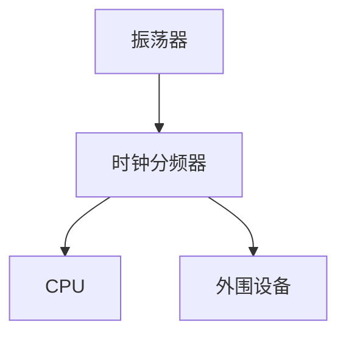

# 51单片机时钟系统

## 介绍

51单片机的时钟系统是其核心组成部分之一，它为单片机提供了精确的时间基准，确保程序的执行和外围设备的操作能够按照预期进行。时钟系统决定了单片机的工作频率，进而影响其性能和功耗。理解时钟系统的工作原理对于编写高效、稳定的程序至关重要。

## 时钟系统的基本概念

51单片机的时钟系统主要由以下几个部分组成：

1. **振荡器**：产生时钟信号，通常使用晶体振荡器或陶瓷谐振器。
2. **时钟分频器**：将振荡器产生的时钟信号分频，以提供不同的工作频率。
3. **时钟控制寄存器**：用于配置时钟系统的各种参数。

### 振荡器

振荡器是时钟系统的核心，它产生一个稳定的时钟信号。51单片机通常使用外部晶体振荡器或陶瓷谐振器来提供时钟信号。振荡器的频率决定了单片机的工作频率。

```c
// 示例：使用12MHz晶体振荡器
#define FOSC 12000000UL
```

### 时钟分频器

时钟分频器用于将振荡器产生的时钟信号分频，以提供不同的工作频率。51单片机的时钟分频器通常由时钟控制寄存器配置。

```c
// 示例：配置时钟分频器
SCON = 0x50; // 设置串口波特率
```

### 时钟控制寄存器

时钟控制寄存器用于配置时钟系统的各种参数，如分频系数、时钟源选择等。通过配置这些寄存器，可以灵活地调整单片机的工作频率。

```c
// 示例：配置时钟控制寄存器
PCON |= 0x80; // 设置SMOD位，提高波特率
```

## 时钟系统的工作原理

51单片机的时钟系统通过振荡器产生时钟信号，然后通过时钟分频器将信号分频，最终提供给CPU和外围设备使用。时钟信号的频率决定了单片机的工作速度。



## 实际应用案例

### 案例1：定时器配置

在51单片机中，定时器的精度直接依赖于时钟系统的配置。通过合理配置时钟系统，可以实现高精度的定时功能。

```c
// 示例：配置定时器
TMOD = 0x01; // 设置定时器0为模式1
TH0 = 0xFC;  // 设置定时器初值
TL0 = 0x18;
TR0 = 1;     // 启动定时器
```

### 案例2：串口通信

串口通信的波特率也依赖于时钟系统的配置。通过调整时钟分频器，可以实现不同的波特率。

```c
// 示例：配置串口波特率
SCON = 0x50; // 设置串口模式1
TH1 = 0xFD;  // 设置波特率9600
TL1 = 0xFD;
TR1 = 1;     // 启动定时器1
```

## 总结

51单片机的时钟系统是其核心组成部分之一，理解其工作原理和配置方法对于编写高效、稳定的程序至关重要。通过合理配置振荡器、时钟分频器和时钟控制寄存器，可以实现不同的工作频率和功能。

## 附加资源与练习

- **练习1**：尝试配置51单片机的时钟系统，使其工作在12MHz频率下，并编写一个简单的LED闪烁程序。
- **练习2**：使用定时器功能，编写一个精确的1秒延时程序。
- **附加资源**：参考51单片机的数据手册，了解更多关于时钟系统的详细信息。

:::tip
在实际项目中，合理配置时钟系统可以显著提高单片机的性能和稳定性。建议在项目初期就仔细规划时钟系统的配置。
:::