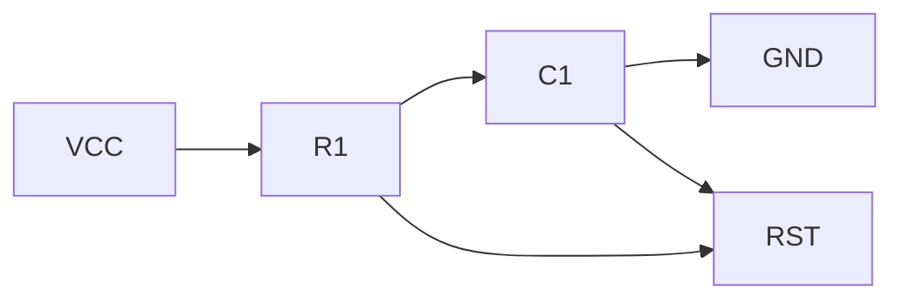
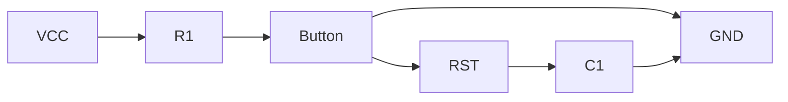

## 介绍

在51单片机的设计中，复位电路是一个至关重要的部分。复位电路的作用是在系统上电或出现异常时，将单片机恢复到初始状态，确保程序能够从头开始执行。如果没有复位电路，单片机可能会在启动时进入不确定的状态，导致程序无法正常运行。

## 复位电路的基本原理

复位电路的核心功能是提供一个稳定的复位信号，通常是一个低电平脉冲。当复位信号有效时，单片机的内部寄存器会被重置为默认值，程序计数器（PC）会被设置为0，程序从起始地址开始执行。

### 复位信号的时序要求

51单片机的复位信号需要满足一定的时序要求。通常，复位信号的低电平持续时间需要至少保持24个时钟周期以上，以确保单片机能够正确复位。如果复位信号持续时间不足，可能会导致复位不完全，程序无法正常启动。

## 常见的复位电路设计

### 1. 上电复位电路

上电复位电路是最简单的复位电路之一。它利用电容和电阻的充放电特性，在上电时产生一个短暂的低电平信号，从而实现复位功能。



在上图中，`VCC`是电源电压，`R1`是电阻，`C1`是电容，`RST`是复位引脚。当电源上电时，电容`C1`开始充电，复位引脚`RST`会保持一段时间的低电平，直到电容充电完成，复位信号变为高电平。

### 2. 手动复位电路

手动复位电路允许用户通过按下按钮来手动复位单片机。这种电路通常由一个按钮、一个电阻和一个电容组成。



当按钮按下时，复位引脚`RST`会被拉低，单片机进入复位状态。松开按钮后，电容`C1`会逐渐充电，复位信号恢复为高电平。

## 实际应用案例

### 案例1：智能家居控制系统

在一个智能家居控制系统中，51单片机负责控制灯光、窗帘和温度等设备。如果系统在运行过程中出现异常，比如程序跑飞或死机，手动复位电路可以快速将系统恢复到初始状态，确保家居设备能够正常工作。

### 案例2：工业自动化设备

在工业自动化设备中，51单片机通常用于控制电机、传感器和执行器。上电复位电路可以确保设备在每次启动时都能从初始状态开始运行，避免因上次运行状态残留而导致的问题。

## 代码示例

以下是一个简单的51单片机程序，展示了如何使用复位电路。当单片机复位后，程序会从`main`函数开始执行，点亮一个LED灯。

```c
#include <reg51.h>

sbit LED = P1^0;  // 定义LED连接到P1.0引脚

void main() {
    LED = 0;  // 点亮LED
    while(1) {
        // 主循环
    }
}
```

在这个例子中，当单片机复位后，`main`函数会被执行，LED灯会被点亮。如果复位电路工作正常，每次复位后LED灯都会重新点亮。

## 总结

复位电路是51单片机设计中不可或缺的一部分，它确保了系统在上电或出现异常时能够恢复到初始状态。通过合理设计复位电路，可以提高系统的稳定性和可靠性。本文介绍了上电复位电路和手动复位电路的设计方法，并通过实际案例展示了复位电路的应用场景。

## 附加资源与练习

- **练习1**：尝试设计一个包含上电复位和手动复位功能的电路，并使用51单片机进行测试。
- **练习2**：编写一个程序，在复位后通过串口发送一条消息，验证复位电路是否正常工作。

通过以上学习和练习，你将能够更好地理解和应用51单片机的复位电路。