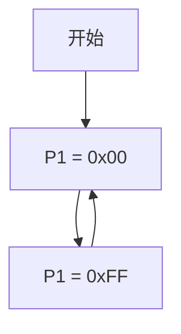

# 51单片机第一个程序

## 介绍

51单片机是一种广泛使用的微控制器，因其简单易学、成本低廉而受到初学者的青睐。在学习51单片机的过程中，编写并运行第一个程序是一个重要的里程碑。本文将带领你从零开始，逐步完成第一个51单片机程序的编写和运行。

## 准备工作

在开始编写程序之前，你需要准备以下工具和环境：

1. **开发环境**：推荐使用Keil uVision，这是一个功能强大的集成开发环境（IDE），支持51单片机的开发和调试。
2. **硬件设备**：一块51单片机开发板，如STC89C52RC。
3. **下载工具**：用于将程序烧录到单片机中，如STC-ISP。

## 编写第一个程序

### 1. 创建新项目

首先，打开Keil uVision并创建一个新项目：

1. 点击 `Project` -> `New uVision Project`。
2. 选择一个文件夹并命名你的项目。
3. 在弹出的对话框中选择你的单片机型号，如 `STC89C52RC`。

### 2. 编写代码

在项目中创建一个新的C文件（如 `main.c`），并输入以下代码：

```c
#include <reg52.h>

void main() {
    while(1) {
        P1 = 0x00;  // 将P1口的所有引脚设置为低电平
        P1 = 0xFF;  // 将P1口的所有引脚设置为高电平
    }
}
```

### 3. 代码解释

- `#include <reg52.h>`：包含51单片机的寄存器定义文件。
- `void main()`：主函数，程序的入口点。
- `while(1)`：无限循环，确保程序持续运行。
- `P1 = 0x00;` 和 `P1 = 0xFF;`：分别将P1口的所有引脚设置为低电平和高电平。

### 4. 编译和下载

1. 点击 `Build` 按钮编译代码，确保没有错误。
2. 使用STC-ISP工具将生成的 `.hex` 文件下载到单片机中。

## 实际应用场景

这个简单的程序可以用于控制LED灯的闪烁。假设P1口连接了8个LED灯，程序将不断切换LED灯的状态，使其闪烁。



## 总结

通过本文的学习，你已经成功编写并运行了第一个51单片机程序。这个程序虽然简单，但它为你后续的学习打下了坚实的基础。接下来，你可以尝试修改代码，控制不同的引脚，或者添加更多的功能。

## 附加资源与练习

- **练习1**：修改代码，使LED灯以不同的频率闪烁。
- **练习2**：尝试控制其他端口（如P2口）的LED灯。
- **资源**：参考Keil uVision的官方文档，了解更多高级功能。

:::tip
在学习过程中，遇到问题时不要气馁，多查阅资料和尝试，你会逐渐掌握51单片机的编程技巧。
:::