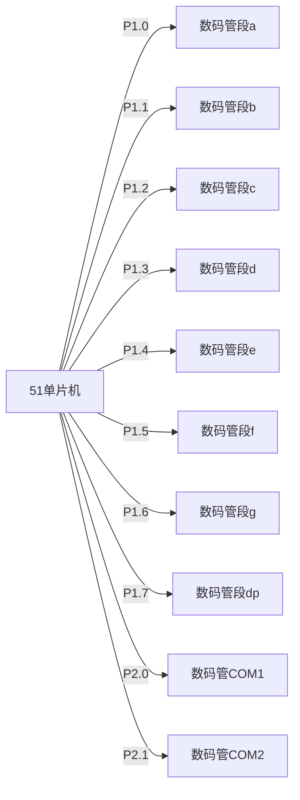

## 介绍

数码管是一种常见的显示设备，广泛应用于电子设备中，用于显示数字、字母或简单的符号。在51单片机中，数码管的控制是通过I/O口实现的。本文将详细介绍如何使用51单片机控制数码管，并展示如何通过编程实现数字和字符的显示。

## 数码管的基本原理

数码管通常由多个发光二极管（LED）组成，每个LED代表数码管的一个段。常见的数码管有7段数码管和8段数码管。7段数码管可以显示数字0-9和一些简单的字母，而8段数码管则多了一个小数点。

数码管分为共阴极和共阳极两种类型：
- **共阴极数码管**：所有LED的阴极连接在一起，通常接地，阳极接高电平时对应的段点亮。
- **共阳极数码管**：所有LED的阳极连接在一起，通常接电源，阴极接低电平时对应的段点亮。

## 51单片机与数码管的连接

在51单片机中，数码管的控制通常通过I/O口实现。每个数码管的段（a-g）连接到单片机的一个I/O口，而数码管的公共端（COM）则通过另一个I/O口控制。

### 示例电路



在这个示例中，P1口用于控制数码管的各个段，P2口用于控制数码管的公共端。

## 数码管的显示控制

为了在数码管上显示特定的数字或字符，我们需要将对应的段点亮或熄灭。通常，我们会使用一个段码表来映射每个数字或字符对应的段码。

### 段码表

以下是一个共阴极数码管的段码表示例：

| 数字 | 段码（a-g） |
|------|-------------|
| 0    | 0x3F        |
| 1    | 0x06        |
| 2    | 0x5B        |
| 3    | 0x4F        |
| 4    | 0x66        |
| 5    | 0x6D        |
| 6    | 0x7D        |
| 7    | 0x07        |
| 8    | 0x7F        |
| 9    | 0x6F        |

### 代码示例

以下是一个简单的代码示例，展示如何在51单片机上显示数字“5”：

```c
#include <reg51.h>

#define DIGIT_5 0x6D  // 数字5的段码

void delay(unsigned int time) {
    unsigned int i, j;
    for(i = 0; i < time; i++)
        for(j = 0; j < 120; j++);
}

void main() {
    while(1) {
        P1 = DIGIT_5;  // 将数字5的段码输出到P1口
        P2 = 0x01;     // 选择第一个数码管
        delay(1000);    // 延时
    }
}
```

在这个示例中，`P1`口输出数字“5”的段码，`P2`口选择第一个数码管进行显示。通过调整`P2`的值，可以选择不同的数码管进行显示。

## 多位数码管的动态显示

在实际应用中，通常需要显示多位数字。由于51单片机的I/O口有限，通常采用动态扫描的方式来实现多位数码管的显示。动态扫描的原理是依次点亮每个数码管，利用人眼的视觉暂留效应，使得多个数码管看起来是同时点亮的。

### 动态显示代码示例

以下是一个动态显示两位数字的代码示例：

```c
#include <reg51.h>

unsigned char code digit[] = {0x3F, 0x06, 0x5B, 0x4F, 0x66, 0x6D, 0x7D, 0x07, 0x7F, 0x6F};  // 0-9的段码

void delay(unsigned int time) {
    unsigned int i, j;
    for(i = 0; i < time; i++)
        for(j = 0; j < 120; j++);
}

void display(unsigned char num1, unsigned char num2) {
    P1 = digit[num1];  // 显示第一个数字
    P2 = 0x01;         // 选择第一个数码管
    delay(10);         // 延时
    P1 = digit[num2];  // 显示第二个数字
    P2 = 0x02;         // 选择第二个数码管
    delay(10);         // 延时
}

void main() {
    while(1) {
        display(1, 2);  // 显示数字“1”和“2”
    }
}
```

在这个示例中，`display`函数依次显示两个数字，并通过延时函数实现动态扫描。

## 实际应用场景

数码管广泛应用于各种电子设备中，如电子钟、温度计、计数器等。以下是一个简单的电子钟应用示例：

```c
#include <reg51.h>

unsigned char code digit[] = {0x3F, 0x06, 0x5B, 0x4F, 0x66, 0x6D, 0x7D, 0x07, 0x7F, 0x6F};  // 0-9的段码

void delay(unsigned int time) {
    unsigned int i, j;
    for(i = 0; i < time; i++)
        for(j = 0; j < 120; j++);
}

void display(unsigned char hour, unsigned char minute) {
    P1 = digit[hour / 10];  // 显示小时的十位
    P2 = 0x01;              // 选择第一个数码管
    delay(10);              // 延时
    P1 = digit[hour % 10];  // 显示小时的个位
    P2 = 0x02;              // 选择第二个数码管
    delay(10);              // 延时
    P1 = digit[minute / 10];  // 显示分钟的十位
    P2 = 0x04;               // 选择第三个数码管
    delay(10);                // 延时
    P1 = digit[minute % 10];  // 显示分钟的个位
    P2 = 0x08;               // 选择第四个数码管
    delay(10);                // 延时
}

void main() {
    unsigned char hour = 12, minute = 34;
    while(1) {
        display(hour, minute);  // 显示时间
    }
}
```

在这个示例中，`display`函数用于显示当前的小时和分钟，模拟了一个简单的电子钟。

## 总结

通过本文的学习，你应该已经掌握了如何在51单片机上使用数码管进行数字和字符的显示。我们介绍了数码管的基本原理、连接方式、段码表的使用以及动态显示的实现方法。通过实际代码示例和应用场景，你可以更好地理解这些概念并将其应用到实际项目中。

## 附加资源与练习

- **练习1**：修改代码，实现一个倒计时器，从99倒计时到00。
- **练习2**：尝试使用4位数码管显示当前温度（假设温度数据已经通过传感器获取）。
- **附加资源**：查阅51单片机的数据手册，了解更多关于I/O口的使用方法。

:::tip
在实际项目中，数码管的显示效果可以通过调整延时时间来优化。较短的延时时间可以提高显示的刷新率，但可能会增加单片机的负担。
:::