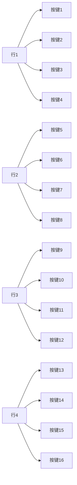

## 介绍

矩阵键盘是一种常见的输入设备，广泛应用于嵌入式系统中。它通过将按键排列成矩阵形式，减少了I/O引脚的使用数量，从而提高了硬件的利用率。在51单片机中，矩阵键盘的扫描与输入是一个基础但重要的操作，掌握这一技能可以帮助你实现更复杂的交互功能。

本文将逐步讲解矩阵键盘的工作原理、扫描方法以及如何在51单片机中实现矩阵键盘的输入检测。

## 矩阵键盘的工作原理

矩阵键盘通常由多行多列的按键组成，按键位于行和列的交叉点。通过扫描行和列的状态，可以确定哪个按键被按下。例如，一个4x4的矩阵键盘有4行和4列，共16个按键。

### 矩阵键盘的连接方式

矩阵键盘的行和列分别连接到单片机的I/O引脚。行通常作为输出，列作为输入。通过逐行输出低电平，并检测列的状态，可以确定按键的位置。



## 矩阵键盘的扫描方法

矩阵键盘的扫描通常采用“行扫描法”。具体步骤如下：

1. **初始化**：将所有行设置为高电平，列设置为输入模式。
2. **逐行扫描**：逐行将某一行设置为低电平，其他行保持高电平。
3. **检测列状态**：读取列的状态，如果某一列为低电平，则表示该列与当前行的交叉点有按键被按下。
4. **确定按键位置**：根据当前扫描的行和检测到的列，确定按键的位置。

### 代码示例

以下是一个简单的4x4矩阵键盘扫描的代码示例：

```c
#include <reg51.h>

#define ROW P1
#define COL P2

unsigned char keypad_scan() {
    unsigned char row, col;

    // 初始化行和列
    ROW = 0xF0; // 高4位为行，低4位为列
    COL = 0x0F;

    // 逐行扫描
    for (row = 0; row < 4; row++) {
        ROW = ~(0x10 << row); // 将当前行设置为低电平
        if ((COL & 0x0F) != 0x0F) { // 检测列状态
            for (col = 0; col < 4; col++) {
                if (!(COL & (0x01 << col))) { // 检测到低电平
                    return (row * 4 + col); // 返回按键位置
                }
            }
        }
    }
    return 0xFF; // 没有按键按下
}

void main() {
    unsigned char key;
    while (1) {
        key = keypad_scan();
        if (key != 0xFF) {
            // 处理按键输入
        }
    }
}
```

### 输入与输出

- **输入**：矩阵键盘的按键状态。
- **输出**：按键的位置（0-15），如果没有按键按下，则返回0xFF。

## 实际应用场景

矩阵键盘广泛应用于需要用户输入的嵌入式系统中，例如：

- **计算器**：用于输入数字和运算符。
- **密码锁**：用于输入密码。
- **遥控器**：用于输入控制命令。

### 案例：密码锁

假设我们使用4x4矩阵键盘实现一个简单的密码锁。用户输入4位密码，如果密码正确，则解锁。

```c
#include <reg51.h>

#define ROW P1
#define COL P2

unsigned char keypad_scan() {
    // 同上
}

void main() {
    unsigned char key, password[4] = {1, 2, 3, 4}; // 预设密码
    unsigned char input[4], i = 0;

    while (1) {
        key = keypad_scan();
        if (key != 0xFF) {
            input[i++] = key; // 记录输入
            if (i == 4) { // 输入完成
                if (input[0] == password[0] && input[1] == password[1] &&
                    input[2] == password[2] && input[3] == password[3]) {
                    // 密码正确，解锁
                } else {
                    // 密码错误，重新输入
                }
                i = 0; // 重置输入
            }
        }
    }
}
```

## 总结

通过本文的学习，你应该已经掌握了51单片机矩阵键盘的基本原理和编程方法。矩阵键盘的扫描与输入是嵌入式系统中常见的操作，掌握这一技能可以帮助你实现更复杂的交互功能。

:::tip
在实际应用中，为了提高按键检测的准确性，通常需要加入去抖动处理。可以通过软件延时或硬件电路来实现。
:::

## 附加资源与练习

- **练习1**：修改代码，实现一个简单的计算器功能。
- **练习2**：尝试使用中断来实现矩阵键盘的扫描，提高系统的响应速度。
- **资源**：参考51单片机的数据手册，了解更多关于I/O操作的内容。

希望本文对你有所帮助，祝你在51单片机的学习道路上越走越远！