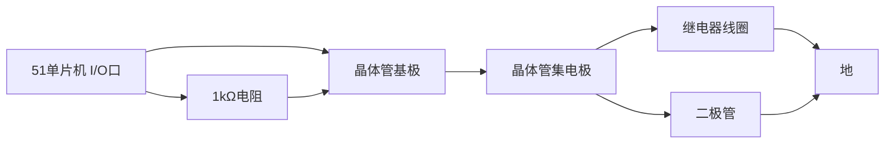

# 51单片机继电器控制

## 介绍

继电器是一种电子开关，可以通过小电流控制大电流的设备。在51单片机中，我们可以通过I/O口来控制继电器的开关状态，从而实现对高功率设备的控制。这对于初学者来说是一个非常重要的实践项目，因为它结合了I/O操作和实际硬件控制。

## 继电器的工作原理

继电器主要由线圈和触点组成。当线圈通电时，会产生磁场，吸引触点闭合或断开，从而控制外部电路的开关状态。在51单片机中，我们通常使用一个晶体管来驱动继电器，因为单片机的I/O口输出电流较小，无法直接驱动继电器。

## 硬件连接

在连接继电器时，通常需要以下组件：

- 51单片机
- 继电器模块
- 晶体管（如NPN型晶体管2N2222）
- 二极管（如1N4007，用于保护晶体管）
- 电阻（如1kΩ，用于限流）

连接方式如下：



## 代码示例

以下是一个简单的代码示例，展示了如何使用51单片机的I/O口控制继电器的开关状态。

```c
#include <reg51.h>

sbit relay = P1^0;  // 将继电器连接到P1.0口

void delay(unsigned int time) {
    unsigned int i, j;
    for(i = 0; i < time; i++)
        for(j = 0; j < 120; j++);
}

void main() {
    while(1) {
        relay = 1;  // 打开继电器
        delay(1000);  // 延时1秒
        relay = 0;  // 关闭继电器
        delay(1000);  // 延时1秒
    }
}
```

### 代码解释

- `sbit relay = P1^0;`：定义P1.0口为继电器的控制引脚。
- `relay = 1;`：将P1.0口置高，打开继电器。
- `relay = 0;`：将P1.0口置低，关闭继电器。
- `delay(1000);`：延时函数，用于控制继电器的开关时间。

## 实际应用场景

继电器控制在实际应用中有很多场景，例如：

- **家用电器控制**：通过单片机控制继电器的开关，可以实现对家电的远程控制。
- **工业自动化**：在工业自动化中，继电器常用于控制电机、灯光等设备的开关。
- **安全系统**：继电器可以用于控制报警系统、门禁系统等安全设备。

## 总结

通过本文的学习，你应该已经掌握了如何使用51单片机控制继电器的基本原理和实现方法。继电器控制是单片机应用中非常基础且重要的一部分，掌握它可以帮助你更好地理解和应用单片机的I/O操作。

## 附加资源与练习

- **练习**：尝试修改代码，使继电器以不同的时间间隔开关。
- **扩展阅读**：了解不同类型的继电器及其应用场景。
- **项目实践**：设计一个简单的家用电器控制系统，使用51单片机和继电器控制灯的开关。

:::tip
在实际项目中，务必注意继电器的额定电压和电流，选择合适的晶体管和电阻，以确保电路的稳定性和安全性。
:::