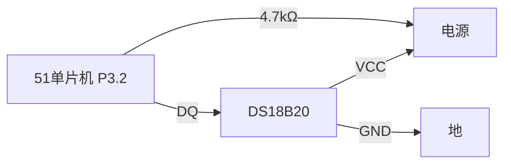

## 介绍

温度传感器是一种用于测量环境温度的电子设备。在嵌入式系统中，51单片机（如8051系列）常与温度传感器结合使用，以实现温度监控、数据采集等功能。本文将介绍如何使用51单片机与常见的温度传感器（如DS18B20）进行接口，并读取温度数据。

## 温度传感器简介

温度传感器有多种类型，常见的有模拟温度传感器（如LM35）和数字温度传感器（如DS18B20）。本文将重点介绍数字温度传感器DS18B20，因为它具有高精度、单总线通信等优点，适合与51单片机配合使用。

### DS18B20 特性
- **单总线通信**：仅需一根数据线即可与单片机通信。
- **高精度**：测量精度可达±0.5°C。
- **宽温度范围**：测量范围为-55°C至+125°C。
- **可编程分辨率**：分辨率可配置为9至12位。

## 硬件连接

DS18B20与51单片机的连接非常简单。以下是典型的连接方式：

- **VCC**：接电源（3.3V或5V）。
- **GND**：接地。
- **DQ**：接单片机的I/O引脚（如P3.2），并通过一个4.7kΩ的上拉电阻连接到VCC。



## 软件实现

### 1. 初始化DS18B20

在使用DS18B20之前，需要对其进行初始化。初始化过程包括发送复位脉冲和检测传感器的存在。

```c
#include <reg51.h>

sbit DQ = P3^2;  // 定义DS18B20的数据引脚

void delay_us(unsigned int us) {
    while (us--);
}

void DS18B20_Init() {
    DQ = 1;  // 拉高总线
    delay_us(10);
    DQ = 0;  // 发送复位脉冲
    delay_us(480);  // 保持低电平480us
    DQ = 1;  // 释放总线
    delay_us(60);  // 等待60us
    if (!DQ) {  // 检测传感器是否存在
        delay_us(240);  // 等待传感器响应
    }
    DQ = 1;  // 释放总线
}
```

### 2. 读取温度数据

DS18B20的温度数据以16位二进制形式存储。读取温度数据的过程包括发送读取命令和读取数据。

```c
unsigned char DS18B20_ReadByte() {
    unsigned char i, data = 0;
    for (i = 0; i < 8; i++) {
        DQ = 0;  // 拉低总线
        delay_us(2);
        DQ = 1;  // 释放总线
        delay_us(4);
        if (DQ) {  // 读取数据位
            data |= (1 << i);
        }
        delay_us(60);
    }
    return data;
}

void DS18B20_WriteByte(unsigned char data) {
    unsigned char i;
    for (i = 0; i < 8; i++) {
        DQ = 0;  // 拉低总线
        delay_us(2);
        DQ = data & 0x01;  // 发送数据位
        delay_us(60);
        DQ = 1;  // 释放总线
        data >>= 1;
    }
}

float DS18B20_ReadTemp() {
    unsigned char tempL, tempH;
    float temp;
    DS18B20_Init();
    DS18B20_WriteByte(0xCC);  // 跳过ROM命令
    DS18B20_WriteByte(0x44);  // 启动温度转换
    delay_us(800);  // 等待转换完成
    DS18B20_Init();
    DS18B20_WriteByte(0xCC);  // 跳过ROM命令
    DS18B20_WriteByte(0xBE);  // 读取温度命令
    tempL = DS18B20_ReadByte();  // 读取温度低字节
    tempH = DS18B20_ReadByte();  // 读取温度高字节
    temp = (tempH << 8) | tempL;  // 合并高低字节
    temp = temp * 0.0625;  // 转换为实际温度值
    return temp;
}
```

### 3. 显示温度数据

读取到的温度数据可以通过串口或LCD显示屏进行显示。以下是一个简单的串口显示示例：

```c
void UART_Init() {
    SCON = 0x50;  // 设置串口模式
    TMOD = 0x20;  // 设置定时器模式
    TH1 = 0xFD;  // 设置波特率9600
    TL1 = 0xFD;
    TR1 = 1;  // 启动定时器
    ES = 1;  // 使能串口中断
    EA = 1;  // 使能总中断
}

void UART_SendChar(unsigned char c) {
    SBUF = c;
    while (!TI);
    TI = 0;
}

void UART_SendString(char *str) {
    while (*str) {
        UART_SendChar(*str++);
    }
}

void main() {
    float temp;
    UART_Init();
    while (1) {
        temp = DS18B20_ReadTemp();
        UART_SendString("Temperature: ");
        UART_SendChar((int)temp + '0');
        UART_SendString(" C\n");
        delay_us(1000000);  // 延时1秒
    }
}
```

## 实际应用场景

### 1. 温度监控系统

在工业控制或家庭自动化中，温度监控系统可以实时监测环境温度，并在温度超出设定范围时发出警报。例如，在温室中，温度监控系统可以确保植物生长在适宜的温度范围内。

### 2. 智能恒温器

智能恒温器可以根据环境温度自动调节加热或制冷设备的工作状态，以保持室内温度恒定。这种系统广泛应用于家庭、办公室等场所。

## 总结

本文介绍了如何使用51单片机与DS18B20温度传感器进行接口，并读取温度数据。通过硬件连接和软件实现的详细讲解，初学者可以快速掌握温度传感器的使用方法。实际应用场景展示了温度传感器在嵌入式系统中的广泛应用。

## 附加资源与练习

- **练习1**：尝试将温度数据显示在LCD屏幕上。
- **练习2**：扩展代码，实现温度报警功能，当温度超过设定值时，点亮LED或触发蜂鸣器。
- **资源**：参考DS18B20数据手册，了解更多关于传感器的详细信息。

:::tip
在实际项目中，建议使用调试工具（如逻辑分析仪）来验证单总线通信的正确性。
:::