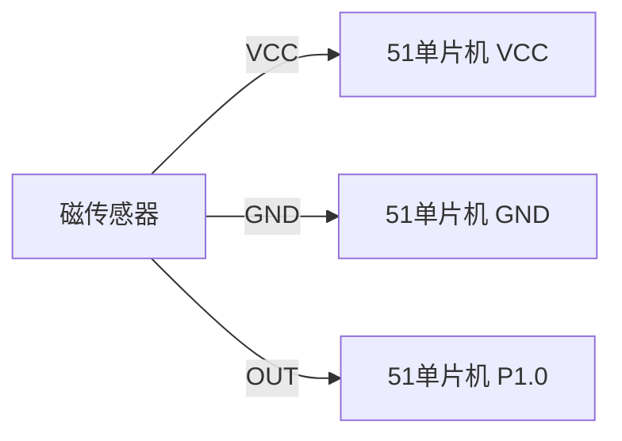

# 51单片机磁传感器

## 介绍

磁传感器是一种能够检测磁场强度或磁场变化的设备。它们广泛应用于导航、位置检测、速度测量等领域。51单片机作为一种经典的微控制器，可以通过其GPIO引脚与磁传感器进行接口，读取传感器数据并进行处理。本文将介绍如何使用51单片机与磁传感器进行接口，并提供代码示例和实际应用案例。

## 磁传感器的工作原理

磁传感器通常基于霍尔效应或磁阻效应工作。霍尔效应传感器通过检测磁场对电流的影响来输出电压信号，而磁阻传感器则通过检测磁场对材料电阻的影响来输出信号。无论是哪种类型的传感器，它们都可以将磁场的变化转换为电信号，供单片机读取和处理。

## 51单片机与磁传感器的接口

51单片机通常通过其GPIO引脚与磁传感器进行接口。磁传感器的输出信号可以是模拟信号或数字信号，具体取决于传感器的类型。对于模拟信号，51单片机需要通过ADC（模数转换器）将模拟信号转换为数字信号；对于数字信号，51单片机可以直接读取。

### 硬件连接

假设我们使用一个数字输出的磁传感器，其输出引脚连接到51单片机的P1.0引脚。传感器的VCC和GND分别连接到单片机的电源和地。



### 代码示例

以下是一个简单的代码示例，展示了如何读取磁传感器的输出信号：

```c
#include <reg51.h>

sbit sensorPin = P1^0;  // 定义传感器输出引脚

void main() {
    while (1) {
        if (sensorPin == 1) {
            // 检测到磁场
            // 执行相应操作
        } else {
            // 未检测到磁场
            // 执行相应操作
        }
    }
}
```

在这个示例中，我们通过读取P1.0引脚的状态来判断磁传感器是否检测到磁场。如果检测到磁场，传感器输出高电平（1），否则输出低电平（0）。

## 实际应用案例

### 案例1：转速测量

磁传感器可以用于测量旋转物体的转速。例如，在电机轴上安装一个磁铁，并在附近放置一个磁传感器。每当磁铁经过传感器时，传感器会输出一个脉冲信号。通过计算单位时间内的脉冲数，可以计算出电机的转速。

```c
#include <reg51.h>

sbit sensorPin = P1^0;  // 定义传感器输出引脚
unsigned int pulseCount = 0;

void timer0_isr(void) interrupt 1 {
    // 定时器中断服务程序
    // 计算转速
    unsigned int rpm = pulseCount * 60;  // 假设每秒脉冲数为pulseCount
    pulseCount = 0;  // 重置脉冲计数
}

void main() {
    TMOD = 0x01;  // 设置定时器0为模式1
    TH0 = 0xFC;   // 设置定时器初值
    TL0 = 0x18;
    ET0 = 1;      // 使能定时器0中断
    EA = 1;       // 使能全局中断
    TR0 = 1;      // 启动定时器0

    while (1) {
        if (sensorPin == 1) {
            pulseCount++;  // 检测到脉冲，增加计数
            while (sensorPin == 1);  // 等待脉冲结束
        }
    }
}
```

在这个案例中，我们使用定时器中断来计算单位时间内的脉冲数，从而计算出电机的转速。

### 案例2：位置检测

磁传感器还可以用于检测物体的位置。例如，在自动化生产线上，可以使用磁传感器来检测工件是否到达指定位置。当工件上的磁铁经过传感器时，传感器会输出一个信号，单片机可以根据该信号控制机械臂或其他设备进行相应操作。

```c
#include <reg51.h>

sbit sensorPin = P1^0;  // 定义传感器输出引脚

void main() {
    while (1) {
        if (sensorPin == 1) {
            // 检测到工件到达指定位置
            // 控制机械臂进行抓取操作
        }
    }
}
```

在这个案例中，我们通过检测磁传感器的输出来判断工件是否到达指定位置，并控制机械臂进行相应操作。

## 总结

本文介绍了51单片机与磁传感器的接口方法，包括硬件连接和代码实现。我们还通过两个实际应用案例展示了磁传感器在转速测量和位置检测中的应用。希望本文能帮助初学者更好地理解和使用51单片机与磁传感器。

## 附加资源与练习

- **练习1**：尝试修改代码示例，使其能够检测磁场的强度变化，并根据强度变化控制LED的亮度。
- **练习2**：设计一个基于磁传感器的电子罗盘，使用51单片机读取传感器的输出，并显示当前方向。

:::tip
提示：在实际应用中，磁传感器的输出信号可能会受到环境噪声的干扰。为了提高检测精度，可以使用滤波算法对传感器信号进行处理。
:::