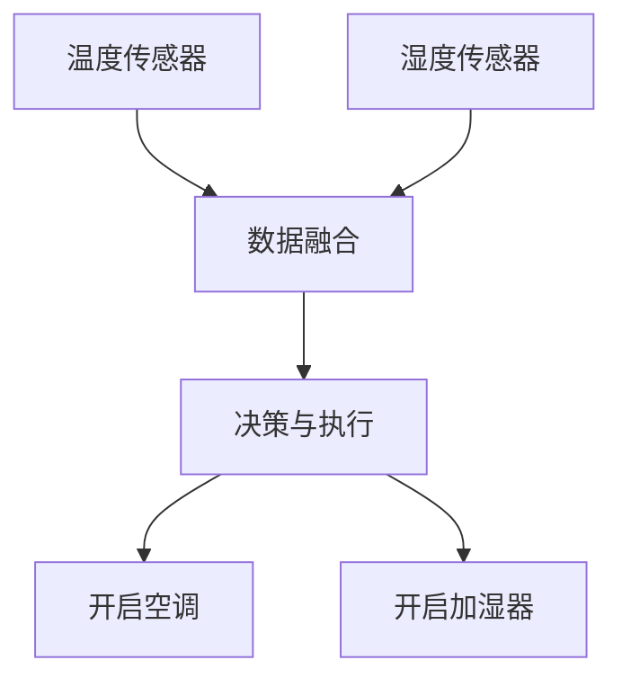

## 介绍

在现代嵌入式系统中，单一传感器的数据往往不足以提供全面、准确的环境信息。多传感器融合（Multi-Sensor Fusion）通过整合多个传感器的数据，能够显著提升系统的感知能力和决策精度。本文将介绍如何在51单片机中实现多传感器融合，并通过实际案例展示其应用。

## 什么是多传感器融合？

多传感器融合是指将来自多个传感器的数据进行整合和处理，以生成更准确、更可靠的环境信息。常见的传感器包括温度传感器、湿度传感器、光敏传感器、加速度传感器等。通过融合这些传感器的数据，系统可以更好地理解周围环境，并做出更智能的决策。

## 多传感器融合的基本步骤

1. **数据采集**：从各个传感器中读取数据。
2. **数据预处理**：对采集到的数据进行滤波、校准等处理。
3. **数据融合**：将预处理后的数据进行融合，生成更准确的环境信息。
4. **决策与执行**：根据融合后的数据做出决策，并执行相应的操作。

## 代码示例

以下是一个简单的51单片机多传感器融合的代码示例。假设我们有两个传感器：温度传感器和湿度传感器。

```c
#include <reg51.h>

// 假设温度传感器和湿度传感器的数据通过P1口读取
#define TEMP_SENSOR P1_0
#define HUMIDITY_SENSOR P1_1

// 读取温度传感器数据
unsigned char read_temperature() {
    return TEMP_SENSOR;
}

// 读取湿度传感器数据
unsigned char read_humidity() {
    return HUMIDITY_SENSOR;
}

// 简单的数据融合函数
unsigned char sensor_fusion(unsigned char temp, unsigned char humidity) {
    // 这里使用简单的加权平均法进行数据融合
    return (temp * 0.6 + humidity * 0.4);
}

void main() {
    unsigned char temperature, humidity, fused_data;

    while (1) {
        temperature = read_temperature();
        humidity = read_humidity();
        fused_data = sensor_fusion(temperature, humidity);

        // 根据融合后的数据执行相应的操作
        if (fused_data > 128) {
            // 执行某些操作
        } else {
            // 执行其他操作
        }
    }
}
```

:::note
**注意**：上述代码仅为示例，实际应用中需要根据具体传感器和需求进行调整。
:::

## 实际案例

### 智能家居环境监测系统

在一个智能家居系统中，温度传感器和湿度传感器可以用于监测室内环境。通过多传感器融合，系统可以更准确地判断是否需要开启空调或加湿器。例如，当温度较高且湿度较低时，系统可以决定开启空调；当温度适中但湿度过高时，系统可以决定开启除湿器。



## 总结

多传感器融合是提升嵌入式系统感知能力和决策精度的重要手段。通过整合多个传感器的数据，系统可以更全面地理解周围环境，并做出更智能的决策。本文介绍了多传感器融合的基本概念、实现步骤，并通过代码示例和实际案例展示了其在51单片机中的应用。

## 附加资源与练习

- **练习1**：尝试在代码中添加更多的传感器（如光敏传感器），并修改数据融合算法。
- **练习2**：研究其他数据融合算法（如卡尔曼滤波），并尝试在51单片机中实现。
- **资源**：阅读相关文献和书籍，深入了解多传感器融合的理论和实践。

:::tip
**提示**：多传感器融合是一个复杂的领域，建议从简单的加权平均法开始，逐步学习更高级的算法。
:::