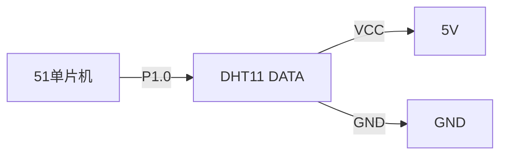
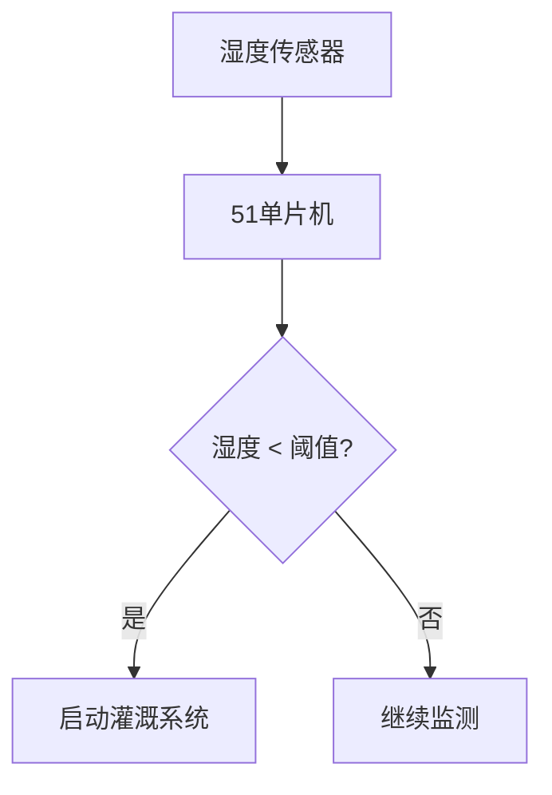

# 51单片机湿度传感器

湿度传感器是一种用于测量环境湿度的设备，广泛应用于气象监测、农业、工业控制等领域。在51单片机项目中，湿度传感器可以帮助我们实时监测环境湿度，并根据湿度数据做出相应的控制决策。本文将详细介绍如何在51单片机中使用湿度传感器，包括其工作原理、接口方式以及实际应用案例。

## 湿度传感器的工作原理

湿度传感器通常基于电容或电阻的变化来测量湿度。常见的湿度传感器有DHT11、DHT22等。这些传感器通过测量空气中的水蒸气含量来输出相应的湿度值。

### DHT11 湿度传感器

DHT11 是一种常用的数字湿度传感器，它能够同时测量温度和湿度。DHT11 的输出信号为数字信号，可以直接与51单片机的I/O口连接。

:::note
DHT11 的测量范围为 20% ~ 90% RH（相对湿度），精度为 ±5% RH。
:::

## 51单片机与湿度传感器的接口

### 硬件连接

DHT11 传感器通常有三个引脚：VCC、GND 和 DATA。DATA 引脚用于与单片机进行通信。



### 软件实现

在51单片机中，我们需要通过软件模拟单总线协议来读取DHT11的数据。以下是一个简单的代码示例：

```c
#include <reg51.h>

sbit DHT11 = P1^0;

void delay_us(unsigned int us) {
    while (us--);
}

void DHT11_start() {
    DHT11 = 0;
    delay_us(18000);  // 18ms低电平
    DHT11 = 1;
    delay_us(30);     // 30us高电平
}

unsigned char DHT11_read_byte() {
    unsigned char i, data = 0;
    for (i = 0; i < 8; i++) {
        while (!DHT11);  // 等待高电平
        delay_us(30);
        if (DHT11) {
            data |= (1 << (7 - i));
        }
        while (DHT11);  // 等待低电平
    }
    return data;
}

void main() {
    unsigned char humidity, temperature;
    DHT11_start();
    DHT11 = 1;
    while (!DHT11);  // 等待DHT11响应
    while (DHT11);   // 等待DHT11释放
    humidity = DHT11_read_byte();
    temperature = DHT11_read_byte();
    // 处理湿度和温度数据
}
```

:::tip
在实际应用中，建议对读取的数据进行校验，以确保数据的准确性。
:::

## 实际应用案例

### 智能温室控制系统

在智能温室控制系统中，湿度传感器可以用于监测温室内的湿度，并根据湿度数据自动控制灌溉系统。例如，当湿度低于某个阈值时，系统可以自动启动灌溉设备，以保持温室内的适宜湿度。



## 总结

通过本文的学习，你应该已经掌握了如何在51单片机中使用湿度传感器。我们介绍了湿度传感器的工作原理、与51单片机的接口方式，并通过一个实际应用案例展示了湿度传感器在智能温室控制系统中的应用。

## 附加资源与练习

1. **练习**：尝试修改代码，使其能够同时读取湿度和温度数据，并将数据显示在LCD屏幕上。
2. **资源**：查阅DHT11的数据手册，了解更多关于其工作原理和通信协议的细节。

:::caution
在实际项目中，务必注意传感器的供电电压和通信时序，以免损坏传感器或导致数据读取失败。
:::