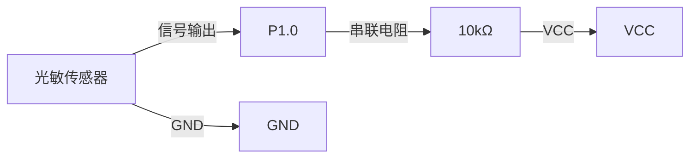

## 介绍

光敏传感器是一种能够检测环境光强度的电子元件。它通常用于自动调节屏幕亮度、路灯控制、智能家居等场景。在51单片机中，光敏传感器可以通过模拟信号或数字信号与单片机进行交互，从而实现对光强度的检测和控制。

本文将介绍如何使用51单片机与光敏传感器进行交互，并通过代码示例展示如何读取光敏传感器的数据。

## 光敏传感器的工作原理

光敏传感器的核心部件是光敏电阻（LDR，Light Dependent Resistor）。光敏电阻的阻值会随着光照强度的变化而变化：光照越强，阻值越低；光照越弱，阻值越高。通过测量光敏电阻的阻值，我们可以间接得到环境的光照强度。

在51单片机中，光敏传感器通常通过ADC（模数转换器）模块将模拟信号转换为数字信号，或者通过比较器输出数字信号。

## 硬件连接

在开始编写代码之前，我们需要将光敏传感器与51单片机正确连接。以下是典型的连接方式：

- 光敏传感器的一端连接到51单片机的ADC输入引脚（如P1.0）。
- 光敏传感器的另一端连接到GND。
- 在光敏传感器和ADC引脚之间串联一个电阻（如10kΩ），用于分压。



## 代码示例

以下是一个简单的代码示例，展示了如何使用51单片机读取光敏传感器的数据，并通过串口输出光强度值。

```c
#include <reg52.h>
#include <stdio.h>

#define ADC_PIN P1_0  // 定义光敏传感器连接的ADC引脚

void UART_Init() {
    SCON = 0x50;  // 设置串口模式1，8位数据，1位停止位
    TMOD = 0x20;  // 设置定时器1为模式2
    TH1 = 0xFD;   // 设置波特率为9600
    TL1 = 0xFD;
    TR1 = 1;      // 启动定时器1
    ES = 1;       // 使能串口中断
    EA = 1;       // 使能全局中断
}

void UART_SendChar(char c) {
    SBUF = c;
    while (!TI);
    TI = 0;
}

void UART_SendString(char *str) {
    while (*str) {
        UART_SendChar(*str++);
    }
}

unsigned int Read_ADC() {
    unsigned int adc_value = 0;
    // 这里假设使用外部ADC模块读取光敏传感器的值
    // 实际代码需要根据具体硬件进行调整
    adc_value = ADC_PIN;  // 读取ADC值
    return adc_value;
}

void main() {
    unsigned int light_intensity;
    UART_Init();
    while (1) {
        light_intensity = Read_ADC();
        printf("Light Intensity: %d\n", light_intensity);
        delay(1000);  // 延时1秒
    }
}
```

:::note
注意：上述代码中的 `Read_ADC()` 函数是一个简化的示例，实际使用时需要根据具体的ADC模块和硬件连接进行调整。
:::

## 实际应用场景

光敏传感器在许多实际应用中都有广泛的使用，以下是一些常见的应用场景：

1. **自动调节屏幕亮度**：在手机、平板电脑等设备中，光敏传感器用于检测环境光强度，并自动调节屏幕亮度，以提供最佳的视觉体验。
2. **路灯控制**：在智能路灯系统中，光敏传感器用于检测环境光强度，并在天黑时自动开启路灯，天亮时自动关闭路灯。
3. **智能家居**：在智能家居系统中，光敏传感器可以用于检测室内光线强度，并自动调节窗帘、灯光等设备。

## 总结

通过本文，我们了解了光敏传感器的工作原理，并学习了如何使用51单片机读取光敏传感器的数据。我们还通过代码示例展示了如何将光敏传感器的数据通过串口输出，并介绍了一些实际应用场景。

光敏传感器是一种简单但非常有用的电子元件，掌握它的使用方法可以为你的项目增添更多的智能功能。

## 附加资源与练习

- **练习1**：尝试修改代码，使得当光强度低于某个阈值时，点亮一个LED灯。
- **练习2**：研究如何使用PWM（脉宽调制）技术，根据光强度调节LED灯的亮度。
- **附加资源**：查阅51单片机的ADC模块手册，了解更多关于模数转换的细节。

希望本文对你理解和使用51单片机光敏传感器有所帮助！如果你有任何问题或建议，欢迎在评论区留言。