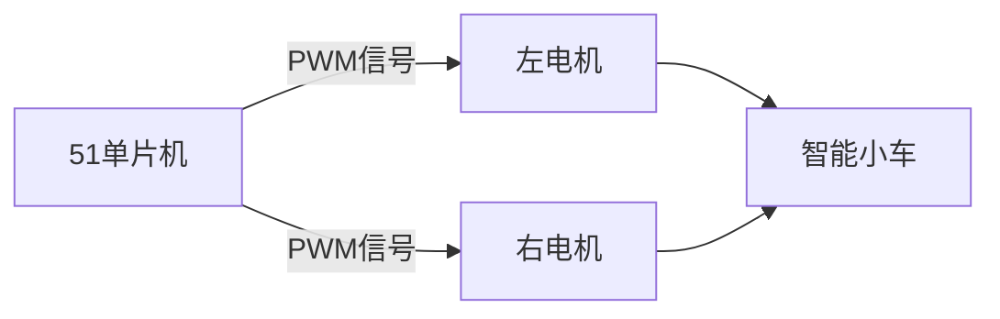

# 51单片机电机控制概述

## 介绍

51单片机是一种广泛应用于嵌入式系统的微控制器，因其成本低、易于学习和使用而受到初学者的青睐。电机控制是嵌入式系统中常见的任务之一，广泛应用于机器人、自动化设备、家用电器等领域。本文将介绍如何使用51单片机控制电机的基本原理和方法，帮助初学者快速入门。

## 电机控制的基本原理

电机控制的核心是通过单片机输出信号来控制电机的转动方向、速度和启停。常见的电机类型包括直流电机（DC Motor）、步进电机（Stepper Motor）和伺服电机（Servo Motor）。本文将以直流电机为例进行讲解。

### 直流电机控制

直流电机的控制通常通过PWM（脉宽调制）信号来实现。PWM信号通过调节占空比（Duty Cycle）来控制电机的转速。占空比越高，电机转速越快；占空比越低，电机转速越慢。

:::note
**占空比**：占空比是指在一个周期内，高电平时间与整个周期时间的比值。例如，50%的占空比表示高电平时间占整个周期的一半。
:::

## 51单片机控制直流电机的实现

### 硬件连接

在51单片机中，通常使用I/O口输出PWM信号来控制电机。以下是一个简单的硬件连接示意图：


### 代码示例

以下是一个使用51单片机控制直流电机的简单代码示例。假设我们使用P1.0口输出PWM信号。

```c
#include <reg52.h>

sbit PWM_PIN = P1^0;  // 定义PWM输出引脚

void delay(unsigned int time) {
    while(time--);
}

void main() {
    while(1) {
        PWM_PIN = 1;  // 输出高电平
        delay(500);  // 延时
        PWM_PIN = 0;  // 输出低电平
        delay(500);  // 延时
    }
}
```

:::tip
**代码解释**：上述代码通过P1.0口输出一个简单的PWM信号，占空比为50%。通过调整`delay`函数的参数，可以改变PWM信号的占空比，从而控制电机的转速。
:::

### 输入与输出

- **输入**：51单片机通过程序生成PWM信号。
- **输出**：电机根据PWM信号的占空比调整转速。

## 实际应用场景

### 案例：智能小车

在智能小车项目中，51单片机常用于控制小车的电机。通过调节左右两个电机的转速和方向，可以实现小车的直行、转弯、后退等动作。



:::caution
**注意**：在实际应用中，电机通常需要配合电机驱动模块（如L298N）使用，因为单片机的I/O口输出电流有限，无法直接驱动电机。
:::

## 总结

通过本文的学习，你应该已经掌握了使用51单片机控制直流电机的基本原理和方法。我们介绍了PWM信号的概念，并通过代码示例展示了如何生成PWM信号来控制电机的转速。此外，我们还探讨了电机控制在智能小车等实际应用中的使用场景。

## 附加资源与练习

1. **附加资源**：
   - [51单片机数据手册](https://www.example.com)
   - [PWM信号详解](https://www.example.com)

2. **练习**：
   - 修改代码，使电机以不同的占空比运行，观察电机的转速变化。
   - 尝试控制两个电机，实现智能小车的转弯功能。

:::warning
**提示**：在进行实验时，请确保电路连接正确，避免短路或损坏单片机。
:::