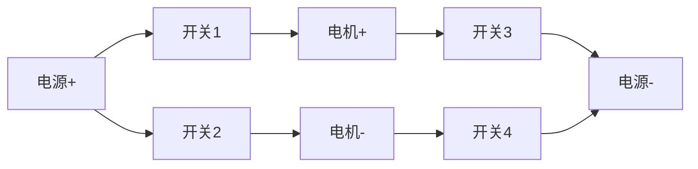

# 51单片机直流电机驱动

## 介绍

直流电机是一种常见的电机类型，广泛应用于各种电子设备中。通过51单片机控制直流电机，可以实现电机的启动、停止、调速和方向控制等功能。本文将详细介绍如何使用51单片机驱动直流电机，并提供代码示例和实际应用案例。

## 直流电机基础

直流电机通过电流的方向和大小来控制其转动方向和速度。通常，直流电机的控制需要以下两个主要部分：

1. **电机驱动电路**：用于提供足够的电流和电压来驱动电机。
2. **控制信号**：由单片机生成，用于控制电机的启动、停止、速度和方向。

## 电机驱动电路

常见的直流电机驱动电路包括H桥电路和L298N驱动模块。H桥电路可以通过控制四个开关的状态来改变电机的转动方向，而L298N是一种集成的电机驱动芯片，可以简化电路设计。

### H桥电路

H桥电路由四个开关（通常是晶体管或MOSFET）组成，通过控制这些开关的状态，可以改变电机的电流方向，从而实现电机的正反转。



### L298N驱动模块

L298N是一种常用的电机驱动芯片，可以同时驱动两个直流电机。它通过接收单片机的PWM信号来控制电机的速度和方向。

## 51单片机控制直流电机

### 硬件连接

假设我们使用L298N驱动模块，连接方式如下：

- **IN1** 和 **IN2** 连接到单片机的P1.0和P1.1引脚，用于控制电机的方向。
- **ENA** 连接到单片机的P1.2引脚，用于控制电机的速度（PWM信号）。

### 代码示例

以下是一个简单的51单片机控制直流电机的代码示例：

```c
#include <reg51.h>

sbit IN1 = P1^0;
sbit IN2 = P1^1;
sbit ENA = P1^2;

void delay(unsigned int time) {
    unsigned int i, j;
    for(i = 0; i < time; i++)
        for(j = 0; j < 120; j++);
}

void main() {
    while(1) {
        // 电机正转
        IN1 = 1;
        IN2 = 0;
        ENA = 1; // 全速运行
        delay(1000);

        // 电机停止
        IN1 = 0;
        IN2 = 0;
        ENA = 0;
        delay(1000);

        // 电机反转
        IN1 = 0;
        IN2 = 1;
        ENA = 1; // 全速运行
        delay(1000);

        // 电机停止
        IN1 = 0;
        IN2 = 0;
        ENA = 0;
        delay(1000);
    }
}
```

### 代码解释

- **IN1** 和 **IN2** 控制电机的方向。当 `IN1 = 1` 且 `IN2 = 0` 时，电机正转；当 `IN1 = 0` 且 `IN2 = 1` 时，电机反转。
- **ENA** 控制电机的速度。通过PWM信号可以调节电机的转速。
- `delay` 函数用于控制电机的运行时间。

## 实际应用案例

### 智能小车

在智能小车项目中，直流电机常用于驱动车轮。通过控制两个电机的速度和方向，可以实现小车的前进、后退、左转和右转。

:::tip
在实际应用中，可以使用PID算法来精确控制电机的转速，从而实现更复杂的运动控制。
:::

## 总结

通过本文的学习，你应该已经掌握了如何使用51单片机控制直流电机的基本方法。我们介绍了直流电机的基础知识、驱动电路的设计、硬件连接和代码实现，并提供了一个实际应用案例。

## 附加资源与练习

1. **练习**：尝试修改代码，实现电机的调速功能。
2. **资源**：查阅L298N数据手册，了解更多关于电机驱动的细节。
3. **扩展**：学习如何使用PID算法进行电机速度的精确控制。

希望本文对你学习51单片机直流电机驱动有所帮助！继续探索和实践，你将能够掌握更多高级的控制技术。