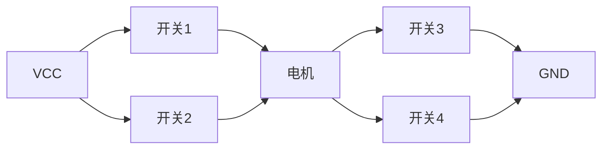
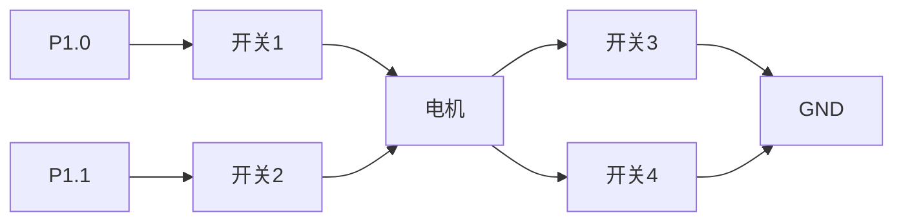

# 51单片机电机正反转

## 介绍

在嵌入式系统中，电机控制是一个常见的应用场景。通过51单片机，我们可以轻松实现电机的正反转控制。本文将详细介绍如何使用51单片机控制电机的正反转，包括电路设计、编程实现以及实际应用案例。

## 电机控制基础

电机正反转控制通常通过改变电机两端的电压极性来实现。51单片机通过控制H桥电路或继电器来改变电机的电压极性，从而实现电机的正反转。

### H桥电路

H桥电路是一种常用的电机驱动电路，它由四个开关（通常是晶体管或MOSFET）组成，可以控制电机的正反转。以下是H桥电路的基本结构：



通过控制开关1和开关4闭合，开关2和开关3断开，电机正转；反之，控制开关2和开关3闭合，开关1和开关4断开，电机反转。

## 51单片机控制电机正反转

### 电路设计

我们使用51单片机的两个I/O口来控制H桥电路的两个开关。以下是电路连接示意图：



### 编程实现

以下是使用51单片机控制电机正反转的示例代码：

```c
#include <reg51.h>

sbit motor_pin1 = P1^0;  // 控制开关1
sbit motor_pin2 = P1^1;  // 控制开关2

void delay(unsigned int time) {
    unsigned int i, j;
    for(i = 0; i < time; i++)
        for(j = 0; j < 1275; j++);
}

void motor_forward() {
    motor_pin1 = 1;
    motor_pin2 = 0;
}

void motor_reverse() {
    motor_pin1 = 0;
    motor_pin2 = 1;
}

void motor_stop() {
    motor_pin1 = 0;
    motor_pin2 = 0;
}

void main() {
    while(1) {
        motor_forward();  // 电机正转
        delay(1000);     // 延时1秒
        motor_stop();    // 电机停止
        delay(500);      // 延时0.5秒
        motor_reverse(); // 电机反转
        delay(1000);     // 延时1秒
        motor_stop();    // 电机停止
        delay(500);      // 延时0.5秒
    }
}
```

### 代码解释

- `motor_forward()` 函数控制电机正转，通过设置 `motor_pin1` 为高电平，`motor_pin2` 为低电平。
- `motor_reverse()` 函数控制电机反转，通过设置 `motor_pin1` 为低电平，`motor_pin2` 为高电平。
- `motor_stop()` 函数停止电机，通过设置 `motor_pin1` 和 `motor_pin2` 都为低电平。
- `delay()` 函数用于延时，控制电机运行的时间。

## 实际应用案例

### 案例：智能小车

在智能小车中，电机正反转控制用于实现小车的前进和后退。通过51单片机控制两个电机的正反转，可以实现小车的直线行驶、转弯和后退等功能。

:::tip
在实际应用中，建议使用电机驱动模块（如L298N）来简化电路设计，并提供更好的驱动能力。
:::

## 总结

通过本文的学习，你应该已经掌握了如何使用51单片机控制电机的正反转。我们介绍了H桥电路的基本原理，并提供了详细的电路设计和编程实现。希望你能将这些知识应用到实际项目中，进一步探索嵌入式系统的奥秘。

## 附加资源与练习

### 附加资源

- [51单片机编程手册](https://example.com)
- [H桥电路设计指南](https://example.com)

### 练习

1. 修改代码，使电机在正转和反转之间切换时，增加一个短暂的停止时间。
2. 尝试使用PWM（脉宽调制）控制电机的转速，实现电机的调速功能。
3. 设计一个简单的智能小车，使用两个电机实现前进、后退和转弯功能。

:::caution
在进行实验时，请确保电路连接正确，避免短路或损坏单片机。
:::