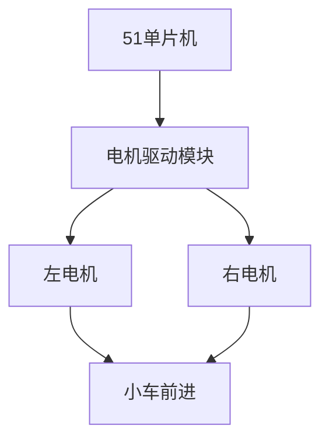
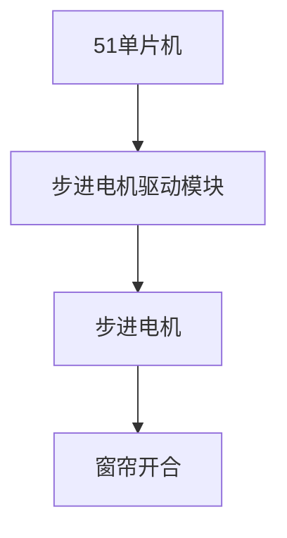

# 51单片机电机应用实例

## 介绍

51单片机是一种广泛应用于嵌入式系统的微控制器，因其成本低、易于学习和使用而受到初学者的青睐。电机控制是51单片机的一个重要应用领域，广泛应用于机器人、自动化设备、家用电器等场景。本文将介绍如何使用51单片机控制电机，并通过实际案例展示其应用。

## 基础概念

在开始之前，我们需要了解一些基础概念：

- **电机类型**：常见的电机类型包括直流电机（DC Motor）、步进电机（Stepper Motor）和伺服电机（Servo Motor）。每种电机都有其特定的控制方式。
- **PWM（脉宽调制）**：PWM是一种通过调节信号的占空比来控制电机速度的技术。占空比越高，电机转速越快。
- **H桥电路**：H桥电路是一种用于控制电机正反转的电路，通过切换电流方向来实现电机的正反转。

## 代码示例

以下是一个使用51单片机控制直流电机的简单示例。我们将使用PWM来控制电机的速度，并使用H桥电路来控制电机的正反转。

```c
#include <reg51.h>

sbit motor_pin1 = P1^0;  // 电机控制引脚1
sbit motor_pin2 = P1^1;  // 电机控制引脚2

void delay(unsigned int time) {
    unsigned int i, j;
    for(i = 0; i < time; i++)
        for(j = 0; j < 120; j++);
}

void main() {
    while(1) {
        // 电机正转
        motor_pin1 = 1;
        motor_pin2 = 0;
        delay(1000);  // 延时1秒

        // 电机停止
        motor_pin1 = 0;
        motor_pin2 = 0;
        delay(1000);  // 延时1秒

        // 电机反转
        motor_pin1 = 0;
        motor_pin2 = 1;
        delay(1000);  // 延时1秒

        // 电机停止
        motor_pin1 = 0;
        motor_pin2 = 0;
        delay(1000);  // 延时1秒
    }
}
```

### 代码解释

- `motor_pin1` 和 `motor_pin2` 是连接到H桥电路的两个引脚，用于控制电机的正反转。
- `delay` 函数用于产生延时，控制电机的运行时间。
- 在 `main` 函数中，我们通过切换 `motor_pin1` 和 `motor_pin2` 的状态来控制电机的正反转和停止。

## 实际案例

### 案例1：智能小车

智能小车是51单片机电机控制的一个典型应用。通过控制两个直流电机的转速和方向，可以实现小车的前进、后退、左转和右转。



### 案例2：自动窗帘

自动窗帘系统使用步进电机来控制窗帘的开合。通过51单片机控制步进电机的步进角度，可以实现窗帘的精确控制。



## 总结

通过本文的学习，我们了解了如何使用51单片机控制电机，并通过实际案例展示了其应用场景。51单片机的电机控制技术广泛应用于各种嵌入式系统中，掌握这一技术对于初学者来说非常重要。

## 附加资源与练习

- **练习1**：尝试修改代码，使电机以不同的速度运行。
- **练习2**：设计一个简单的智能小车，实现前进、后退、左转和右转功能。
- **资源**：参考51单片机的官方文档，了解更多关于PWM和H桥电路的应用。

:::tip
建议初学者在学习过程中多动手实践，通过实际操作来加深对知识的理解。
:::