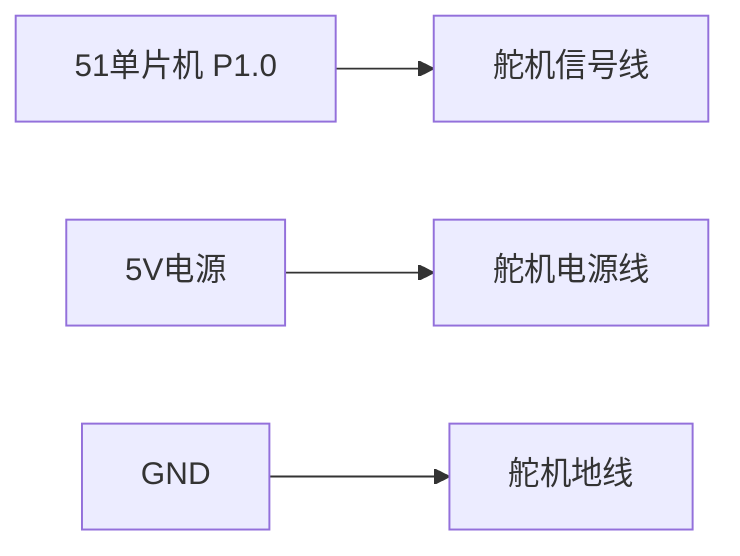
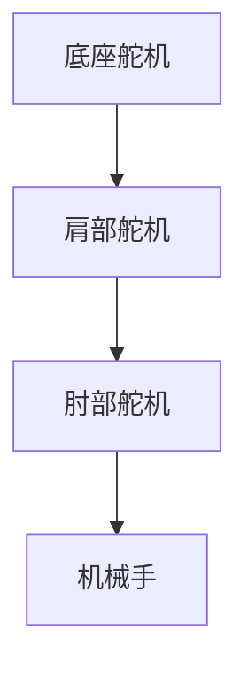

# 51单片机舵机控制

## 介绍

舵机是一种常见的电机设备，广泛应用于机器人、遥控模型、自动化设备等领域。它能够根据输入信号精确地控制角度位置。51单片机是一种经典的微控制器，适合初学者学习嵌入式开发。本文将详细介绍如何使用51单片机控制舵机，帮助初学者掌握舵机的基本原理和控制方法。

## 舵机的工作原理

舵机通常由电机、减速齿轮组、控制电路和反馈电位器组成。它通过接收PWM（脉宽调制）信号来控制角度。PWM信号的占空比决定了舵机的旋转角度。

:::tip
PWM信号的周期通常为20ms（50Hz），而高电平的持续时间（脉宽）决定了舵机的角度。例如：
- 0.5ms 脉宽对应 0° 角度
- 1.5ms 脉宽对应 90° 角度
- 2.5ms 脉宽对应 180° 角度
:::

## 51单片机控制舵机的步骤

### 1. 硬件连接

将舵机的信号线连接到51单片机的一个IO口（例如P1.0），电源线连接到5V电源，地线连接到GND。



### 2. 编写代码

以下是一个简单的51单片机控制舵机的代码示例。代码通过定时器生成PWM信号，控制舵机旋转到指定角度。

```c
#include <reg52.h>

sbit Servo_Pin = P1^0; // 舵机信号线连接到P1.0

void Timer0_Init() {
    TMOD |= 0x01; // 设置定时器0为模式1
    TH0 = 0xFC;   // 定时器初值，定时1ms
    TL0 = 0x18;
    ET0 = 1;      // 使能定时器0中断
    EA = 1;       // 使能总中断
    TR0 = 1;      // 启动定时器0
}

void Timer0_ISR() interrupt 1 {
    TH0 = 0xFC;   // 重装定时器初值
    TL0 = 0x18;
    Servo_Pin = ~Servo_Pin; // 翻转P1.0状态
}

void Delay(unsigned int ms) {
    unsigned int i, j;
    for (i = ms; i > 0; i--)
        for (j = 110; j > 0; j--);
}

void main() {
    Timer0_Init();
    while (1) {
        Servo_Pin = 1; // 高电平开始
        Delay(1);      // 延时1ms，对应0°角度
        Servo_Pin = 0; // 低电平结束
        Delay(19);     // 保持低电平19ms，完成20ms周期

        Servo_Pin = 1; // 高电平开始
        Delay(1.5);    // 延时1.5ms，对应90°角度
        Servo_Pin = 0; // 低电平结束
        Delay(18.5);    // 保持低电平18.5ms，完成20ms周期

        Servo_Pin = 1; // 高电平开始
        Delay(2);      // 延时2ms，对应180°角度
        Servo_Pin = 0; // 低电平结束
        Delay(18);     // 保持低电平18ms，完成20ms周期
    }
}
```

:::note
代码中的 `Delay` 函数用于模拟PWM信号的占空比。实际应用中，建议使用定时器精确控制PWM信号。
:::

### 3. 调试与测试

将代码烧录到51单片机中，观察舵机的旋转角度是否与预期一致。如果舵机没有反应，检查硬件连接是否正确，电源是否稳定。

## 实际应用案例

### 案例：舵机控制的机械臂

在机器人领域，舵机常用于控制机械臂的关节。通过多个舵机的组合，可以实现复杂的动作。例如，一个简单的三自由度机械臂可以通过三个舵机分别控制底座、肩部和肘部的旋转。



通过51单片机控制这些舵机，可以实现机械臂的抓取、旋转等动作。

## 总结

本文介绍了如何使用51单片机控制舵机，包括舵机的工作原理、硬件连接、代码编写以及实际应用案例。通过学习，你应该能够掌握舵机的基本控制方法，并将其应用到实际项目中。

## 附加资源与练习

- **练习1**：尝试修改代码，使舵机在不同角度之间平滑过渡。
- **练习2**：设计一个简单的机械臂模型，使用多个舵机实现抓取动作。
- **资源**：查阅51单片机的定时器相关文档，学习如何精确生成PWM信号。

希望本文对你学习51单片机舵机控制有所帮助！继续探索嵌入式开发的奇妙世界吧！