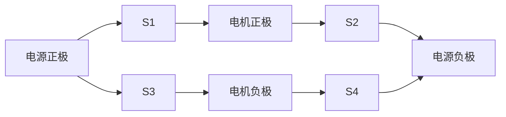

## 介绍

H桥驱动电路是一种常见的电机控制电路，能够实现电机的正反转和调速。它由四个开关（通常是晶体管或MOSFET）组成，排列成“H”形，因此得名。通过控制这些开关的状态，可以改变电流的方向，从而控制电机的旋转方向。

在51单片机中，我们可以通过编程控制H桥的开关状态，实现对电机的精确控制。本文将详细介绍H桥的工作原理、电路设计以及如何在51单片机上实现电机控制。

## H桥的基本原理

H桥电路由四个开关（S1、S2、S3、S4）组成，如下图所示：



通过控制这四个开关的状态，可以实现电机的正反转和停止：

- **正转**：S1和S4闭合，S2和S3断开。
- **反转**：S2和S3闭合，S1和S4断开。
- **停止**：所有开关断开。

:::note
注意：在实际电路中，不能同时闭合S1和S2或S3和S4，否则会导致电源短路，损坏电路。
:::

## 51单片机控制H桥

在51单片机中，我们可以通过GPIO口控制H桥的开关状态。以下是一个简单的代码示例，展示如何通过51单片机控制电机的正反转和停止。

```c
#include <reg51.h>

sbit S1 = P1^0;  // 控制S1
sbit S2 = P1^1;  // 控制S2
sbit S3 = P1^2;  // 控制S3
sbit S4 = P1^3;  // 控制S4

void motor_forward() {
    S1 = 1;
    S2 = 0;
    S3 = 0;
    S4 = 1;
}

void motor_reverse() {
    S1 = 0;
    S2 = 1;
    S3 = 1;
    S4 = 0;
}

void motor_stop() {
    S1 = 0;
    S2 = 0;
    S3 = 0;
    S4 = 0;
}

void main() {
    while (1) {
        motor_forward();  // 电机正转
        delay(1000);      // 延时1秒
        motor_stop();     // 电机停止
        delay(1000);      // 延时1秒
        motor_reverse();  // 电机反转
        delay(1000);      // 延时1秒
        motor_stop();     // 电机停止
        delay(1000);      // 延时1秒
    }
}
```

:::tip
在实际应用中，可以通过PWM（脉宽调制）技术来控制电机的转速。通过调整PWM的占空比，可以改变电机的平均电压，从而实现调速。
:::

## 实际应用案例

### 案例1：智能小车

在智能小车中，H桥驱动电路常用于控制小车的左右轮电机。通过控制两个H桥电路，可以实现小车的前进、后退、左转和右转。

```c
void car_forward() {
    motor_forward_left();  // 左轮正转
    motor_forward_right(); // 右轮正转
}

void car_reverse() {
    motor_reverse_left();  // 左轮反转
    motor_reverse_right(); // 右轮反转
}

void car_turn_left() {
    motor_reverse_left();  // 左轮反转
    motor_forward_right(); // 右轮正转
}

void car_turn_right() {
    motor_forward_left();  // 左轮正转
    motor_reverse_right(); // 右轮反转
}
```

### 案例2：机器人手臂

在机器人手臂中，H桥驱动电路可以用于控制关节电机的旋转。通过精确控制电机的正反转和转速，可以实现机器人手臂的精确运动。

## 总结

H桥驱动电路是电机控制中的核心组件，通过51单片机可以轻松实现对H桥的控制，从而实现对电机的正反转和调速。本文从H桥的基本原理讲起，逐步深入，提供了代码示例和实际应用案例，帮助初学者理解和掌握这一重要概念。

## 附加资源与练习

- **练习1**：尝试修改代码，实现电机的PWM调速。
- **练习2**：设计一个智能小车的控制程序，实现小车的自动避障功能。
- **资源**：阅读更多关于H桥驱动电路和电机控制的资料，深入理解其工作原理和应用场景。

:::caution
在实际操作中，务必注意电路的安全，避免短路和过载，以免损坏电路元件。
:::