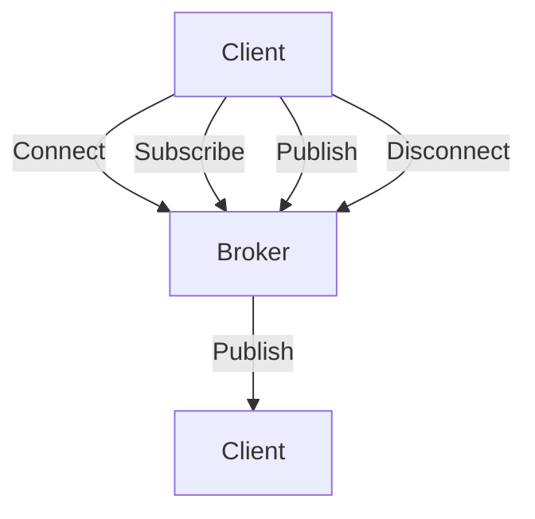

# 51单片机MQTT协议

MQTT（Message Queuing Telemetry Transport）是一种轻量级的发布/订阅消息传输协议，专为低带宽、不稳定网络环境下的物联网设备设计。它非常适合在资源有限的51单片机上使用，能够实现设备与服务器之间的高效通信。

本文将逐步讲解如何在51单片机上实现MQTT协议，并通过实际案例展示其应用场景。

## 1. MQTT协议简介

MQTT协议基于发布/订阅模式，主要由三个角色组成：

- **发布者（Publisher）**：发送消息的客户端。
- **订阅者（Subscriber）**：接收消息的客户端。
- **代理（Broker）**：负责消息的路由和分发。

MQTT协议的核心特点包括：

- 轻量级：协议头小，适合资源有限的设备。
- 低带宽：通过压缩和二进制格式减少数据传输量。
- 可靠性：支持三种服务质量（QoS）级别，确保消息传递的可靠性。

## 2. MQTT协议的工作流程

MQTT协议的工作流程可以分为以下几个步骤：

1. **连接（Connect）**：客户端与MQTT代理建立连接。
2. **订阅（Subscribe）**：客户端订阅感兴趣的主题。
3. **发布（Publish）**：客户端向主题发布消息。
4. **接收（Receive）**：订阅了该主题的客户端会收到消息。
5. **断开连接（Disconnect）**：客户端断开与代理的连接。



## 3. 在51单片机上实现MQTT协议

在51单片机上实现MQTT协议，通常需要借助第三方库，例如 `Paho MQTT` 或 `Eclipse Paho`。以下是一个简单的代码示例，展示如何在51单片机上连接MQTT代理并发布消息。

### 3.1 硬件准备

- 51单片机开发板
- ESP8266 Wi-Fi模块（用于连接网络）
- MQTT代理服务器（例如：`broker.hivemq.com`）

### 3.2 代码示例

```c
#include <reg52.h>
#include <stdio.h>
#include <string.h>

// 定义MQTT代理服务器地址和端口
#define MQTT_BROKER "broker.hivemq.com"
#define MQTT_PORT 1883

// 定义Wi-Fi模块的串口通信函数
void UART_SendString(char *str) {
    while (*str) {
        SBUF = *str++;
        while (!TI);
        TI = 0;
    }
}

// 连接MQTT代理
void MQTT_Connect() {
    char connectPacket[] = "CONNECT\n";
    UART_SendString(connectPacket);
}

// 发布消息
void MQTT_Publish(char *topic, char *message) {
    char publishPacket[100];
    sprintf(publishPacket, "PUBLISH %s %s\n", topic, message);
    UART_SendString(publishPacket);
}

void main() {
    // 初始化串口
    SCON = 0x50;
    TMOD = 0x20;
    TH1 = 0xFD;
    TL1 = 0xFD;
    TR1 = 1;

    // 连接MQTT代理
    MQTT_Connect();

    // 发布消息
    MQTT_Publish("test/topic", "Hello, MQTT!");

    while (1);
}
```

### 3.3 代码解释

- **UART_SendString**：通过串口发送字符串到Wi-Fi模块。
- **MQTT_Connect**：发送MQTT连接请求到代理服务器。
- **MQTT_Publish**：向指定主题发布消息。

:::note
在实际应用中，MQTT协议的实现可能会更加复杂，需要考虑连接保持、消息确认等机制。
:::

## 4. 实际应用场景

MQTT协议在物联网领域有广泛的应用，以下是一些典型的应用场景：

- **智能家居**：通过MQTT协议，家中的各种设备（如灯光、温控器）可以与中央控制系统通信。
- **工业自动化**：工厂中的传感器和执行器可以通过MQTT协议与监控系统进行数据交换。
- **环境监测**：远程传感器可以通过MQTT协议将环境数据（如温度、湿度）发送到服务器。

## 5. 总结

MQTT协议是一种高效、轻量级的通信协议，非常适合在资源有限的51单片机上使用。通过本文的学习，你应该已经掌握了MQTT协议的基本概念、工作流程以及在51单片机上的实现方法。

## 6. 附加资源与练习

- **资源**：
  - [MQTT协议官方文档](https://mqtt.org/)
  - [Eclipse Paho MQTT库](https://www.eclipse.org/paho/)
- **练习**：
  - 尝试在51单片机上实现MQTT订阅功能。
  - 使用MQTT协议实现一个简单的远程控制LED灯的项目。

:::tip
在实现MQTT协议时，建议使用现成的MQTT库，以减少开发难度和提高代码的可靠性。
:::