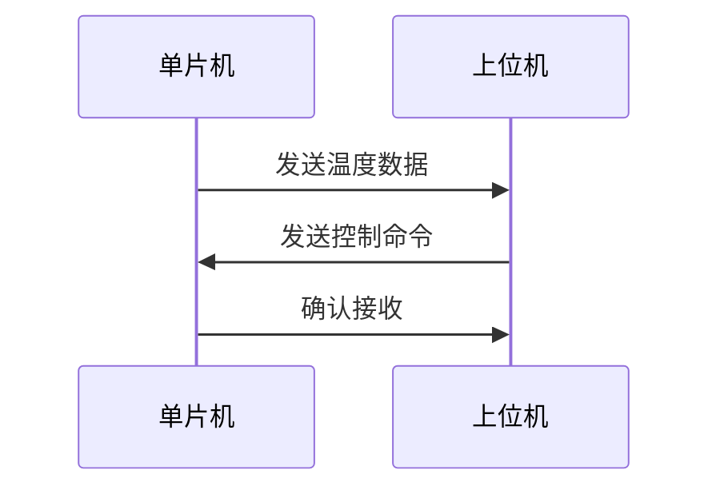

# 51单片机自定义协议

在嵌入式系统中，通信协议是设备之间交换数据的基础。51单片机作为一种广泛使用的微控制器，支持多种通信协议，如UART、I2C、SPI等。然而，在某些特定场景下，标准的通信协议可能无法满足需求，这时就需要设计自定义协议。本文将详细介绍如何在51单片机中设计和实现自定义通信协议。

## 什么是自定义协议？

自定义协议是指根据特定需求设计的通信规则。与标准协议不同，自定义协议可以根据应用场景灵活调整数据格式、传输速率、校验方式等。自定义协议的设计需要考虑到数据的可靠性、传输效率和实现的复杂性。

## 自定义协议的基本要素

设计一个自定义协议时，通常需要考虑以下几个要素：

1. **数据帧格式**：定义数据的起始标志、数据长度、数据内容、校验码等。
2. **传输速率**：确定数据的传输速率，通常以波特率（Baud Rate）表示。
3. **校验方式**：选择适当的校验方式，如奇偶校验、CRC校验等，以确保数据的完整性。
4. **错误处理**：定义如何处理传输中的错误，如重传机制、超时处理等。

## 自定义协议的设计步骤

### 1. 定义数据帧格式

数据帧是通信的基本单位，通常包括以下几个部分：

- **起始标志**：用于标识数据帧的开始，通常是一个特定的字节或字节序列。
- **数据长度**：指示数据内容的长度，可以是固定长度或可变长度。
- **数据内容**：实际传输的数据。
- **校验码**：用于验证数据的完整性，如CRC校验码。

例如，一个简单的数据帧格式可以定义如下：

```c
typedef struct {
    uint8_t startFlag;  // 起始标志
    uint8_t length;     // 数据长度
    uint8_t data[32];   // 数据内容
    uint8_t crc;        // CRC校验码
} CustomFrame;
```

### 2. 实现数据帧的发送和接收

在51单片机中，可以通过UART模块实现数据的发送和接收。以下是一个简单的发送和接收示例：

```c
void sendFrame(CustomFrame *frame) {
    UART_SendByte(frame->startFlag);
    UART_SendByte(frame->length);
    for (int i = 0; i < frame->length; i++) {
        UART_SendByte(frame->data[i]);
    }
    UART_SendByte(frame->crc);
}

void receiveFrame(CustomFrame *frame) {
    frame->startFlag = UART_ReceiveByte();
    frame->length = UART_ReceiveByte();
    for (int i = 0; i < frame->length; i++) {
        frame->data[i] = UART_ReceiveByte();
    }
    frame->crc = UART_ReceiveByte();
}
```

### 3. 实现校验机制

校验机制是确保数据完整性的关键。常用的校验方式包括奇偶校验、CRC校验等。以下是一个简单的CRC校验实现：

```c
uint8_t calculateCRC(uint8_t *data, uint8_t length) {
    uint8_t crc = 0;
    for (int i = 0; i < length; i++) {
        crc ^= data[i];
    }
    return crc;
}
```

在发送数据帧时，可以计算CRC校验码并将其附加到数据帧中：

```c
frame->crc = calculateCRC(frame->data, frame->length);
```

在接收数据帧时，可以重新计算CRC校验码并与接收到的校验码进行比较：

```c
uint8_t receivedCRC = frame->crc;
uint8_t calculatedCRC = calculateCRC(frame->data, frame->length);
if (receivedCRC != calculatedCRC) {
    // 数据校验失败，处理错误
}
```

## 实际应用案例

假设我们需要设计一个简单的温度监控系统，使用51单片机通过自定义协议与上位机通信。系统需要定期发送温度数据，并接收上位机的控制命令。

### 数据帧格式

- **起始标志**：0xAA
- **数据长度**：1字节
- **数据内容**：温度数据（1字节）
- **校验码**：CRC校验码（1字节）

### 代码实现

```c
void sendTemperature(uint8_t temperature) {
    CustomFrame frame;
    frame.startFlag = 0xAA;
    frame.length = 1;
    frame.data[0] = temperature;
    frame.crc = calculateCRC(frame.data, frame.length);
    sendFrame(&frame);
}

void processCommand(uint8_t command) {
    // 处理接收到的命令
}
```

### 通信流程



## 总结

自定义协议在嵌入式系统中具有广泛的应用，特别是在标准协议无法满足需求的情况下。通过合理设计数据帧格式、实现校验机制和错误处理，可以确保通信的可靠性和效率。本文介绍了自定义协议的基本要素和设计步骤，并通过一个实际案例展示了如何在实际项目中应用自定义协议。

## 附加资源与练习

- **练习1**：尝试设计一个自定义协议，用于控制LED灯的亮灭，并通过51单片机实现。
- **练习2**：在现有温度监控系统的基础上，增加湿度数据的传输，并修改数据帧格式以支持多数据类型的传输。
- **资源**：参考51单片机的UART模块文档，了解更多关于串口通信的细节。

:::tip
在实际项目中，自定义协议的设计需要根据具体需求进行调整，确保协议的简洁性和高效性。
:::