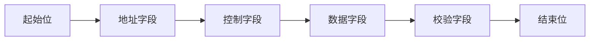
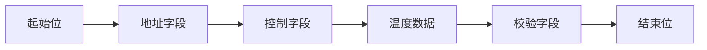

# 51单片机通信帧格式

在嵌入式系统中，通信协议是设备之间交换数据的基础。51单片机作为一种常用的微控制器，其通信协议中的帧格式是数据传输的核心。本文将详细介绍51单片机通信帧格式的基本概念、结构以及实际应用。

## 什么是通信帧格式？

通信帧格式是指在数据传输过程中，数据被组织成特定的结构，以便发送方和接收方能够正确解析和处理。一个典型的通信帧通常包括以下几个部分：

1. **起始位**：标识帧的开始。
2. **地址字段**：指定目标设备的地址。
3. **控制字段**：包含控制信息，如帧类型、序列号等。
4. **数据字段**：实际传输的数据。
5. **校验字段**：用于检测数据传输中的错误。
6. **结束位**：标识帧的结束。

## 51单片机通信帧格式的结构

在51单片机中，通信帧格式可以根据具体的通信协议（如UART、I2C、SPI等）有所不同。以下是一个典型的UART通信帧格式示例：



### 1. 起始位
起始位通常是一个固定的低电平信号，用于标识帧的开始。在UART通信中，起始位通常为1位。

### 2. 地址字段
地址字段用于指定目标设备的地址。在多设备通信中，地址字段是必不可少的。例如，在I2C通信中，地址字段通常为7位或10位。

### 3. 控制字段
控制字段包含控制信息，如帧类型、序列号等。这些信息用于指示接收方如何处理数据。

### 4. 数据字段
数据字段是实际传输的数据部分。数据字段的长度可以根据具体应用进行调整。

### 5. 校验字段
校验字段用于检测数据传输中的错误。常见的校验方式包括奇偶校验、CRC校验等。

### 6. 结束位
结束位标识帧的结束。在UART通信中，结束位通常为1位或2位的高电平信号。

## 代码示例

以下是一个简单的UART通信帧发送和接收的代码示例：

```c
#include <reg51.h>

void UART_Init() {
    SCON = 0x50;  // 设置串口模式1，8位数据，1位停止位
    TMOD = 0x20;  // 设置定时器1为模式2
    TH1 = 0xFD;   // 设置波特率为9600
    TL1 = 0xFD;
    TR1 = 1;      // 启动定时器1
    ES = 1;       // 使能串口中断
    EA = 1;       // 使能全局中断
}

void UART_SendByte(unsigned char byte) {
    SBUF = byte;  // 发送数据
    while (!TI);  // 等待发送完成
    TI = 0;       // 清除发送标志
}

unsigned char UART_ReceiveByte() {
    while (!RI);  // 等待接收完成
    RI = 0;       // 清除接收标志
    return SBUF;  // 返回接收到的数据
}

void main() {
    UART_Init();
    UART_SendByte(0x55);  // 发送一个字节
    unsigned char received = UART_ReceiveByte();  // 接收一个字节
    while (1);
}
```

### 输入和输出
- **输入**：发送字节 `0x55`
- **输出**：接收字节 `0x55`

## 实际应用案例

假设我们有一个温度传感器通过UART与51单片机通信。传感器发送的数据帧格式如下：



在这个案例中，51单片机需要解析接收到的数据帧，提取温度数据并进行处理。

## 总结

51单片机通信帧格式是数据传输的基础，理解其结构和组成对于开发嵌入式系统至关重要。通过本文的介绍和代码示例，你应该能够掌握如何构建和解析通信帧，并在实际项目中应用这些知识。

## 附加资源与练习

- **练习1**：修改代码示例，使其能够发送和接收一个完整的数据帧（包括起始位、地址字段、控制字段、数据字段、校验字段和结束位）。
- **练习2**：尝试使用I2C或SPI协议实现类似的通信帧格式。

:::tip
在实际项目中，通信帧格式可能会根据具体需求进行调整。建议在开发过程中仔细阅读相关设备的通信协议文档。
:::