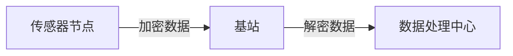
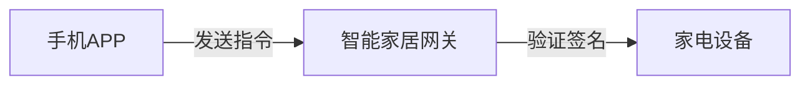

# 51单片机通信加密

在现代嵌入式系统中，通信安全是一个至关重要的课题。51单片机作为一种广泛使用的微控制器，其通信协议的安全性同样需要关注。本文将介绍如何在51单片机通信中实现数据加密，确保通信过程中的数据安全。

## 1. 什么是通信加密？

通信加密是指在数据传输过程中，通过某种算法将原始数据（明文）转换为不可读的形式（密文），以防止未经授权的第三方窃取或篡改数据。在51单片机通信中，加密可以保护敏感信息，如传感器数据、控制指令等。

:::note
加密的目的是确保数据的**机密性**、**完整性**和**真实性**。
:::

## 2. 常见的加密方法

在51单片机中，由于资源有限，通常采用轻量级的加密算法。以下是一些常见的加密方法：

### 2.1 对称加密

对称加密使用相同的密钥进行加密和解密。常见的对称加密算法有：

- **AES（高级加密标准）**
- **DES（数据加密标准）**
- **RC4**

由于51单片机的计算能力有限，AES-128 是一个常用的选择。

### 2.2 非对称加密

非对称加密使用一对密钥：公钥和私钥。公钥用于加密，私钥用于解密。常见的非对称加密算法有：

- **RSA**
- **ECC（椭圆曲线加密）**

非对称加密通常用于密钥交换，但由于其计算复杂度较高，51单片机中较少使用。

### 2.3 哈希函数

哈希函数将任意长度的数据映射为固定长度的哈希值。常见的哈希函数有：

- **MD5**
- **SHA-1**
- **SHA-256**

哈希函数通常用于验证数据的完整性。

## 3. 51单片机通信加密的实现

### 3.1 对称加密示例：AES-128

以下是一个简单的AES-128加密示例，使用C语言编写：

```c
#include <stdint.h>
#include <string.h>

// AES-128加密函数
void aes128_encrypt(uint8_t *plaintext, uint8_t *key, uint8_t *ciphertext) {
    // 这里实现AES-128加密算法
    // 由于AES算法较为复杂，此处省略具体实现
    memcpy(ciphertext, plaintext, 16); // 假设加密后数据不变
}

int main() {
    uint8_t plaintext[16] = "Hello, World!";
    uint8_t key[16] = "secretkey123456";
    uint8_t ciphertext[16];

    aes128_encrypt(plaintext, key, ciphertext);

    // 输出密文
    for (int i = 0; i < 16; i++) {
        printf("%02x", ciphertext[i]);
    }
    return 0;
}
```

**输入：**
- 明文：`"Hello, World!"`
- 密钥：`"secretkey123456"`

**输出：**
- 密文：`（假设加密后数据不变）`

:::caution
在实际应用中，AES-128的实现需要包含完整的加密算法，此处仅为示例。
:::

### 3.2 哈希函数示例：MD5

以下是一个简单的MD5哈希函数示例：

```c
#include <stdio.h>
#include <string.h>
#include <openssl/md5.h>

void md5_hash(const char *input, unsigned char *output) {
    MD5_CTX context;
    MD5_Init(&context);
    MD5_Update(&context, input, strlen(input));
    MD5_Final(output, &context);
}

int main() {
    const char *input = "Hello, World!";
    unsigned char output[MD5_DIGEST_LENGTH];

    md5_hash(input, output);

    // 输出哈希值
    for (int i = 0; i < MD5_DIGEST_LENGTH; i++) {
        printf("%02x", output[i]);
    }
    return 0;
}
```

**输入：**
- 数据：`"Hello, World!"`

**输出：**
- 哈希值：`（假设为`fc3ff98e8c6a0d3087d515c0473f8677`）`

## 4. 实际应用案例

### 4.1 无线传感器网络

在无线传感器网络中，传感器节点通过无线通信将数据传输到基站。为了防止数据被窃听或篡改，可以使用AES-128对数据进行加密。



### 4.2 智能家居系统

在智能家居系统中，控制指令通过无线通信发送到家电设备。为了防止未经授权的控制，可以使用MD5哈希函数对指令进行签名验证。



## 5. 总结

51单片机通信加密是确保数据安全的重要手段。通过对称加密、非对称加密和哈希函数，可以有效保护通信数据的机密性、完整性和真实性。在实际应用中，应根据具体需求选择合适的加密方法。

:::tip
对于初学者来说，建议从对称加密（如AES-128）开始学习，逐步掌握更复杂的加密技术。
:::

## 6. 附加资源与练习

- **资源：**
  - [AES加密算法详解](https://en.wikipedia.org/wiki/Advanced_Encryption_Standard)
  - [MD5哈希函数详解](https://en.wikipedia.org/wiki/MD5)

- **练习：**
  1. 尝试在51单片机上实现AES-128加密算法。
  2. 使用MD5哈希函数对一段数据进行哈希，并验证其完整性。

通过本文的学习，你应该对51单片机通信加密有了初步的了解。继续深入学习，你将能够设计出更加安全的嵌入式系统。