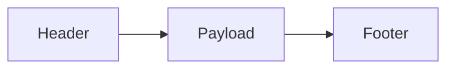

# 51单片机数据打包

在嵌入式系统中，数据打包是一个非常重要的概念，尤其是在通信协议中。数据打包是指将多个数据项组合成一个数据包，以便于传输或存储。对于51单片机来说，数据打包可以帮助我们更高效地处理数据，尤其是在串口通信、无线通信等场景中。

## 什么是数据打包？

数据打包是将多个数据项（如传感器数据、状态信息等）组合成一个数据包的过程。这个数据包通常包含一个头部（Header）、数据部分（Payload）和尾部（Footer）。头部和尾部通常用于标识数据包的开始和结束，以及校验数据的完整性。

### 数据包的基本结构

一个典型的数据包结构如下：



- **Header**: 标识数据包的开始，通常包含数据包的长度、类型等信息。
- **Payload**: 实际的数据内容，可以是传感器数据、控制命令等。
- **Footer**: 标识数据包的结束，通常包含校验和（Checksum）等信息。

## 数据打包的实现

在51单片机中，数据打包通常通过数组或结构体来实现。下面是一个简单的例子，展示了如何将传感器数据打包成一个数据包。

### 示例代码

```c
#include <reg51.h>

typedef struct {
    unsigned char header;
    unsigned char sensor1;
    unsigned char sensor2;
    unsigned char footer;
} DataPacket;

void packData(DataPacket *packet, unsigned char sensor1, unsigned char sensor2) {
    packet->header = 0xAA;  // 数据包头
    packet->sensor1 = sensor1;
    packet->sensor2 = sensor2;
    packet->footer = 0x55;  // 数据包尾
}

void sendData(DataPacket *packet) {
    // 假设通过串口发送数据
    SBUF = packet->header;
    while(!TI); TI = 0;
    SBUF = packet->sensor1;
    while(!TI); TI = 0;
    SBUF = packet->sensor2;
    while(!TI); TI = 0;
    SBUF = packet->footer;
    while(!TI); TI = 0;
}

void main() {
    DataPacket packet;
    unsigned char sensor1 = 0x10;
    unsigned char sensor2 = 0x20;

    packData(&packet, sensor1, sensor2);
    sendData(&packet);

    while(1);
}
```

### 代码解释

1. **DataPacket 结构体**: 定义了一个包含头部、传感器数据和尾部的结构体。
2. **packData 函数**: 将传感器数据打包到结构体中。
3. **sendData 函数**: 通过串口发送打包好的数据。

### 输入和输出

- **输入**: `sensor1 = 0x10`, `sensor2 = 0x20`
- **输出**: 通过串口发送的数据包为 `0xAA 0x10 0x20 0x55`

## 实际应用场景

数据打包在实际应用中非常常见，例如：

- **无线通信**: 在无线模块中，数据打包可以确保数据的完整性和可靠性。
- **传感器网络**: 多个传感器的数据可以通过打包后一次性传输，减少通信开销。
- **工业控制**: 在工业控制系统中，数据打包可以用于传输控制命令和状态信息。

## 总结

数据打包是51单片机通信协议中的一个重要概念，它可以帮助我们更高效地处理数据。通过本文的介绍，你应该已经了解了数据打包的基本概念、实现方法以及实际应用场景。

:::tip
在实际开发中，数据打包的格式和内容可以根据具体需求进行调整。例如，可以增加校验和、时间戳等信息，以提高数据的可靠性。
:::

## 附加资源

- [51单片机串口通信教程](#)
- [嵌入式系统中的数据打包与解包](#)
- [51单片机编程实战](#)

## 练习

1. 修改上述代码，增加一个校验和字段，并在发送数据时计算校验和。
2. 尝试将多个传感器的数据打包成一个数据包，并通过串口发送。
3. 研究如何在接收端解包数据，并验证数据的完整性。
