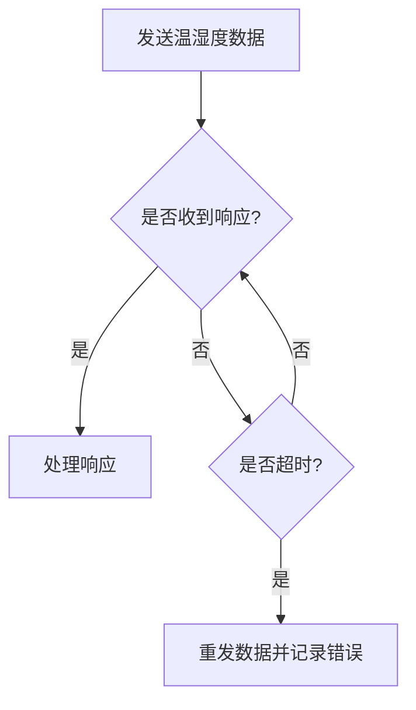

# 51单片机通信超时处理

在嵌入式系统中，通信是单片机与其他设备交互的重要方式。然而，通信过程中可能会遇到各种问题，例如数据丢失、设备未响应等。为了确保通信的可靠性，超时处理机制是必不可少的。本文将详细介绍51单片机通信中的超时处理机制，并通过代码示例和实际案例帮助初学者理解和应用这一概念。

## 什么是超时处理？

超时处理是指在通信过程中，如果在一定时间内没有收到预期的响应或数据，系统将采取相应的措施，例如重发数据、记录错误或终止通信。超时处理的主要目的是防止系统因等待响应而陷入无限等待状态，从而提高系统的健壮性和可靠性。

## 超时处理的实现

在51单片机中，超时处理通常通过定时器来实现。定时器可以设置一个时间阈值，如果在规定时间内没有收到响应，定时器将触发超时事件，系统可以根据需要采取相应的措施。

### 定时器设置

首先，我们需要配置定时器来设置超时时间。以下是一个简单的定时器初始化代码示例：

```c
void Timer0_Init(void) {
    TMOD |= 0x01;  // 设置定时器0为模式1（16位定时器）
    TH0 = 0xFC;    // 设置定时器初值，定时1ms
    TL0 = 0x18;
    ET0 = 1;       // 使能定时器0中断
    EA = 1;        // 使能总中断
    TR0 = 1;       // 启动定时器0
}
```

### 超时检测

在通信过程中，我们可以通过定时器中断来检测是否超时。以下是一个简单的超时检测代码示例：

```c
bit timeout_flag = 0;  // 超时标志位

void Timer0_ISR(void) interrupt 1 {
    TH0 = 0xFC;  // 重装定时器初值
    TL0 = 0x18;
    timeout_flag = 1;  // 设置超时标志位
}

void Communication_Process(void) {
    timeout_flag = 0;  // 清除超时标志位
    Send_Data();       // 发送数据
    while (!Receive_Response() && !timeout_flag) {
        // 等待响应或超时
    }
    if (timeout_flag) {
        // 处理超时情况
        Handle_Timeout();
    } else {
        // 处理正常响应
        Handle_Response();
    }
}
```

### 超时处理

当检测到超时后，系统可以根据需要采取不同的处理措施。例如，可以重发数据、记录错误日志或终止通信。以下是一个简单的超时处理代码示例：

```c
void Handle_Timeout(void) {
    // 重发数据
    Send_Data();
    // 记录错误日志
    Log_Error("Timeout occurred");
}
```

## 实际应用案例

假设我们有一个基于51单片机的温湿度传感器系统，单片机通过串口与上位机通信。在通信过程中，如果上位机在一定时间内没有响应，单片机将重发数据并记录错误日志。

### 通信流程



### 代码实现

```c
void Send_Temperature_Humidity(void) {
    timeout_flag = 0;  // 清除超时标志位
    Send_Data();       // 发送温湿度数据
    while (!Receive_Response() && !timeout_flag) {
        // 等待响应或超时
    }
    if (timeout_flag) {
        // 处理超时情况
        Handle_Timeout();
    } else {
        // 处理正常响应
        Handle_Response();
    }
}
```

## 总结

超时处理是51单片机通信中非常重要的一环，它可以有效提高通信的可靠性和系统的健壮性。通过定时器设置和超时检测，我们可以在通信过程中及时发现并处理超时问题。本文通过代码示例和实际案例，帮助初学者理解和应用超时处理机制。

## 附加资源与练习

- **练习1**：尝试在现有的51单片机项目中实现超时处理机制，并测试其效果。
- **练习2**：修改超时处理代码，使其在超时后尝试多次重发数据，直到成功或达到最大重试次数。
- **资源**：参考51单片机数据手册，了解更多关于定时器和中断的详细信息。

通过以上内容的学习和实践，相信你已经掌握了51单片机通信中的超时处理机制。继续努力，你将在嵌入式系统开发中取得更大的进步！