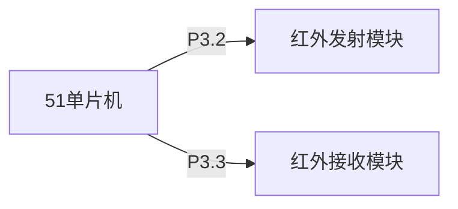

# 51单片机红外通信

## 介绍

红外通信是一种利用红外线进行数据传输的无线通信技术。它广泛应用于遥控器、无线耳机、智能家居等领域。51单片机作为一种经典的微控制器，可以通过红外通信模块实现简单的数据传输。本文将逐步讲解51单片机红外通信的基本原理、实现方法以及实际应用。

## 红外通信的基本原理

红外通信是通过红外发射管和接收管来实现的。发射管将电信号转换为红外光信号，接收管则将接收到的红外光信号转换回电信号。通信过程中，数据通常以脉冲的形式进行编码和解码。

### 红外通信的编码方式

常见的红外通信编码方式有NEC编码、RC5编码等。以NEC编码为例，它使用38kHz的载波频率，数据以脉冲宽度调制（PWM）的形式传输。

## 51单片机红外通信的实现

### 硬件连接

在51单片机中，红外发射模块通常连接到单片机的P3.2引脚（外部中断0），而红外接收模块则连接到P3.3引脚（外部中断1）。以下是硬件连接的示意图：



### 软件实现

#### 红外发射

以下是一个简单的红外发射代码示例，使用NEC编码发送数据：

```c
#include <reg52.h>

sbit IR_TX = P3^2; // 红外发射引脚

void delay(unsigned int time) {
    while(time--);
}

void sendNEC(unsigned char address, unsigned char command) {
    unsigned char i, j;
    // 发送起始信号
    IR_TX = 1;
    delay(9000);
    IR_TX = 0;
    delay(4500);
    // 发送地址
    for(i = 0; i < 8; i++) {
        IR_TX = 1;
        delay(560);
        IR_TX = 0;
        if(address & 0x01) {
            delay(1690);
        } else {
            delay(560);
        }
        address >>= 1;
    }
    // 发送命令
    for(i = 0; i < 8; i++) {
        IR_TX = 1;
        delay(560);
        IR_TX = 0;
        if(command & 0x01) {
            delay(1690);
        } else {
            delay(560);
        }
        command >>= 1;
    }
    // 发送结束信号
    IR_TX = 1;
    delay(560);
    IR_TX = 0;
}

void main() {
    while(1) {
        sendNEC(0x00, 0x45); // 发送地址0x00，命令0x45
        delay(50000); // 延时一段时间
    }
}
```

#### 红外接收

以下是一个简单的红外接收代码示例，使用NEC编码接收数据：

```c
#include <reg52.h>

sbit IR_RX = P3^3; // 红外接收引脚

unsigned char irData[4]; // 存储接收到的数据

void delay(unsigned int time) {
    while(time--);
}

void decodeNEC() {
    unsigned char i, j;
    // 等待起始信号
    while(IR_RX);
    delay(9000);
    // 接收地址
    for(i = 0; i < 8; i++) {
        while(!IR_RX);
        delay(560);
        if(IR_RX) {
            irData[0] |= (1 << i);
            delay(1690);
        } else {
            delay(560);
        }
    }
    // 接收命令
    for(i = 0; i < 8; i++) {
        while(!IR_RX);
        delay(560);
        if(IR_RX) {
            irData[1] |= (1 << i);
            delay(1690);
        } else {
            delay(560);
        }
    }
}

void main() {
    while(1) {
        decodeNEC();
        // 处理接收到的数据
        // ...
    }
}
```

## 实际应用案例

### 红外遥控器

红外通信最常见的应用之一是红外遥控器。通过51单片机，我们可以实现一个简单的红外遥控器，用于控制家电设备。例如，可以通过红外遥控器控制电视的开关、音量调节等功能。

### 智能家居

在智能家居系统中，红外通信可以用于控制灯光、空调、窗帘等设备。通过51单片机，我们可以实现一个集中控制系统，通过红外信号控制多个设备。

## 总结

本文详细介绍了51单片机红外通信的基本原理、实现方法以及实际应用场景。通过学习本文，您应该能够理解红外通信的基本概念，并能够在51单片机上实现简单的红外通信功能。

## 附加资源与练习

- **练习1**：尝试修改代码，实现一个红外遥控器，控制LED灯的开关。
- **练习2**：研究其他红外通信编码方式，如RC5编码，并尝试在51单片机上实现。
- **附加资源**：阅读更多关于红外通信的文献，了解其在不同领域的应用。

:::tip
在实际项目中，红外通信的稳定性和抗干扰能力非常重要。建议在实际应用中进行充分的测试和优化。
:::