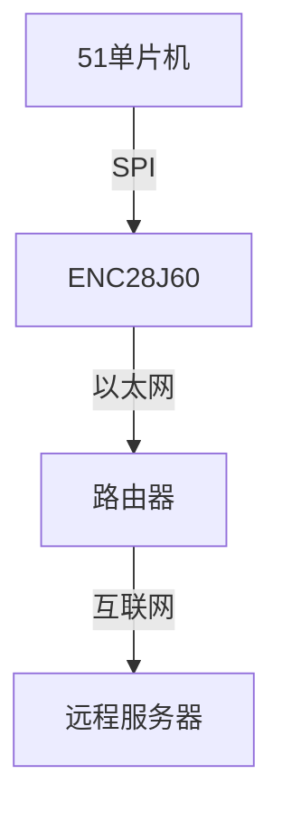

# 51单片机TCP/IP协议

## 介绍

TCP/IP协议是互联网通信的基础协议栈，由传输控制协议（TCP）和互联网协议（IP）组成。它定义了数据如何在网络中传输，并确保数据的可靠性和完整性。在嵌入式系统中，51单片机由于其资源有限，实现TCP/IP协议栈需要特别优化。本教程将带你了解如何在51单片机上实现TCP/IP协议栈，并通过实际案例展示其应用。

## TCP/IP协议栈的基本概念

TCP/IP协议栈分为四层：

1. **应用层**：负责处理特定的应用程序细节，如HTTP、FTP等。
2. **传输层**：提供端到端的通信服务，如TCP和UDP。
3. **网络层**：负责数据包的路由和转发，如IP协议。
4. **链路层**：负责物理介质的访问控制，如以太网、Wi-Fi等。

在51单片机上实现TCP/IP协议栈时，通常需要简化协议栈，以适应其有限的资源。

## 51单片机上的TCP/IP实现

### 1. 硬件准备

在51单片机上实现TCP/IP协议栈，通常需要一个网络接口芯片，如ENC28J60。该芯片可以通过SPI接口与51单片机通信，并提供以太网功能。

### 2. 软件实现

在51单片机上实现TCP/IP协议栈，通常使用轻量级的协议栈，如uIP或lwIP。这些协议栈经过优化，适合资源有限的嵌入式系统。

#### 代码示例：初始化ENC28J60

```c
#include <reg52.h>
#include "enc28j60.h"

void main() {
    // 初始化ENC28J60
    ENC28J60_Init();
    
    // 配置MAC地址
    ENC28J60_SetMACAddr(0x00, 0x11, 0x22, 0x33, 0x44, 0x55);
    
    // 配置IP地址
    ENC28J60_SetIPAddr(192, 168, 1, 100);
    
    // 进入主循环
    while (1) {
        // 处理网络数据包
        ENC28J60_ProcessPacket();
    }
}
```

#### 代码示例：发送TCP数据包

```c
void send_tcp_packet() {
    // 创建TCP数据包
    struct tcp_packet packet;
    packet.src_port = 80;
    packet.dst_port = 8080;
    packet.data = "Hello, World!";
    
    // 发送TCP数据包
    ENC28J60_SendTCPPacket(&packet);
}
```

### 3. 实际案例：远程温度监控系统

假设我们有一个基于51单片机的远程温度监控系统，该系统通过TCP/IP协议将温度数据发送到远程服务器。

#### 系统架构



#### 代码示例：发送温度数据

```c
void send_temperature_data(float temperature) {
    // 创建TCP数据包
    struct tcp_packet packet;
    packet.src_port = 80;
    packet.dst_port = 8080;
    packet.data = "Temperature: ";
    strcat(packet.data, float_to_string(temperature));
    
    // 发送TCP数据包
    ENC28J60_SendTCPPacket(&packet);
}
```

## 总结

通过本教程，我们了解了如何在51单片机上实现TCP/IP协议栈，并通过实际案例展示了其应用。虽然51单片机资源有限，但通过优化和简化协议栈，我们仍然可以实现基本的网络通信功能。

## 附加资源

- [uIP协议栈文档](https://www.sics.se/~adam/uip/)
- [lwIP协议栈文档](https://savannah.nongnu.org/projects/lwip/)
- [ENC28J60数据手册](https://www.microchip.com/wwwproducts/en/ENC28J60)

## 练习

1. 尝试在51单片机上实现一个简单的HTTP服务器，能够响应GET请求并返回一个简单的HTML页面。
2. 修改远程温度监控系统，使其能够通过UDP协议发送温度数据，并比较TCP和UDP的优缺点。
