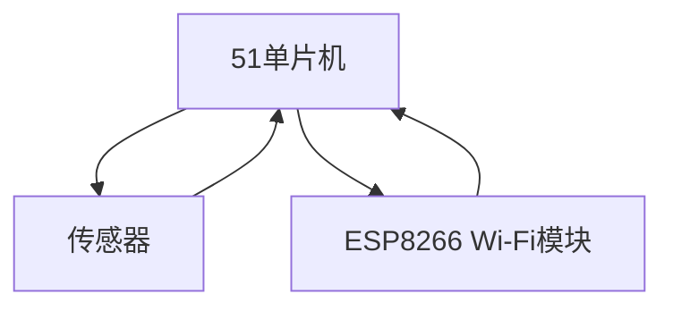

## 介绍

51单片机是一种广泛应用于嵌入式系统的微控制器，因其成本低、易于编程和广泛的支持库而受到初学者的青睐。在网络应用中，51单片机可以用于采集传感器数据并通过网络发送到远程服务器。本文将详细介绍如何使用51单片机进行网络数据采集，包括硬件连接、网络通信协议以及数据采集的实现方法。

## 硬件连接

在进行网络数据采集之前，首先需要将51单片机与传感器和网络模块连接起来。常见的网络模块有ESP8266 Wi-Fi模块和ENC28J60以太网模块。以下是一个简单的硬件连接示意图：



### 连接步骤

1. **传感器连接**：将传感器的数据引脚连接到51单片机的I/O口。例如，温度传感器的数据引脚可以连接到P1.0。
2. **网络模块连接**：将ESP8266的TX和RX引脚分别连接到51单片机的P3.0和P3.1（串口通信引脚）。
3. **电源连接**：确保所有设备都连接到适当的电源，通常为5V或3.3V。

## 网络通信协议

51单片机通过网络模块与远程服务器通信时，通常使用HTTP或MQTT协议。以下是两种协议的简要介绍：

### HTTP协议

HTTP是一种应用层协议，常用于Web服务。51单片机可以通过HTTP GET或POST请求将采集到的数据发送到服务器。

### MQTT协议

MQTT是一种轻量级的发布/订阅消息传输协议，适用于低带宽、不稳定的网络环境。51单片机可以作为MQTT客户端，将数据发布到指定的主题。

## 数据采集与发送

以下是一个简单的代码示例，展示如何使用51单片机采集温度传感器数据并通过ESP8266 Wi-Fi模块发送到远程服务器。

```c
#include <reg52.h>
#include <stdio.h>
#include <string.h>

#define uchar unsigned char
#define uint unsigned int

sbit DQ = P1^0;  // 温度传感器数据引脚

void UART_Init() {
    SCON = 0x50;  // 8位数据,1位停止位
    TMOD = 0x20;  // 定时器1模式2
    TH1 = 0xFD;   // 波特率9600
    TL1 = 0xFD;
    TR1 = 1;      // 启动定时器1
    ES = 1;       // 使能串口中断
    EA = 1;       // 使能总中断
}

void UART_SendByte(uchar byte) {
    SBUF = byte;
    while (!TI);
    TI = 0;
}

void UART_SendString(char *str) {
    while (*str) {
        UART_SendByte(*str++);
    }
}

float ReadTemperature() {
    // 读取温度传感器数据的代码
    // 这里假设返回一个浮点数温度值
    return 25.5;  // 示例温度值
}

void SendDataToServer(float temperature) {
    char buffer[50];
    sprintf(buffer, "GET /update?temp=%.2f HTTP/1.1\r\nHost: example.com\r\n\r\n", temperature);
    UART_SendString(buffer);
}

void main() {
    UART_Init();
    while (1) {
        float temp = ReadTemperature();
        SendDataToServer(temp);
        delay(5000);  // 每5秒发送一次数据
    }
}
```

### 代码解释

1. **UART_Init()**：初始化串口通信，设置波特率为9600。
2. **UART_SendByte()**：发送一个字节的数据。
3. **UART_SendString()**：发送一个字符串。
4. **ReadTemperature()**：读取温度传感器的数据（此处为示例值）。
5. **SendDataToServer()**：将温度数据通过HTTP GET请求发送到服务器。

## 实际应用案例

### 智能家居温度监控

在一个智能家居系统中，51单片机可以用于采集室内温度数据，并通过Wi-Fi模块将数据发送到云服务器。用户可以通过手机应用实时查看室内温度，并根据需要调整空调或暖气。

### 工业环境监测

在工业环境中，51单片机可以用于监测设备的温度、湿度等参数，并通过以太网模块将数据发送到中央监控系统。这有助于及时发现设备异常，防止事故发生。

## 总结

通过本文的学习，你应该已经掌握了如何使用51单片机进行网络数据采集的基本方法。我们介绍了硬件连接、网络通信协议以及数据采集与发送的实现步骤。希望这些内容能够帮助你在实际项目中应用51单片机进行网络数据采集。

## 附加资源与练习

1. **练习**：尝试修改代码，使用MQTT协议将数据发送到服务器。
2. **资源**：查阅ESP8266和ENC28J60的官方文档，了解更多关于网络模块的使用方法。
3. **扩展**：探索如何将多个传感器的数据同时采集并发送到服务器。

:::tip
在实际项目中，确保网络连接的稳定性和数据的安全性是非常重要的。建议使用加密协议（如HTTPS或MQTTS）来保护数据传输。
:::