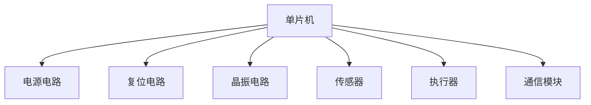
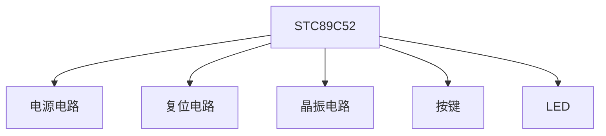

# 51单片机项目规划

## 介绍

51单片机是一种广泛应用于嵌入式系统的微控制器，因其成本低、易于学习和使用而受到初学者的青睐。在开始一个51单片机项目之前，合理的项目规划是确保项目成功的关键。本文将逐步讲解如何规划一个51单片机项目，并通过实际案例帮助你理解这一过程。

## 项目规划步骤

### 1. 项目需求分析

在开始任何项目之前，首先需要明确项目的需求。需求分析包括以下几个方面：

- **功能需求**：项目需要实现哪些功能？例如，控制LED灯、读取传感器数据、驱动电机等。
- **性能需求**：项目对性能有何要求？例如，响应时间、功耗、精度等。
- **用户需求**：项目的最终用户是谁？他们对项目有何期望？
- **环境需求**：项目将在何种环境下运行？例如，温度、湿度、电磁干扰等。

:::tip
需求分析是项目规划的基础，确保所有需求都被明确记录，并在后续设计中逐一实现。
:::

### 2. 硬件设计

在明确了项目需求后，接下来是硬件设计。硬件设计包括以下几个方面：

- **选择单片机型号**：根据项目需求选择合适的51单片机型号。例如，STC89C52、AT89S51等。
- **外围电路设计**：设计单片机的外围电路，包括电源电路、复位电路、晶振电路等。
- **接口设计**：设计单片机与其他模块的接口，例如传感器、执行器、通信模块等。



:::caution
硬件设计时需注意电路的稳定性和抗干扰能力，确保硬件系统能够可靠运行。
:::

### 3. 软件设计

硬件设计完成后，接下来是软件设计。软件设计包括以下几个方面：

- **程序架构设计**：设计程序的整体架构，包括主程序、子程序、中断服务程序等。
- **模块化设计**：将程序分解为多个模块，每个模块负责一个特定的功能。例如，按键处理模块、显示模块、通信模块等。
- **算法设计**：根据项目需求设计相应的算法。例如，PID控制算法、滤波算法等。

```c
#include <reg52.h>

void main() {
    while (1) {
        // 主循环
    }
}

void Timer0_ISR() interrupt 1 {
    // 定时器0中断服务程序
}
```

:::note
软件设计时需注意代码的可读性和可维护性，尽量使用模块化设计，便于后续调试和维护。
:::

### 4. 调试与测试

硬件和软件设计完成后，接下来是调试与测试。调试与测试包括以下几个方面：

- **硬件调试**：检查硬件电路是否正确连接，是否存在短路、断路等问题。
- **软件调试**：通过仿真器或调试工具检查程序是否按预期运行，是否存在逻辑错误。
- **系统测试**：将硬件和软件结合起来进行系统测试，确保整个系统能够正常工作。

:::warning
调试与测试是项目成功的关键步骤，需耐心细致地进行，确保每个功能都能正常工作。
:::

## 实际案例：LED灯控制系统

为了更好地理解51单片机项目规划的过程，我们以一个简单的LED灯控制系统为例进行说明。

### 需求分析

- **功能需求**：通过按键控制LED灯的开关。
- **性能需求**：按键响应时间小于100ms。
- **用户需求**：用户希望通过按键轻松控制LED灯。
- **环境需求**：系统在室内环境下运行。

### 硬件设计

- **单片机型号**：STC89C52。
- **外围电路**：电源电路、复位电路、晶振电路。
- **接口设计**：按键接口、LED接口。



### 软件设计

- **程序架构**：主循环检测按键状态，控制LED灯。
- **模块化设计**：按键处理模块、LED控制模块。
- **算法设计**：简单的状态机控制LED灯。

```c
#include <reg52.h>

sbit LED = P1^0;
sbit KEY = P3^2;

void main() {
    LED = 0; // 初始化LED灯关闭
    while (1) {
        if (KEY == 0) { // 检测按键是否按下
            LED = ~LED; // 切换LED灯状态
            while (KEY == 0); // 等待按键释放
        }
    }
}
```

### 调试与测试

- **硬件调试**：检查按键和LED灯是否正确连接。
- **软件调试**：通过仿真器检查程序是否按预期运行。
- **系统测试**：按下按键，观察LED灯是否正常切换。

## 总结

通过本文的学习，你应该已经掌握了如何规划一个51单片机项目。从需求分析到硬件设计、软件设计，再到调试与测试，每一步都至关重要。合理的项目规划能够大大提高项目的成功率。

## 附加资源与练习

- **附加资源**：
  - [51单片机编程指南](https://example.com)
  - [嵌入式系统设计教程](https://example.com)

- **练习**：
  - 设计一个基于51单片机的温度控制系统，要求能够读取温度传感器数据并通过LED显示温度范围。
  - 设计一个基于51单片机的简单计算器，要求能够实现加减乘除运算并通过数码管显示结果。

希望本文对你有所帮助，祝你在51单片机的学习道路上越走越远！