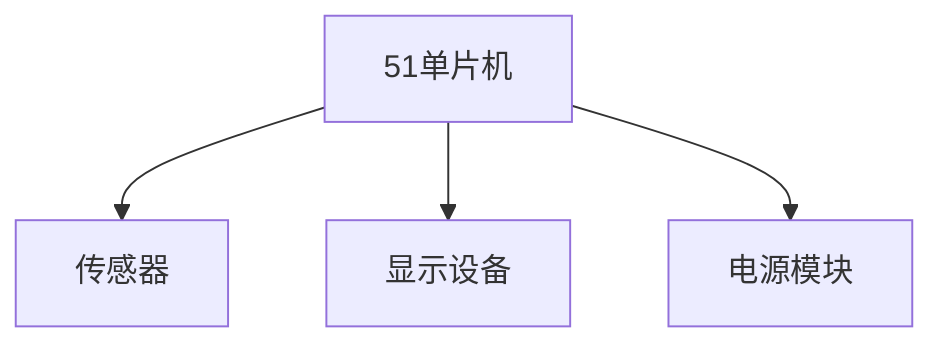

## 介绍

在开始任何51单片机项目之前，需求分析是一个至关重要的步骤。需求分析帮助我们明确项目的目标、功能、性能要求以及所需的硬件和软件资源。通过详细的需求分析，我们可以避免在开发过程中遇到不必要的麻烦，并确保项目能够按时完成。

## 什么是需求分析？

需求分析是项目开发的第一步，它涉及收集和分析项目的需求，以确定项目的目标和约束条件。对于51单片机项目，需求分析通常包括以下几个方面：

1. **功能需求**：项目需要实现哪些功能？
2. **性能需求**：项目需要达到什么样的性能标准？
3. **硬件需求**：项目需要哪些硬件资源？
4. **软件需求**：项目需要哪些软件资源？

## 功能需求

功能需求描述了项目需要实现的具体功能。例如，如果您正在开发一个温度监控系统，功能需求可能包括：

- 实时采集温度数据
- 显示当前温度
- 当温度超过设定阈值时发出警报

:::tip
在定义功能需求时，尽量具体和明确。避免使用模糊的语言，如“系统应该快速响应”。
:::

## 性能需求

性能需求描述了项目需要达到的性能标准。例如，对于温度监控系统，性能需求可能包括：

- 温度采集的精度为±0.5°C
- 系统响应时间不超过1秒
- 系统能够在-40°C到85°C的温度范围内正常工作

:::caution
性能需求应与实际应用场景相匹配。过高的性能要求可能会导致不必要的硬件成本增加。
:::

## 硬件需求

硬件需求描述了项目所需的硬件资源。对于51单片机项目，硬件需求可能包括：

- 51单片机型号（如STC89C52）
- 传感器（如DS18B20温度传感器）
- 显示设备（如LCD1602液晶屏）
- 电源模块



## 软件需求

软件需求描述了项目所需的软件资源。对于51单片机项目，软件需求可能包括：

- 开发环境（如Keil uVision）
- 编程语言（如C语言）
- 驱动程序（如LCD1602驱动程序）
- 通信协议（如I2C、SPI）

:::note
选择合适的开发环境和编程语言可以大大提高开发效率。对于初学者，Keil uVision和C语言是不错的选择。
:::

## 实际案例：温度监控系统

让我们通过一个实际案例来展示如何进行需求分析。假设我们要开发一个基于51单片机的温度监控系统。

### 功能需求

- 实时采集温度数据
- 显示当前温度
- 当温度超过设定阈值时发出警报

### 性能需求

- 温度采集的精度为±0.5°C
- 系统响应时间不超过1秒
- 系统能够在-40°C到85°C的温度范围内正常工作

### 硬件需求

- 51单片机：STC89C52
- 传感器：DS18B20温度传感器
- 显示设备：LCD1602液晶屏
- 电源模块：5V直流电源

### 软件需求

- 开发环境：Keil uVision
- 编程语言：C语言
- 驱动程序：LCD1602驱动程序
- 通信协议：1-Wire协议（用于DS18B20）

### 代码示例

以下是一个简单的代码示例，展示了如何使用51单片机读取DS18B20温度传感器的数据并显示在LCD1602上。

```c
#include <reg52.h>
#include <intrins.h>

#define uchar unsigned char
#define uint unsigned int

sbit DQ = P3^7;  // DS18B20数据引脚
sbit RS = P2^0;  // LCD1602 RS引脚
sbit RW = P2^1;  // LCD1602 RW引脚
sbit EN = P2^2;  // LCD1602 EN引脚

void delay(uint t) {
    while(t--);
}

void lcd_write_command(uchar command) {
    RS = 0;
    RW = 0;
    EN = 1;
    P0 = command;
    delay(100);
    EN = 0;
}

void lcd_write_data(uchar data) {
    RS = 1;
    RW = 0;
    EN = 1;
    P0 = data;
    delay(100);
    EN = 0;
}

void lcd_init() {
    lcd_write_command(0x38);  // 8位数据接口，两行显示，5x7点阵
    lcd_write_command(0x0C);  // 显示开，光标关，光标不闪烁
    lcd_write_command(0x06);  // 文字不动，地址自动+1
    lcd_write_command(0x01);  // 清屏
}

void ds18b20_reset() {
    DQ = 1;
    _nop_();
    DQ = 0;
    delay(480);
    DQ = 1;
    delay(60);
    while(DQ);
    delay(480);
}

uchar ds18b20_read_byte() {
    uchar i, dat = 0;
    for(i=0; i<8; i++) {
        DQ = 0;
        _nop_();
        dat >>= 1;
        DQ = 1;
        _nop_();
        if(DQ) dat |= 0x80;
        delay(60);
    }
    return dat;
}

void ds18b20_write_byte(uchar dat) {
    uchar i;
    for(i=0; i<8; i++) {
        DQ = 0;
        _nop_();
        DQ = dat & 0x01;
        delay(60);
        DQ = 1;
        dat >>= 1;
    }
}

float ds18b20_read_temp() {
    uchar tempL, tempH;
    float temp;
    ds18b20_reset();
    ds18b20_write_byte(0xCC);  // 跳过ROM
    ds18b20_write_byte(0x44);  // 启动温度转换
    delay(1000);
    ds18b20_reset();
    ds18b20_write_byte(0xCC);  // 跳过ROM
    ds18b20_write_byte(0xBE);  // 读取温度
    tempL = ds18b20_read_byte();
    tempH = ds18b20_read_byte();
    temp = (tempH << 8) | tempL;
    temp = temp * 0.0625;
    return temp;
}

void main() {
    float temp;
    lcd_init();
    while(1) {
        temp = ds18b20_read_temp();
        lcd_write_command(0x80);  // 设置显示位置
        lcd_write_data('T');
        lcd_write_data('e');
        lcd_write_data('m');
        lcd_write_data('p');
        lcd_write_data(':');
        lcd_write_data((uchar)(temp / 10) + '0');
        lcd_write_data((uchar)(temp % 10) + '0');
        lcd_write_data('.');
        lcd_write_data((uchar)((temp * 10) % 10) + '0');
        lcd_write_data('C');
        delay(10000);
    }
}
```

## 总结

需求分析是51单片机项目开发的关键步骤。通过明确功能需求、性能需求、硬件需求和软件需求，我们可以确保项目顺利进行并达到预期目标。本文通过一个温度监控系统的实际案例，展示了如何进行需求分析，并提供了相关的代码示例。

## 附加资源

- [Keil uVision 官方文档](https://www.keil.com/support/man/docs/uv4/)
- [51单片机编程指南](https://www.stcmcu.com/)
- [DS18B20 数据手册](https://datasheets.maximintegrated.com/en/ds/DS18B20.pdf)

## 练习

1. 为您的51单片机项目编写一份详细的需求分析文档。
2. 尝试修改代码示例，使其能够在温度超过30°C时发出警报。
3. 研究其他类型的传感器（如湿度传感器），并将其集成到您的项目中。

通过以上步骤，您将能够更好地理解和应用51单片机需求分析的概念。祝您学习愉快！