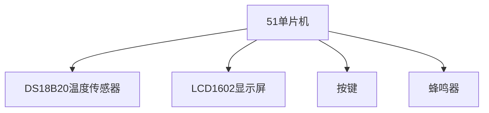

# 51单片机综合应用实例

## 介绍

51单片机是一种广泛应用于嵌入式系统的微控制器，因其成本低、易于学习和使用而受到初学者的青睐。本文将通过一个综合应用实例，展示如何利用51单片机实现一个简单的温度监控系统。通过这个案例，你将学习到如何将多个模块（如传感器、显示器和按键）集成到51单片机中，并编写代码实现功能。

## 项目概述

我们将设计一个温度监控系统，该系统能够实时读取环境温度，并在LCD显示屏上显示。用户可以通过按键设置温度报警阈值，当温度超过设定值时，系统会触发蜂鸣器报警。

### 所需硬件
- 51单片机（如STC89C52）
- 温度传感器（如DS18B20）
- LCD1602显示屏
- 按键
- 蜂鸣器
- 电阻、电容等基础元件

### 项目功能
1. 实时读取温度传感器数据。
2. 在LCD1602上显示当前温度和报警阈值。
3. 通过按键设置报警阈值。
4. 当温度超过阈值时，触发蜂鸣器报警。

## 硬件连接

以下是硬件连接的简要说明：

- **DS18B20温度传感器**：数据引脚连接到单片机的P3.7引脚。
- **LCD1602显示屏**：数据引脚连接到P0口，控制引脚（RS、RW、E）分别连接到P2.0、P2.1、P2.2。
- **按键**：连接到P1口，用于设置报警阈值。
- **蜂鸣器**：连接到P3.6引脚。



## 软件设计

### 1. 温度读取

DS18B20是一款数字温度传感器，通过单总线协议与单片机通信。以下是读取温度的基本代码：

```c
#include <reg52.h>
#include <intrins.h>

sbit DQ = P3^7;  // DS18B20数据引脚

unsigned char ReadTemperature() {
    unsigned char temp;
    // 初始化DS18B20
    DQ = 1;
    _nop_();
    DQ = 0;
    _nop_();
    DQ = 1;
    _nop_();
    // 读取温度数据
    temp = DQ;
    return temp;
}
```

### 2. LCD1602显示

LCD1602是一种常见的字符型液晶显示屏，用于显示温度和报警阈值。以下是初始化LCD和显示字符的代码：

```c
sbit RS = P2^0;
sbit RW = P2^1;
sbit E  = P2^2;

void LcdWriteCommand(unsigned char cmd) {
    RS = 0;
    RW = 0;
    E = 1;
    P0 = cmd;
    _nop_();
    E = 0;
}

void LcdWriteData(unsigned char dat) {
    RS = 1;
    RW = 0;
    E = 1;
    P0 = dat;
    _nop_();
    E = 0;
}

void LcdInit() {
    LcdWriteCommand(0x38);  // 初始化LCD
    LcdWriteCommand(0x0C);  // 显示开，光标关
    LcdWriteCommand(0x06);  // 文字不动，地址自动+1
    LcdWriteCommand(0x01);  // 清屏
}
```

### 3. 按键处理

按键用于设置报警阈值。以下是按键检测的代码：

```c
sbit Key1 = P1^0;
sbit Key2 = P1^1;

unsigned char threshold = 30;  // 默认报警阈值

void CheckKeys() {
    if (Key1 == 0) {  // 按键1按下
        threshold++;
        while (Key1 == 0);  // 等待按键释放
    }
    if (Key2 == 0) {  // 按键2按下
        threshold--;
        while (Key2 == 0);  // 等待按键释放
    }
}
```

### 4. 蜂鸣器报警

当温度超过阈值时，蜂鸣器会发出报警声。以下是控制蜂鸣器的代码：

```c
sbit Buzzer = P3^6;

void Alarm() {
    if (temperature > threshold) {
        Buzzer = 1;  // 打开蜂鸣器
    } else {
        Buzzer = 0;  // 关闭蜂鸣器
    }
}
```

## 实际应用场景

该温度监控系统可以应用于以下场景：
- **家庭温度监控**：实时监控室内温度，并在温度过高时发出警报。
- **工业设备监控**：监控设备的工作温度，防止过热损坏。
- **农业温室控制**：监控温室内的温度，确保作物生长环境适宜。

## 总结

通过本案例，我们学习了如何将51单片机与温度传感器、LCD显示屏、按键和蜂鸣器等外设集成，实现一个简单的温度监控系统。这个项目不仅帮助初学者理解51单片机的基本工作原理，还展示了如何将多个模块组合在一起，实现复杂的功能。

:::tip
**提示**：在实际开发中，建议使用模块化编程，将不同功能封装成独立的函数或模块，便于代码的维护和扩展。
:::

## 附加资源与练习

1. **扩展练习**：尝试在系统中加入湿度传感器，实现温湿度监控功能。
2. **深入学习**：研究51单片机的中断机制，优化按键检测和温度读取的效率。
3. **参考资源**：
   - 《51单片机C语言程序设计》
   - DS18B20数据手册
   - LCD1602使用指南

通过不断实践和学习，你将能够掌握更多51单片机的应用技巧，开发出更复杂的嵌入式系统。