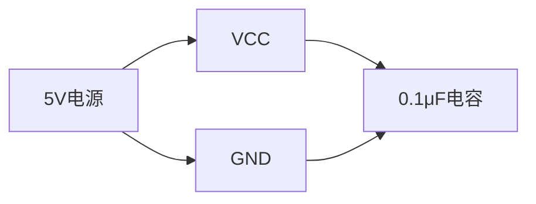
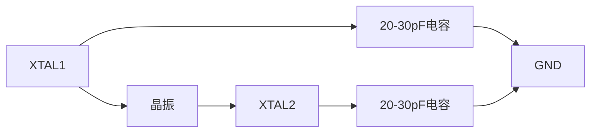
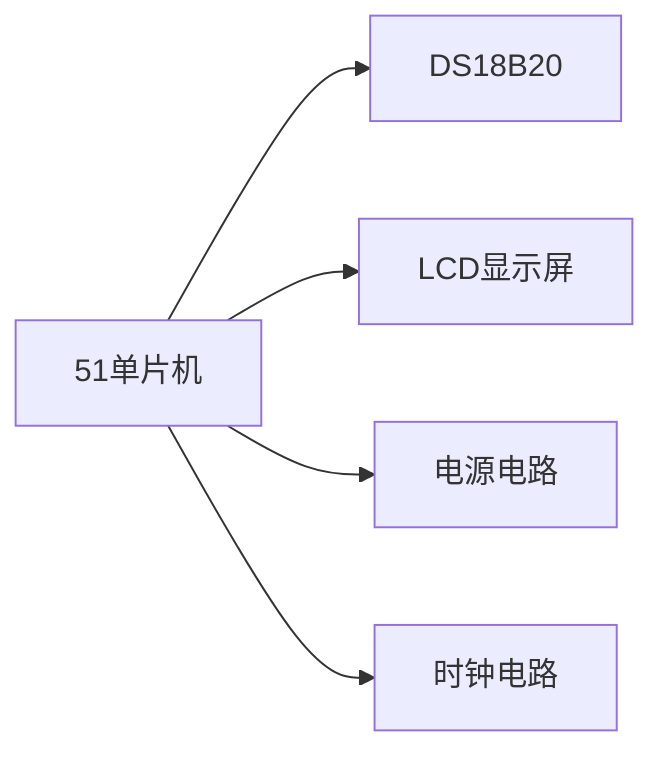

## 介绍

51单片机（如Intel 8051系列）是一种广泛应用于嵌入式系统的微控制器。它的硬件设计是学习嵌入式开发的重要基础。通过合理的硬件设计，我们可以让单片机与各种外设（如LED、按键、传感器等）进行交互，从而实现复杂的功能。

本文将逐步讲解51单片机的硬件设计，包括引脚功能、电源设计、时钟电路、复位电路以及常见外设的连接方法。我们还会通过实际案例展示如何将这些知识应用到项目中。

---

## 51单片机引脚功能

51单片机通常有40个引脚，分为以下几类：

1. **电源引脚（VCC 和 GND）**：用于连接电源和地。
2. **时钟引脚（XTAL1 和 XTAL2）**：用于连接外部晶振，提供时钟信号。
3. **复位引脚（RST）**：用于复位单片机。
4. **I/O 引脚（P0-P3）**：用于输入和输出信号，连接外设。
5. **控制引脚（如 EA、ALE、PSEN 等）**：用于控制单片机的工作模式。

:::tip
引脚的具体功能可能因型号不同而有所差异，请参考具体单片机的数据手册。
:::

---

## 电源设计

51单片机通常需要5V电源供电。以下是电源设计的基本步骤：

1. **连接电源引脚**：将VCC引脚连接到5V电源正极，GND引脚连接到电源负极。
2. **添加滤波电容**：在VCC和GND之间并联一个0.1μF的陶瓷电容，用于滤除高频噪声。



---

## 时钟电路

51单片机需要一个稳定的时钟信号来运行程序。通常使用外部晶振和两个电容来构建时钟电路。

1. **连接晶振**：将晶振的两端分别连接到XTAL1和XTAL2引脚。
2. **添加电容**：在晶振两端分别连接一个20-30pF的电容到GND。



---

## 复位电路

复位电路用于在系统上电或需要时复位单片机。常见的复位电路包括一个电阻和一个电容。

1. **连接复位引脚**：将RST引脚通过一个10kΩ电阻连接到VCC。
2. **添加电容**：在RST引脚和GND之间连接一个10μF的电解电容。


---

## 外设连接

### LED 连接

LED是单片机开发中最常用的外设之一。以下是连接LED的步骤：

1. **连接LED**：将LED的正极通过一个限流电阻（如220Ω）连接到单片机的I/O引脚，负极连接到GND。
2. **控制LED**：通过程序控制I/O引脚的高低电平来点亮或熄灭LED。

```c
#include <reg51.h>

sbit LED = P1^0; // 将LED连接到P1.0引脚

void main() {
    while (1) {
        LED = 0; // 点亮LED
        delay(500); // 延时500ms
        LED = 1; // 熄灭LED
        delay(500); // 延时500ms
    }
}
```

### 按键连接

按键用于输入信号。以下是连接按键的步骤：

1. **连接按键**：将按键的一端连接到单片机的I/O引脚，另一端连接到GND。
2. **添加上拉电阻**：在I/O引脚和VCC之间连接一个10kΩ的上拉电阻。

```c
#include <reg51.h>

sbit BUTTON = P1^0; // 将按键连接到P1.0引脚

void main() {
    while (1) {
        if (BUTTON == 0) { // 检测按键是否按下
            // 执行按键按下后的操作
        }
    }
}
```

---

## 实际案例：温度监测系统

以下是一个简单的温度监测系统的硬件设计示例：

1. **温度传感器（如DS18B20）**：连接到单片机的I/O引脚。
2. **LCD显示屏**：用于显示温度数据。
3. **电源和时钟电路**：如前所述。



---

## 总结

本文介绍了51单片机硬件设计的基础知识，包括引脚功能、电源设计、时钟电路、复位电路以及常见外设的连接方法。通过实际案例，我们展示了如何将这些知识应用到项目中。

---

## 附加资源与练习

1. **练习**：尝试设计一个简单的LED闪烁电路，并使用51单片机控制LED的闪烁频率。
2. **资源**：
   - [8051单片机数据手册](https://www.example.com/8051-datasheet)
   - [嵌入式系统设计教程](https://www.example.com/embedded-tutorial)

:::caution
在实际操作中，请务必注意电源极性，避免损坏单片机或外设。
:::