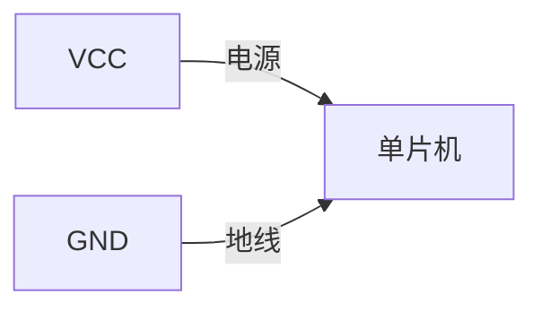
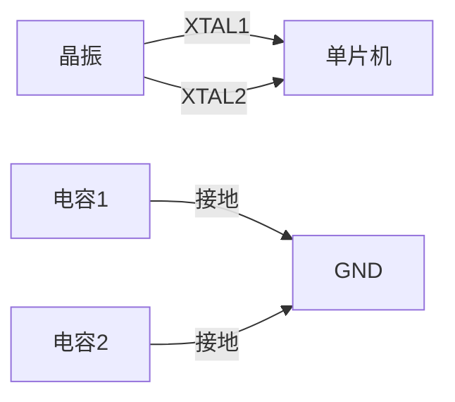
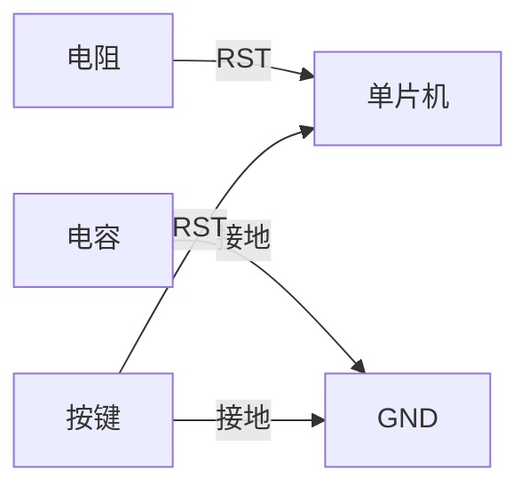
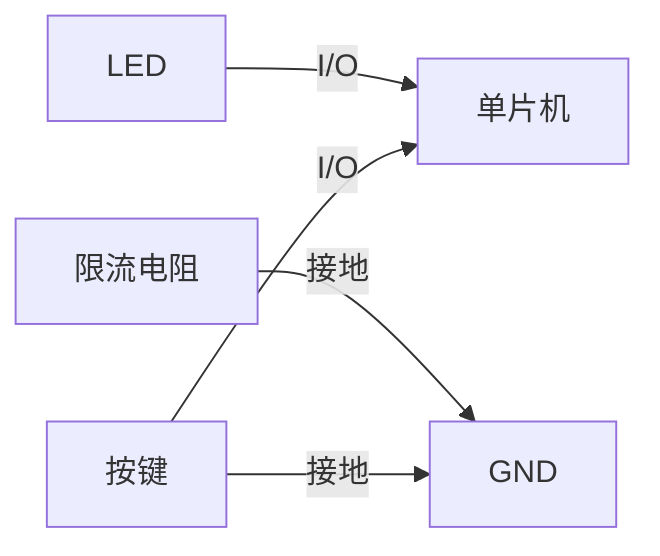
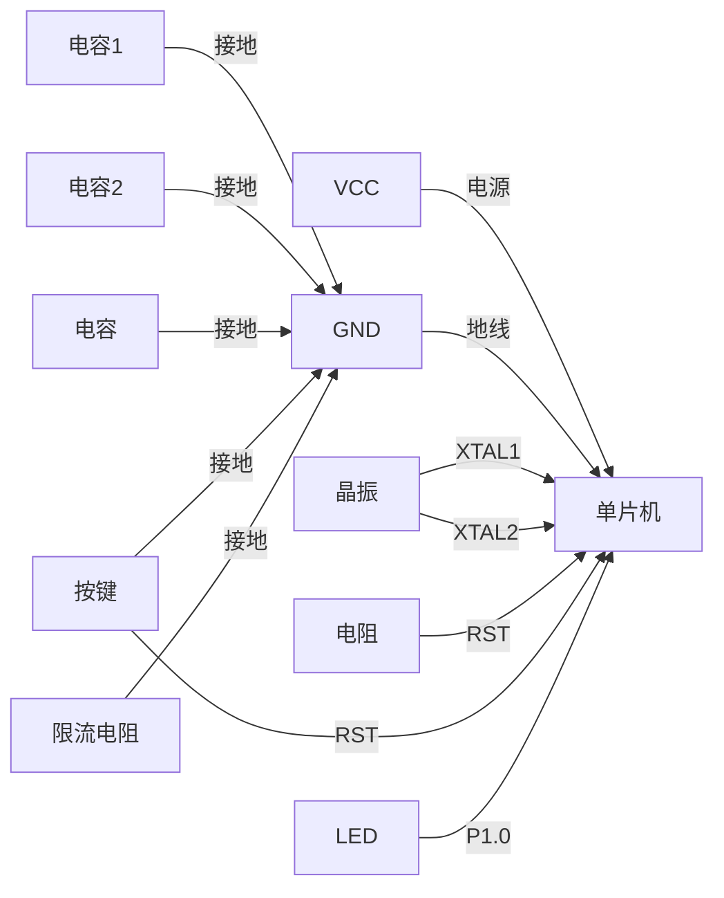

# 51单片机原理图绘制

## 介绍

51单片机是一种广泛使用的微控制器，因其简单易用、成本低廉而受到初学者的青睐。在学习51单片机的过程中，绘制原理图是一个非常重要的步骤。原理图是电路设计的蓝图，它展示了电路中各个元件的连接方式和工作原理。通过绘制原理图，你可以更好地理解电路的工作原理，并为后续的硬件设计和调试打下基础。

## 原理图的基本概念

### 什么是原理图？

原理图是一种用符号表示电路元件及其连接关系的图形。它不涉及元件的实际物理布局，而是专注于电路的功能和逻辑关系。原理图通常包括电源、地线、信号线、电阻、电容、二极管、晶体管、集成电路等元件。

### 为什么需要绘制原理图？

1. **设计验证**：在制作实际电路之前，绘制原理图可以帮助你验证电路设计的正确性。
2. **故障排查**：当电路出现问题时，原理图可以帮助你快速定位问题所在。
3. **文档记录**：原理图是电路设计的重要文档，便于后续的维护和修改。

## 绘制51单片机原理图的步骤

### 1. 确定电路功能

在绘制原理图之前，首先要明确电路的功能需求。例如，你需要设计一个简单的LED闪烁电路，还是一个复杂的温度控制系统？明确功能需求有助于你选择合适的元件和设计电路结构。

### 2. 选择元件

根据电路功能，选择合适的元件。对于51单片机电路，常见的元件包括：

- **51单片机**：如STC89C52、AT89S52等。
- **晶振**：通常为11.0592MHz或12MHz。
- **电容**：用于电源滤波和晶振电路。
- **电阻**：用于限流、上拉或下拉。
- **LED**：用于指示状态。
- **按键**：用于输入控制。

### 3. 绘制电源和地线

电源和地线是电路的基础。在原理图中，通常用符号 `VCC` 表示电源，用符号 `GND` 表示地线。确保所有元件都正确连接到电源和地线。



### 4. 连接晶振电路

51单片机需要外部晶振来提供时钟信号。晶振电路通常包括一个晶振和两个电容。晶振的两个引脚分别连接到单片机的 `XTAL1` 和 `XTAL2` 引脚，电容的一端接地，另一端分别连接到晶振的两个引脚。



### 5. 连接复位电路

复位电路用于在系统上电或按下复位按钮时将单片机复位。复位电路通常包括一个电阻、一个电容和一个按键。电阻和电容串联后连接到单片机的 `RST` 引脚，按键的一端连接到 `RST` 引脚，另一端接地。



### 6. 连接LED和按键

LED和按键是常见的输入输出元件。LED通常通过一个限流电阻连接到单片机的I/O引脚，按键的一端连接到I/O引脚，另一端接地。



### 7. 检查连接

完成原理图绘制后，仔细检查所有连接是否正确。确保电源、地线、晶振、复位电路、LED和按键等元件都正确连接到单片机。

## 实际案例：LED闪烁电路

下面是一个简单的LED闪烁电路的原理图设计示例。该电路使用51单片机控制一个LED的闪烁。



### 代码示例

```c
#include <reg52.h>

void delay(unsigned int time) {
    unsigned int i, j;
    for (i = time; i > 0; i--)
        for (j = 110; j > 0; j--);
}

void main() {
    while (1) {
        P1_0 = 0;  // LED亮
        delay(500);  // 延时
        P1_0 = 1;  // LED灭
        delay(500);  // 延时
    }
}
```

### 输入和输出

- **输入**：无
- **输出**：LED闪烁

## 总结

绘制51单片机的原理图是学习单片机开发的重要一步。通过绘制原理图，你可以更好地理解电路的工作原理，并为后续的硬件设计和调试打下基础。本教程介绍了绘制原理图的基本步骤，并通过一个简单的LED闪烁电路示例展示了实际应用。

## 附加资源

- [51单片机数据手册](https://www.stcmicro.com/)
- [电路设计基础教程](https://www.electronics-tutorials.ws/)
- [在线原理图绘制工具](https://www.circuitlab.com/)

## 练习

1. 设计一个使用51单片机控制的8位LED流水灯电路，并绘制其原理图。
2. 修改LED闪烁电路的代码，使LED的闪烁频率可调。
3. 尝试在原理图中添加一个蜂鸣器，并编写代码使其发出不同频率的声音。

:::tip
在绘制原理图时，务必仔细检查所有连接，确保电路的正确性。如果有条件，可以使用仿真软件进行验证。
:::