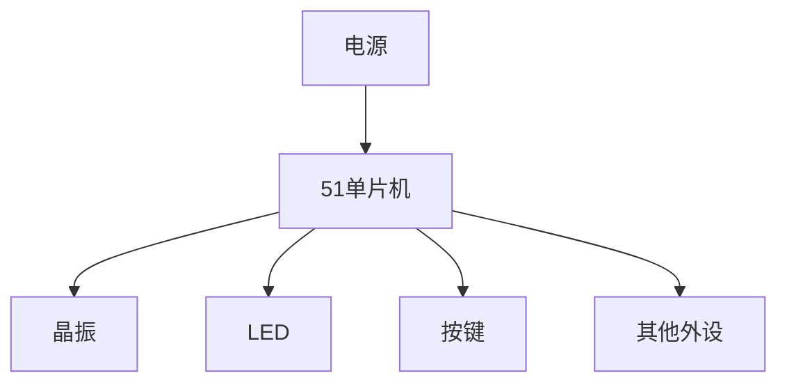
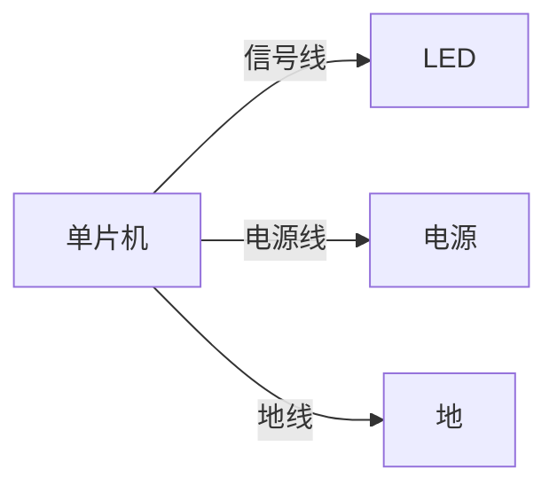

# 51单片机PCB设计

## 介绍

PCB（Printed Circuit Board，印刷电路板）是电子设备中不可或缺的组成部分，它将电子元器件通过导线连接在一起，形成一个完整的电路系统。对于51单片机项目来说，PCB设计是实现硬件功能的关键步骤。本文将带你从零开始，逐步学习如何为51单片机项目设计PCB。

## PCB设计的基本概念

### 什么是PCB？

PCB是一种用于支撑和连接电子元器件的基板，通常由绝缘材料制成，表面覆盖导电铜层。通过蚀刻工艺，铜层被加工成导线，连接各个元器件。

### PCB设计的核心步骤

1. **原理图设计**：根据电路功能需求，绘制电路原理图。
2. **元器件布局**：将元器件合理地放置在PCB板上。
3. **布线**：通过导线连接各个元器件。
4. **设计规则检查（DRC）**：确保设计符合制造要求。
5. **生成制造文件**：导出Gerber文件，用于PCB制造。

---

## 51单片机PCB设计流程

### 1. 原理图设计

原理图是PCB设计的基础，它描述了电路中各个元器件的连接关系。对于51单片机项目，常见的元器件包括单片机、晶振、电容、电阻、LED等。

:::note
在绘制原理图时，确保每个元器件的引脚连接正确，尤其是电源和地线。
:::

### 2. 元器件布局

元器件布局是PCB设计的关键步骤之一。合理的布局可以减少信号干扰，提高电路稳定性。

- **单片机**：通常放置在PCB板的中心位置，方便与其他元器件连接。
- **晶振**：尽量靠近单片机，减少信号延迟。
- **电源部分**：放置在PCB板的边缘，方便连接外部电源。
- **LED和按键**：根据实际需求放置，通常靠近PCB板的边缘。

:::tip
布局时，尽量缩短高频信号线的长度，以减少电磁干扰。
:::

### 3. 布线

布线是将原理图中的连接关系转化为PCB上的实际导线。以下是布线时需要注意的几点：

- **电源线和地线**：尽量加宽，以减少电阻和发热。
- **信号线**：避免交叉，减少信号干扰。
- **高频信号线**：尽量短且直，避免形成环路。

### 4. 设计规则检查（DRC）

DRC是确保PCB设计符合制造要求的重要步骤。常见的检查项目包括：

- **线宽**：确保电源线和地线的宽度足够。
- **间距**：确保导线之间的间距符合制造要求。
- **过孔**：检查过孔的大小和位置是否合理。

:::caution
如果DRC检查失败，需要根据提示修改设计，直到通过检查。
:::

### 5. 生成制造文件

完成PCB设计后，需要导出Gerber文件，用于PCB制造。Gerber文件包含了PCB的所有信息，包括导线、焊盘、丝印等。

---

## 实际案例：51单片机最小系统PCB设计

以下是一个51单片机最小系统的PCB设计案例：

1. **原理图**：包括单片机、晶振、复位电路、电源电路和LED指示灯。
2. **布局**：单片机居中，晶振靠近单片机，电源电路放置在边缘。
3. **布线**：电源线和地线加宽，信号线尽量短且直。
4. **DRC检查**：确保线宽、间距和过孔符合要求。
5. **生成Gerber文件**：导出文件并提交给PCB制造商。

:::tip
在实际项目中，可以根据需求添加更多外设，如按键、LCD显示屏等。
:::

---

## 总结

51单片机PCB设计是硬件开发中的重要环节。通过本文的学习，你应该掌握了从原理图设计到PCB布局和布线的基本流程。希望你能将这些知识应用到实际项目中，设计出稳定可靠的PCB。

---

## 附加资源与练习

### 资源
- [PCB设计软件推荐](#)
- [51单片机数据手册](#)
- [PCB制造流程详解](#)

### 练习
1. 尝试设计一个简单的51单片机最小系统PCB。
2. 在现有设计中添加一个按键和一个LED，并重新布线。
3. 使用DRC工具检查你的设计，确保符合制造要求。

祝你学习愉快！