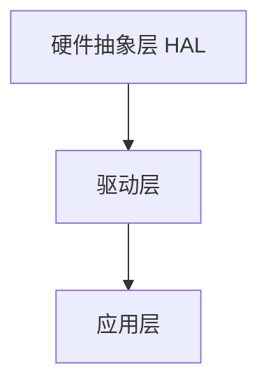
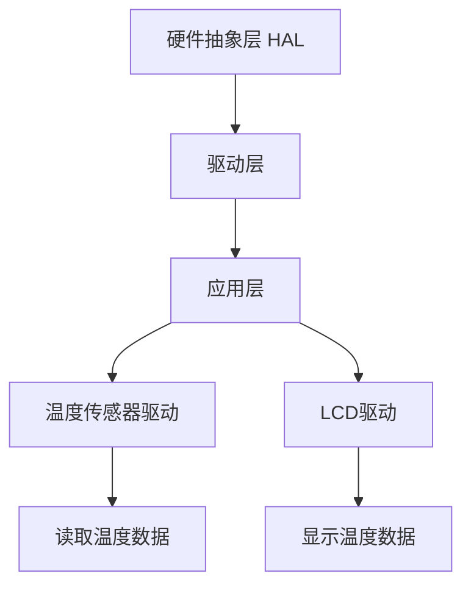

# 51单片机软件架构

## 介绍

51单片机（如Intel 8051系列）是一种广泛使用的8位微控制器，因其简单易用、成本低廉而受到初学者和嵌入式开发者的青睐。在开发51单片机项目时，设计一个合理的软件架构是确保代码可维护性、可扩展性和高效性的关键。本文将逐步讲解51单片机的软件架构，并通过实际案例帮助你理解其应用。

## 什么是软件架构？

软件架构是指软件系统的整体结构，包括模块划分、数据流、控制流以及模块之间的交互方式。在51单片机中，软件架构的设计需要考虑到硬件资源的限制（如内存、处理速度等），同时确保代码的可读性和可维护性。

## 51单片机软件架构的基本设计原则

在设计51单片机的软件架构时，通常遵循以下原则：

1. **模块化设计**：将功能划分为独立的模块，每个模块负责一个特定的任务。
2. **分层设计**：将系统分为硬件抽象层、驱动层、应用层等，便于管理和维护。
3. **事件驱动**：通过中断和事件处理机制来响应外部事件，提高系统的实时性。
4. **资源优化**：合理利用有限的硬件资源，如内存、定时器等。

## 软件架构的层次结构

51单片机的软件架构通常可以分为以下几个层次：

1. **硬件抽象层（HAL）**：直接与硬件交互，提供统一的接口供上层调用。
2. **驱动层**：实现具体的硬件驱动，如GPIO、UART、定时器等。
3. **应用层**：实现具体的业务逻辑，如控制LED、读取传感器数据等。



## 代码示例：模块化设计

以下是一个简单的模块化设计示例，展示了如何将LED控制功能封装为一个独立的模块。

```c
// led.h
#ifndef LED_H
#define LED_H

void LED_Init(void);
void LED_On(void);
void LED_Off(void);

#endif
```

```c
// led.c
#include "led.h"
#include <reg51.h>

#define LED_PIN P1_0

void LED_Init(void) {
    LED_PIN = 0; // 初始化LED引脚为低电平
}

void LED_On(void) {
    LED_PIN = 1; // 点亮LED
}

void LED_Off(void) {
    LED_PIN = 0; // 熄灭LED
}
```

```c
// main.c
#include "led.h"

void main(void) {
    LED_Init(); // 初始化LED
    while (1) {
        LED_On();  // 点亮LED
        delay(500); // 延时500ms
        LED_Off(); // 熄灭LED
        delay(500); // 延时500ms
    }
}
```

:::tip
在模块化设计中，每个模块应尽量独立，减少模块之间的耦合，便于后续的维护和扩展。
:::

## 实际案例：温度监控系统

假设我们要设计一个基于51单片机的温度监控系统，该系统通过温度传感器采集数据，并在LCD显示屏上显示当前温度。以下是该系统的软件架构设计：

1. **硬件抽象层**：提供温度传感器和LCD显示屏的初始化接口。
2. **驱动层**：实现温度传感器的数据读取和LCD显示屏的显示功能。
3. **应用层**：实现温度数据的处理和显示逻辑。



:::note
在实际项目中，硬件抽象层和驱动层的设计可以大大简化应用层的开发工作，使得开发者可以更专注于业务逻辑的实现。
:::

## 总结

51单片机的软件架构设计是嵌入式开发中的重要环节。通过模块化、分层设计和事件驱动等原则，可以构建出高效、可维护的软件系统。本文通过代码示例和实际案例，帮助你理解51单片机软件架构的基本概念和设计方法。

## 附加资源与练习

1. **练习**：尝试将上述温度监控系统的代码实现完整，并测试其功能。
2. **资源**：阅读更多关于51单片机的中断处理、定时器使用等高级主题，进一步优化你的软件架构设计。

:::caution
在实际开发中，务必注意硬件资源的限制，避免因内存不足或处理速度过慢导致系统崩溃。
:::