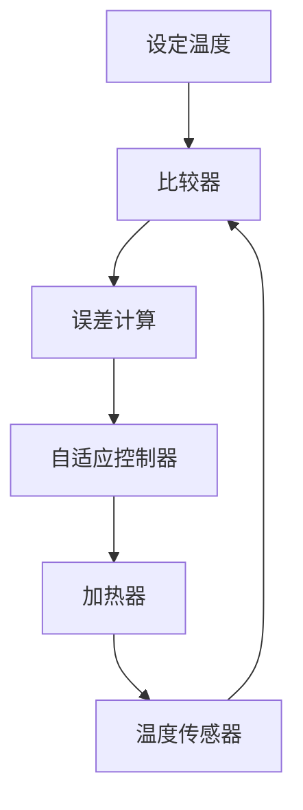

## 介绍

自适应控制是一种能够根据系统动态变化自动调整控制参数的控制方法。在51单片机中，自适应控制可以用于处理不确定的系统参数或外部干扰，从而提高系统的稳定性和性能。本文将介绍51单片机自适应控制的基本概念、实现方法以及实际应用场景。

## 自适应控制的基本概念

自适应控制的核心思想是通过实时监测系统的输出，动态调整控制参数，以达到预期的控制效果。常见的自适应控制方法包括模型参考自适应控制（MRAC）和自校正控制（STC）。

### 模型参考自适应控制（MRAC）

模型参考自适应控制通过比较实际系统输出与参考模型输出的差异，调整控制参数，使实际系统输出尽可能接近参考模型输出。

### 自校正控制（STC）

自校正控制通过在线估计系统参数，实时调整控制律，以适应系统的动态变化。

## 51单片机自适应控制的实现

在51单片机中实现自适应控制，通常需要以下步骤：

1. **系统建模**：建立系统的数学模型，描述系统的动态行为。
2. **参数估计**：通过在线估计方法，实时估计系统参数。
3. **控制律设计**：根据估计的参数，设计控制律。
4. **实时调整**：根据系统输出，实时调整控制参数。

### 代码示例

以下是一个简单的51单片机自适应控制代码示例，使用自校正控制方法：

```c
#include <reg51.h>

// 定义系统参数
float a = 0.5;  // 系统参数
float b = 1.0;  // 控制增益
float y = 0.0;  // 系统输出
float u = 0.0;  // 控制输入
float r = 1.0;  // 参考输入
float e = 0.0;  // 误差

void main() {
    while (1) {
        // 计算误差
        e = r - y;

        // 更新控制输入
        u = b * e;

        // 更新系统输出
        y = a * y + b * u;

        // 实时调整控制增益
        b = b + 0.1 * e * u;

        // 延时
        for (int i = 0; i < 1000; i++);
    }
}
```

### 输入和输出

- **输入**：参考输入 `r`。
- **输出**：系统输出 `y`。

## 实际案例

### 温度控制系统

假设我们需要设计一个温度控制系统，要求温度保持在设定值附近。由于环境温度变化和加热器效率的不确定性，我们可以使用自适应控制来实时调整加热器的功率，以保持温度稳定。



在这个案例中，自适应控制器根据温度传感器的反馈，实时调整加热器的功率，以消除温度误差。

## 总结

自适应控制是一种强大的控制方法，能够处理系统参数不确定性和外部干扰。在51单片机中实现自适应控制，可以提高系统的稳定性和性能。通过本文的介绍和代码示例，初学者可以初步了解自适应控制的基本概念和实现方法。

## 附加资源

- **书籍**：*自适应控制理论与应用*，作者：王伟。
- **在线课程**：Coursera上的*自适应控制系统*课程。
- **练习**：尝试在51单片机上实现一个简单的自适应控制系统，例如温度控制系统。

:::tip
在实际应用中，自适应控制可能需要更复杂的算法和更高的计算能力。建议初学者从简单的案例入手，逐步深入。
:::