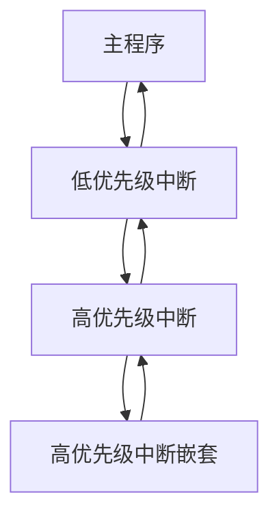

## 介绍

在51单片机中，中断是一种非常重要的机制，它允许单片机在执行主程序的过程中，响应外部或内部的事件。中断优先级决定了当多个中断同时发生时，单片机应该优先处理哪一个中断。理解中断优先级的概念对于编写高效、可靠的单片机程序至关重要。

## 中断优先级的基本概念

51单片机的中断系统支持多个中断源，每个中断源都有一个默认的优先级。当多个中断同时发生时，优先级高的中断会优先得到处理。51单片机的中断优先级分为两个级别：高优先级和低优先级。

### 中断优先级寄存器

51单片机通过中断优先级寄存器（IP）来设置每个中断源的优先级。IP寄存器的每一位对应一个中断源，设置为1表示高优先级，设置为0表示低优先级。

```c
sfr IP = 0xB8;  // 中断优先级寄存器地址
```

### 中断优先级设置示例

以下是一个设置中断优先级的示例代码：

```c
#include <reg51.h>

void main() {
    // 设置外部中断0为高优先级
    IP |= 0x01;  // 设置IP寄存器的第0位为1

    // 设置定时器0中断为低优先级
    IP &= ~0x02; // 设置IP寄存器的第1位为0

    // 启用中断
    EA = 1;  // 全局中断使能
    EX0 = 1; // 外部中断0使能
    ET0 = 1; // 定时器0中断使能

    while (1) {
        // 主程序循环
    }
}
```

:::note
在51单片机中，默认情况下，所有中断的优先级都是低优先级。通过设置IP寄存器，可以改变中断的优先级。
:::

## 中断优先级的工作原理

当多个中断同时发生时，单片机会根据中断优先级来决定处理顺序。高优先级的中断会打断低优先级的中断，而低优先级的中断不能打断高优先级的中断。

### 中断嵌套

如果高优先级的中断正在执行，此时又发生了另一个高优先级的中断，那么新的中断会打断当前的中断处理程序，形成中断嵌套。低优先级的中断则不能打断高优先级的中断。



## 实际应用案例

### 案例1：多任务处理

假设我们有一个系统需要同时处理按键输入和定时器事件。按键输入需要立即响应，而定时器事件可以稍后处理。我们可以将按键中断设置为高优先级，定时器中断设置为低优先级。

```c
#include <reg51.h>

void main() {
    // 设置外部中断0（按键）为高优先级
    IP |= 0x01;

    // 设置定时器0中断为低优先级
    IP &= ~0x02;

    // 启用中断
    EA = 1;
    EX0 = 1;
    ET0 = 1;

    while (1) {
        // 主程序循环
    }
}

void external0_isr() interrupt 0 {
    // 处理按键输入
}

void timer0_isr() interrupt 1 {
    // 处理定时器事件
}
```

### 案例2：实时控制系统

在一个实时控制系统中，传感器数据的采集需要高优先级，而数据显示可以设置为低优先级。这样可以确保传感器数据不会因为显示任务而延迟。

```c
#include <reg51.h>

void main() {
    // 设置外部中断1（传感器）为高优先级
    IP |= 0x04;

    // 设置串口中断为低优先级
    IP &= ~0x10;

    // 启用中断
    EA = 1;
    EX1 = 1;
    ES = 1;

    while (1) {
        // 主程序循环
    }
}

void external1_isr() interrupt 2 {
    // 处理传感器数据
}

void serial_isr() interrupt 4 {
    // 处理串口数据
}
```

## 总结

51单片机的中断优先级机制为处理多个中断提供了灵活的控制方式。通过合理设置中断优先级，可以确保关键任务得到及时处理，提高系统的响应速度和可靠性。

:::tip
在实际应用中，建议根据任务的重要性和实时性要求来设置中断优先级，避免高优先级中断过多导致低优先级任务无法执行。
:::

## 附加资源与练习

1. **练习1**：编写一个程序，设置两个外部中断，分别设置为高优先级和低优先级，观察中断嵌套的效果。
2. **练习2**：在一个实时控制系统中，尝试设置多个中断源，并根据任务的重要性调整中断优先级，观察系统的响应情况。

通过以上内容的学习和练习，相信你已经对51单片机的中断优先级有了更深入的理解。继续探索和实践，你将能够更好地掌握单片机的中断系统。