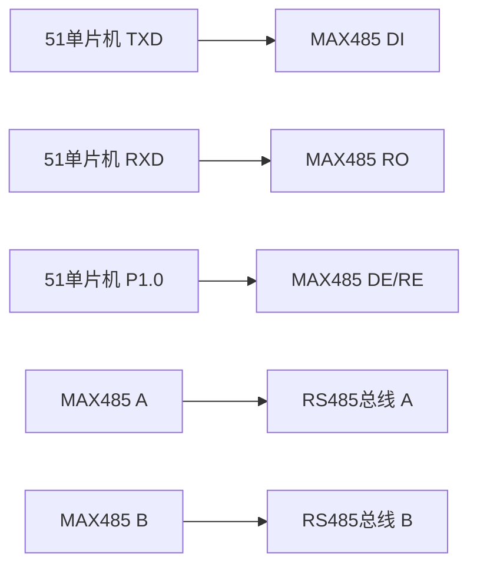

# 51单片机RS485通信

RS485是一种常用的串行通信协议，广泛应用于工业控制、自动化等领域。与RS232相比，RS485具有传输距离远、抗干扰能力强、支持多点通信等优点。本文将详细介绍如何在51单片机中实现RS485通信。

## 1. RS485通信简介

RS485是一种差分信号传输的通信协议，使用两根信号线（A和B）进行数据传输。由于采用差分信号，RS485具有较强的抗干扰能力，适合长距离通信。RS485支持多点通信，即多个设备可以连接到同一总线上，通过地址区分不同的设备。

:::note
RS485通信通常需要额外的硬件支持，如RS485收发器芯片（如MAX485）。
:::

## 2. 硬件连接

在51单片机中实现RS485通信，通常需要以下硬件组件：

- 51单片机（如STC89C52）
- RS485收发器芯片（如MAX485）
- 电阻、电容等外围元件

### 2.1 电路连接

以下是51单片机与MAX485的典型连接方式：



- **TXD**：51单片机的发送引脚，连接到MAX485的DI引脚。
- **RXD**：51单片机的接收引脚，连接到MAX485的RO引脚。
- **P1.0**：51单片机的控制引脚，用于控制MAX485的发送/接收模式（DE/RE引脚）。
- **A/B**：MAX485的差分信号输出，连接到RS485总线。

:::caution
在RS485通信中，总线两端需要接上120Ω的终端电阻，以减少信号反射。
:::

## 3. 软件实现

### 3.1 初始化串口

首先，我们需要初始化51单片机的串口。以下是一个典型的串口初始化代码：

```c
void UART_Init() {
    SCON = 0x50;        // 8位数据, 1位停止位
    TMOD |= 0x20;       // 定时器1模式2
    TH1 = 0xFD;         // 波特率9600
    TL1 = 0xFD;
    TR1 = 1;            // 启动定时器1
    ES = 1;             // 使能串口中断
    EA = 1;             // 使能总中断
}
```

### 3.2 控制发送/接收模式

在RS485通信中，发送和接收模式需要通过控制引脚切换。以下代码展示了如何切换发送和接收模式：

```c
sbit RS485_DE = P1^0;  // 控制引脚

void RS485_SendMode() {
    RS485_DE = 1;      // 进入发送模式
}

void RS485_ReceiveMode() {
    RS485_DE = 0;      // 进入接收模式
}
```

### 3.3 发送数据

在发送数据之前，需要将RS485设置为发送模式，然后通过串口发送数据：

```c
void RS485_SendByte(unsigned char byte) {
    RS485_SendMode();  // 进入发送模式
    SBUF = byte;       // 发送数据
    while(!TI);        // 等待发送完成
    TI = 0;            // 清除发送标志
    RS485_ReceiveMode(); // 返回接收模式
}
```

### 3.4 接收数据

在接收数据时，RS485应处于接收模式。以下代码展示了如何接收数据：

```c
unsigned char RS485_ReceiveByte() {
    RS485_ReceiveMode(); // 进入接收模式
    while(!RI);         // 等待接收完成
    RI = 0;             // 清除接收标志
    return SBUF;        // 返回接收到的数据
}
```

## 4. 实际应用案例

### 4.1 工业控制系统

在工业控制系统中，多个传感器和执行器通常通过RS485总线连接到主控制器。主控制器通过RS485总线发送控制命令，并接收传感器数据。

### 4.2 智能家居

在智能家居系统中，多个设备（如灯光控制器、温度传感器等）可以通过RS485总线连接到中央控制器，实现集中控制和监控。

## 5. 总结

RS485通信是一种可靠、高效的串行通信方式，特别适合长距离和多点通信的场景。通过本文的介绍，你应该已经掌握了如何在51单片机中实现RS485通信的基本方法。

:::tip
在实际应用中，建议使用成熟的RS485通信库，以提高开发效率和代码可靠性。
:::

## 6. 附加资源与练习

- **练习1**：尝试修改代码，实现多点通信功能，即多个设备通过RS485总线进行通信。
- **练习2**：研究RS485通信中的错误检测与纠正机制，如CRC校验。

:::warning
在进行RS485通信时，务必注意总线的终端电阻和信号反射问题，以确保通信的稳定性。
:::