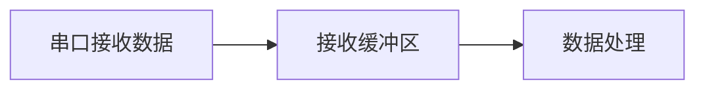
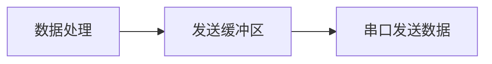

## 介绍

在51单片机的串行通信中，**串口缓冲区**是一个非常重要的概念。它用于临时存储从串口接收到的数据或即将发送的数据。理解串口缓冲区的工作原理，能够帮助我们更好地管理数据流，避免数据丢失或通信错误。

串口缓冲区通常分为**接收缓冲区**和**发送缓冲区**。接收缓冲区用于存储从外部设备接收到的数据，而发送缓冲区则用于存储即将发送到外部设备的数据。

## 串口缓冲区的工作原理

### 接收缓冲区

当51单片机通过串口接收到数据时，数据会被存储在接收缓冲区中。接收缓冲区通常是一个**环形队列**（Circular Buffer），这意味着当缓冲区满时，新的数据会覆盖旧的数据。



### 发送缓冲区

发送缓冲区用于存储即将通过串口发送的数据。当单片机准备好发送数据时，数据会从发送缓冲区中取出并通过串口发送出去。



## 代码示例

以下是一个简单的51单片机串口通信代码示例，展示了如何使用接收缓冲区和发送缓冲区。

```c
#include <reg51.h>

#define BUFFER_SIZE 16

unsigned char receiveBuffer[BUFFER_SIZE];
unsigned char sendBuffer[BUFFER_SIZE];
unsigned char receiveIndex = 0;
unsigned char sendIndex = 0;

void UART_Init() {
    SCON = 0x50;  // 设置串口模式1，8位数据，1位停止位
    TMOD |= 0x20; // 定时器1模式2
    TH1 = 0xFD;   // 波特率9600
    TL1 = 0xFD;
    TR1 = 1;      // 启动定时器1
    ES = 1;       // 使能串口中断
    EA = 1;       // 使能全局中断
}

void UART_SendByte(unsigned char byte) {
    SBUF = byte;
    while (!TI);  // 等待发送完成
    TI = 0;       // 清除发送标志
}

void UART_SendString(unsigned char *str) {
    while (*str) {
        UART_SendByte(*str++);
    }
}

void UART_ReceiveByte() interrupt 4 {
    if (RI) {
        RI = 0;  // 清除接收标志
        receiveBuffer[receiveIndex++] = SBUF;
        if (receiveIndex >= BUFFER_SIZE) {
            receiveIndex = 0;  // 环形缓冲区
        }
    }
}

void main() {
    UART_Init();
    while (1) {
        if (receiveIndex > 0) {
            UART_SendString("Received: ");
            UART_SendByte(receiveBuffer[--receiveIndex]);
            UART_SendString("\n");
        }
    }
}
```

### 代码解释

1. **UART_Init()**: 初始化串口，设置波特率为9600，并启用串口中断。
2. **UART_SendByte()**: 发送一个字节的数据。
3. **UART_SendString()**: 发送一个字符串。
4. **UART_ReceiveByte()**: 串口接收中断服务程序，将接收到的数据存入接收缓冲区。
5. **main()**: 主循环中，检查接收缓冲区是否有数据，如果有则发送回接收到的数据。

## 实际应用场景

### 场景1：数据采集系统

在一个数据采集系统中，51单片机通过串口从传感器接收数据。接收缓冲区用于临时存储传感器数据，直到主程序处理这些数据。

### 场景2：远程控制系统

在远程控制系统中，51单片机通过串口接收来自远程设备的控制命令。接收缓冲区确保即使在主程序忙碌时，也不会丢失任何命令。

## 总结

串口缓冲区在51单片机的串行通信中扮演着至关重要的角色。通过合理使用接收缓冲区和发送缓冲区，我们可以有效地管理数据流，确保通信的可靠性和稳定性。

## 附加资源与练习

- **练习1**: 修改上述代码，使接收缓冲区能够存储更多的数据，并在主循环中处理所有接收到的数据。
- **练习2**: 尝试实现一个双缓冲机制，使得在发送数据的同时，可以继续接收数据而不丢失。

:::tip
建议初学者在理解串口缓冲区的基础上，进一步学习如何使用DMA（直接内存访问）来优化串口通信的性能。
:::