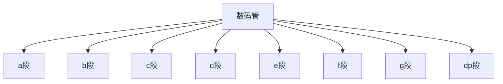

## 介绍

数码管是一种常见的显示设备，广泛应用于电子设备中，用于显示数字、字母或简单的符号。在51单片机开发中，数码管是基础的外设之一，掌握其工作原理和使用方法对于初学者来说非常重要。

数码管通常分为**共阴极**和**共阳极**两种类型。共阴极数码管的阴极（负极）连接在一起，而共阳极数码管的阳极（正极）连接在一起。通过控制数码管的各个段（a、b、c、d、e、f、g、dp），可以显示不同的数字或字符。

## 数码管的结构

数码管通常由8个LED段组成，分别标记为a、b、c、d、e、f、g和dp（小数点）。每个段对应一个LED，通过控制这些LED的亮灭，可以显示不同的数字或字符。



## 数码管的工作原理

### 共阴极数码管

在共阴极数码管中，所有LED的阴极连接在一起，通常接地。要显示某个数字，需要将对应的段（a、b、c等）连接到高电平（通常为5V），以点亮该段。

### 共阳极数码管

在共阳极数码管中，所有LED的阳极连接在一起，通常接电源（5V）。要显示某个数字，需要将对应的段（a、b、c等）连接到低电平（通常为0V），以点亮该段。

## 51单片机控制数码管

在51单片机中，通常使用I/O口来控制数码管的各个段。以下是一个简单的代码示例，展示如何使用51单片机控制一个共阴极数码管显示数字“0”。

```c
#include <reg51.h>

#define uchar unsigned char

// 数码管段码表，共阴极
uchar code seg_code[] = {0x3F, 0x06, 0x5B, 0x4F, 0x66, 0x6D, 0x7D, 0x07, 0x7F, 0x6F};

void delay(unsigned int time) {
    unsigned int i, j;
    for(i = 0; i < time; i++)
        for(j = 0; j < 120; j++);
}

void main() {
    while(1) {
        P2 = seg_code[0];  // 显示数字“0”
        delay(1000);       // 延时
    }
}
```

### 代码解释

- `seg_code[]` 是一个数组，存储了0到9的段码。每个段码对应数码管显示的数字。
- `P2` 是51单片机的I/O口，用于控制数码管的各个段。
- `delay()` 函数用于延时，以便观察数码管的显示效果。

:::note
**注意**：在实际应用中，数码管的段码可能会因型号不同而有所差异，请参考具体数码管的数据手册。
:::

## 实际应用场景

数码管广泛应用于各种电子设备中，例如：

- **电子钟表**：显示时间。
- **温度计**：显示温度。
- **计数器**：显示计数值。

以下是一个简单的电子钟表应用示例，使用51单片机控制数码管显示时间。

```c
#include <reg51.h>

#define uchar unsigned char

// 数码管段码表，共阴极
uchar code seg_code[] = {0x3F, 0x06, 0x5B, 0x4F, 0x66, 0x6D, 0x7D, 0x07, 0x7F, 0x6F};

void delay(unsigned int time) {
    unsigned int i, j;
    for(i = 0; i < time; i++)
        for(j = 0; j < 120; j++);
}

void display_time(uchar hour, uchar minute) {
    P2 = seg_code[hour / 10];  // 显示小时的十位
    delay(1000);
    P2 = seg_code[hour % 10];  // 显示小时的个位
    delay(1000);
    P2 = seg_code[minute / 10];  // 显示分钟的十位
    delay(1000);
    P2 = seg_code[minute % 10];  // 显示分钟的个位
    delay(1000);
}

void main() {
    uchar hour = 12, minute = 34;
    while(1) {
        display_time(hour, minute);
    }
}
```

### 代码解释

- `display_time()` 函数用于显示时间，分别显示小时的十位、个位和分钟的十位、个位。
- `hour` 和 `minute` 分别表示小时和分钟。

:::tip
**提示**：在实际应用中，可以使用定时器来精确控制时间的显示，避免使用延时函数。
:::

## 总结

通过本文的学习，你应该已经掌握了51单片机中数码管的基本原理和使用方法。数码管是单片机开发中常用的显示设备，掌握其控制方法对于后续的学习非常重要。

## 附加资源与练习

- **练习1**：修改代码，使数码管能够显示0到9的所有数字。
- **练习2**：尝试使用多个数码管显示更复杂的数字或字符。
- **资源**：查阅51单片机和数码管的相关数据手册，了解更多细节和高级应用。

希望本文对你有所帮助，祝你学习愉快！