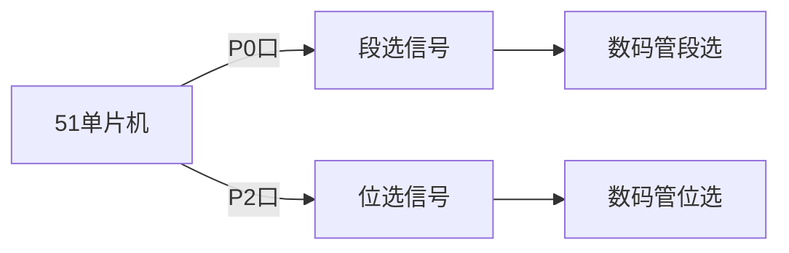

## 介绍

动态数码管显示是51单片机中常用的一种显示技术，通过快速切换数码管的显示内容，利用人眼的视觉暂留效应，实现多个数码管的显示效果。与静态显示相比，动态显示可以节省I/O口资源，降低硬件成本。

在本教程中，我们将学习51单片机如何控制动态数码管，并通过代码示例和实际案例帮助你理解其工作原理。

## 动态数码管的工作原理

动态数码管显示的核心思想是**分时复用**。多个数码管共享一组段选信号（控制显示内容），而每个数码管的位选信号（控制哪个数码管亮起）则通过快速切换来实现。

### 视觉暂留效应

人眼在观察快速变化的图像时，会保留前一帧图像的印象约0.1秒。利用这一特性，我们可以通过快速切换数码管的显示内容，使其看起来像是同时显示。

### 动态扫描的实现

1. **段选信号**：控制数码管显示的内容（如数字0-9）。
2. **位选信号**：控制哪个数码管亮起。
3. **扫描频率**：通常为50Hz以上，以避免闪烁。

通过不断切换位选信号并更新段选信号，可以实现多个数码管的动态显示。

## 硬件连接

以下是一个典型的4位数码管与51单片机的连接示意图：



- **P0口**：用于控制段选信号（a, b, c, d, e, f, g, dp）。
- **P2口**：用于控制位选信号（选择第1位、第2位、第3位、第4位数码管）。

## 代码示例

以下是一个简单的4位数码管动态显示代码示例：

```c
#include <reg52.h>

#define uchar unsigned char
#define uint unsigned int

sbit LSA = P2^0; // 位选信号
sbit LSB = P2^1;
sbit LSC = P2^2;
sbit LSD = P2^3;

uchar code table[] = {0x3f, 0x06, 0x5b, 0x4f, 0x66, 0x6d, 0x7d, 0x07, 0x7f, 0x6f}; // 0-9的段码

void delay(uint ms) {
    uint i, j;
    for (i = ms; i > 0; i--)
        for (j = 110; j > 0; j--);
}

void display(uchar pos, uchar num) {
    switch (pos) {
        case 0: LSA = 0; LSB = 0; LSC = 0; LSD = 1; break; // 第1位
        case 1: LSA = 0; LSB = 0; LSC = 1; LSD = 0; break; // 第2位
        case 2: LSA = 0; LSB = 1; LSC = 0; LSD = 0; break; // 第3位
        case 3: LSA = 1; LSB = 0; LSC = 0; LSD = 0; break; // 第4位
    }
    P0 = table[num]; // 输出段码
    delay(5); // 延时
    P0 = 0x00; // 消隐
}

void main() {
    while (1) {
        display(0, 1); // 第1位显示1
        display(1, 2); // 第2位显示2
        display(2, 3); // 第3位显示3
        display(3, 4); // 第4位显示4
    }
}
```

### 代码解析

1. **段码表**：`table[]` 存储了0-9的段码，用于控制数码管显示的数字。
2. **位选控制**：通过 `LSA`, `LSB`, `LSC`, `LSD` 控制哪个数码管亮起。
3. **显示函数**：`display()` 函数用于设置当前显示的数码管位置和内容。
4. **延时函数**：`delay()` 用于控制数码管的显示时间，避免闪烁。

:::tip
在实际应用中，延时时间需要根据具体硬件调整，以确保显示效果稳定。
:::

## 实际应用场景

动态数码管广泛应用于以下场景：

1. **电子钟**：显示小时、分钟和秒。
2. **温度计**：显示当前温度。
3. **计数器**：显示计数值。
4. **电子秤**：显示重量。

例如，在一个电子钟项目中，可以使用4位数码管分别显示小时和分钟，通过动态扫描技术实现稳定的显示效果。

## 总结

通过本教程，你学习了51单片机动态数码管的工作原理、硬件连接和代码实现。动态数码管显示技术通过分时复用和视觉暂留效应，实现了多个数码管的稳定显示，是51单片机项目中常用的显示方案。

:::note
动态显示的关键在于扫描频率和延时时间的控制，确保显示效果稳定且无闪烁。
:::

## 附加资源与练习

1. **练习**：尝试修改代码，使数码管显示一个跑马灯效果（数字从0到9依次滚动显示）。
2. **扩展阅读**：学习如何使用定时器中断优化动态扫描，减少CPU占用率。
3. **项目实践**：设计一个简单的电子钟，使用4位数码管显示时间。

通过实践和扩展学习，你将更深入地掌握51单片机动态数码管显示技术。