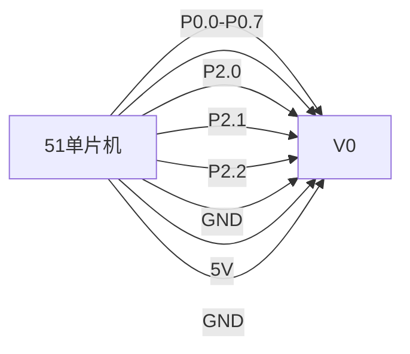

# 51单片机LCD1602显示技术

LCD1602是一种常见的字符型液晶显示屏，广泛应用于嵌入式系统中。它能够显示2行，每行16个字符，适合用于显示简单的文本信息。本文将详细介绍如何在51单片机上使用LCD1602，并通过代码示例和实际案例帮助你快速上手。

## 1. LCD1602简介

LCD1602是一种基于HD44780控制器的液晶显示屏模块。它支持5V电源供电，具有16个引脚，可以通过并行接口与单片机通信。LCD1602的主要特点包括：

- 显示容量：2行 × 16个字符
- 内置字符发生器ROM，支持显示ASCII字符
- 支持自定义字符
- 低功耗，适合嵌入式应用

## 2. 硬件连接

在使用LCD1602之前，首先需要将其与51单片机正确连接。以下是LCD1602与51单片机的典型连接方式：



- **DB0-DB7**：数据总线，用于传输数据或命令。
- **RS**：寄存器选择引脚，高电平选择数据寄存器，低电平选择指令寄存器。
- **RW**：读写控制引脚，高电平为读操作，低电平为写操作。
- **E**：使能信号，高电平有效，用于锁存数据。
- **VSS**：接地。
- **VDD**：接5V电源。
- **V0**：对比度调节，通常通过一个电位器连接到GND。

## 3. LCD1602初始化

在使用LCD1602之前，必须对其进行初始化。初始化的主要步骤包括设置显示模式、清屏、设置光标位置等。以下是初始化代码示例：

```c
#include <reg51.h>

#define uchar unsigned char
#define uint unsigned int

sbit RS = P2^0;
sbit RW = P2^1;
sbit E  = P2^2;

void delay(uint ms) {
    uint i, j;
    for(i = ms; i > 0; i--)
        for(j = 110; j > 0; j--);
}

void write_command(uchar command) {
    RS = 0;  // 选择指令寄存器
    RW = 0;  // 写操作
    P0 = command;
    E = 1;
    delay(1);
    E = 0;
}

void write_data(uchar data) {
    RS = 1;  // 选择数据寄存器
    RW = 0;  // 写操作
    P0 = data;
    E = 1;
    delay(1);
    E = 0;
}

void lcd_init() {
    write_command(0x38);  // 设置8位数据接口，2行显示，5x7点阵
    write_command(0x0C);  // 显示开，光标关，光标不闪烁
    write_command(0x06);  // 文字不动，地址自动+1
    write_command(0x01);  // 清屏
}

void main() {
    lcd_init();
    write_data('H');
    write_data('e');
    write_data('l');
    write_data('l');
    write_data('o');
    while(1);
}
```

:::note
**注意**：在实际使用中，`delay`函数的延时时间可能需要根据具体的硬件环境进行调整。
:::

## 4. 显示字符

在初始化完成后，可以通过`write_data`函数向LCD1602写入字符数据。以下代码展示了如何在LCD1602上显示“Hello, World!”：

```c
void display_string(char *str) {
    while(*str) {
        write_data(*str++);
    }
}

void main() {
    lcd_init();
    write_command(0x80);  // 设置光标到第一行第一列
    display_string("Hello, World!");
    while(1);
}
```

## 5. 自定义字符

LCD1602支持自定义字符，用户可以通过编程定义自己的字符图案。自定义字符的步骤如下：

1. 将自定义字符的位图数据写入CGRAM。
2. 使用`write_data`函数显示自定义字符。

以下代码展示了如何定义并显示一个自定义字符：

```c
void create_custom_char(uchar *pattern, uchar location) {
    uchar i;
    write_command(0x40 + (location << 3));  // 设置CGRAM地址
    for(i = 0; i < 8; i++) {
        write_data(pattern[i]);
    }
}

void main() {
    uchar custom_char[] = {0x00, 0x0A, 0x1F, 0x1F, 0x0E, 0x04, 0x00, 0x00};  // 自定义字符图案
    lcd_init();
    create_custom_char(custom_char, 0);  // 将自定义字符存入CGRAM位置0
    write_command(0x80);  // 设置光标到第一行第一列
    write_data(0x00);  // 显示自定义字符
    while(1);
}
```

## 6. 实际应用案例

LCD1602广泛应用于各种嵌入式系统中，例如：

- **温湿度监测系统**：显示当前环境的温度和湿度。
- **电子钟**：显示当前时间。
- **智能家居控制面板**：显示设备状态和控制选项。

以下是一个简单的温湿度监测系统的示例代码：

```c
void main() {
    lcd_init();
    write_command(0x80);  // 设置光标到第一行第一列
    display_string("Temp: 25C");
    write_command(0xC0);  // 设置光标到第二行第一列
    display_string("Humidity: 60%");
    while(1);
}
```

## 7. 总结

本文详细介绍了如何在51单片机上使用LCD1602液晶显示屏，包括硬件连接、初始化、显示字符和自定义字符等内容。通过本文的学习，你应该能够掌握LCD1602的基本使用方法，并能够在实际项目中应用。

## 8. 附加资源与练习

- **练习1**：尝试修改代码，使LCD1602显示你的名字。
- **练习2**：设计一个电子钟，使用LCD1602显示当前时间。
- **附加资源**：查阅HD44780控制器手册，了解更多高级功能。

:::tip
**提示**：在实际项目中，建议使用库函数来简化LCD1602的操作，这样可以提高代码的可读性和可维护性。
:::