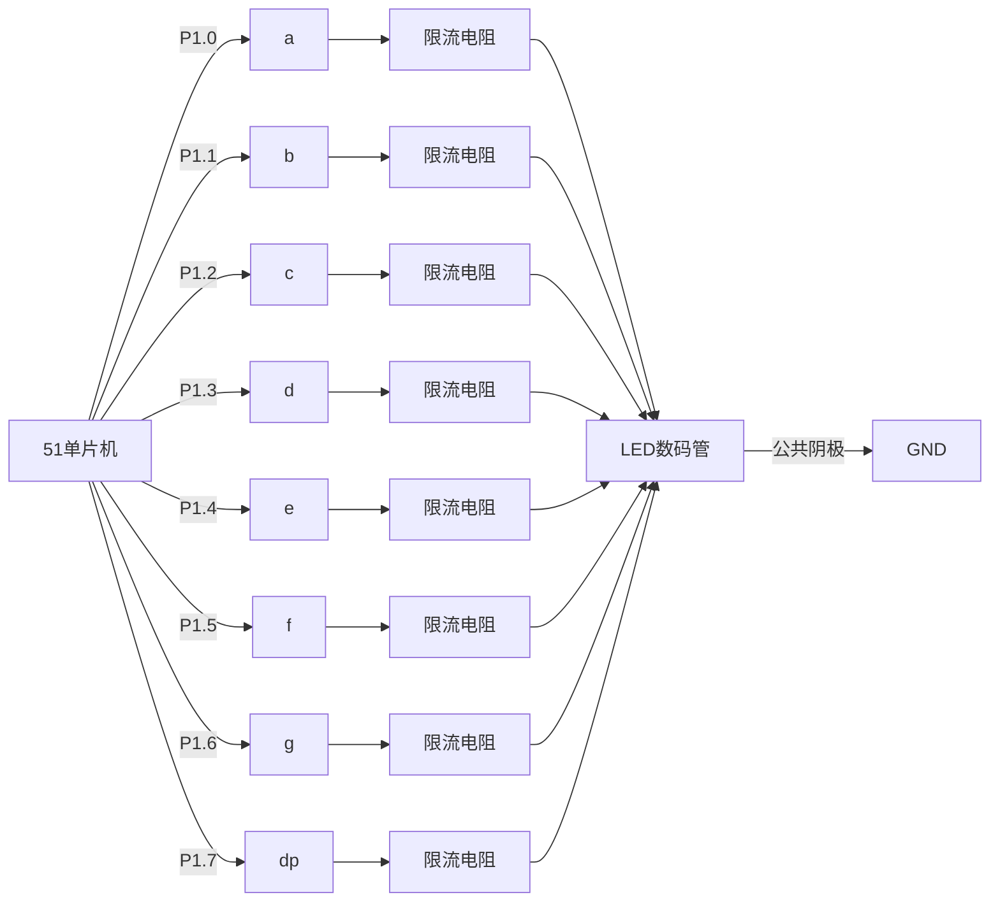

# 51单片机显示驱动电路

## 介绍

51单片机是一种广泛使用的微控制器，常用于嵌入式系统和电子设备中。显示驱动电路是51单片机应用中的重要组成部分，用于控制显示器（如LED、LCD等）的显示内容。通过显示驱动电路，单片机可以将数据或信息以可视化的方式呈现给用户。

本文将详细介绍51单片机显示驱动电路的基本原理、实现方法以及实际应用场景，帮助初学者快速掌握相关知识。

---

## 显示驱动电路的基本原理

显示驱动电路的核心功能是将单片机输出的数字信号转换为显示器能够识别的信号。常见的显示器类型包括LED数码管、LCD液晶屏等。以下是显示驱动电路的基本工作原理：

1. **信号输出**：51单片机通过I/O口输出数字信号（高电平或低电平）。
2. **信号转换**：显示驱动电路将单片机的数字信号转换为适合显示器工作的电压或电流。
3. **显示控制**：根据单片机的控制信号，显示驱动电路控制显示器的亮灭、刷新频率等。

:::note
显示驱动电路的设计需要根据具体的显示器类型进行调整。例如，LED数码管通常需要限流电阻，而LCD液晶屏可能需要特定的时序控制。
:::

---

## 51单片机驱动LED数码管

LED数码管是一种常见的显示设备，通常用于显示数字或简单字符。以下是51单片机驱动LED数码管的基本电路和代码示例。

### 电路连接

LED数码管通常分为共阴极和共阳极两种类型。以下是共阴极LED数码管的连接方式：

- 单片机的I/O口连接到数码管的段选引脚（a、b、c、d、e、f、g、dp）。
- 数码管的公共阴极接地。
- 每个段选引脚通过限流电阻连接到单片机的I/O口。



### 代码示例

以下是一个简单的51单片机程序，用于在共阴极LED数码管上显示数字“0”：

```c
#include <reg51.h>

void main() {
    while (1) {
        P1 = 0x3F; // 显示数字“0”的段码
    }
}
```

:::tip
段码是根据数码管的段选引脚定义的。例如，`0x3F`对应共阴极数码管显示“0”的段码。
:::

---

## 51单片机驱动LCD液晶屏

LCD液晶屏是一种更复杂的显示设备，通常需要特定的时序控制和初始化过程。以下是51单片机驱动LCD1602液晶屏的基本步骤。

### 电路连接

- 单片机的I/O口连接到LCD1602的数据引脚（D0-D7）。
- 单片机的其他I/O口连接到LCD1602的控制引脚（RS、RW、E）。
- LCD1602的电源引脚（VCC、GND）连接到电源和地。

### 代码示例

以下是一个简单的51单片机程序，用于在LCD1602上显示“Hello, World!”：

```c
#include <reg51.h>

sbit RS = P2^0;
sbit RW = P2^1;
sbit E  = P2^2;

void delay(unsigned int time) {
    while (time--);
}

void lcd_command(unsigned char command) {
    RS = 0;
    RW = 0;
    P0 = command;
    E = 1;
    delay(100);
    E = 0;
}

void lcd_data(unsigned char data) {
    RS = 1;
    RW = 0;
    P0 = data;
    E = 1;
    delay(100);
    E = 0;
}

void lcd_init() {
    lcd_command(0x38); // 初始化LCD
    lcd_command(0x0C); // 打开显示，关闭光标
    lcd_command(0x01); // 清屏
    lcd_command(0x06); // 设置输入模式
}

void main() {
    lcd_init();
    lcd_data('H');
    lcd_data('e');
    lcd_data('l');
    lcd_data('l');
    lcd_data('o');
    lcd_data(',');
    lcd_data(' ');
    lcd_data('W');
    lcd_data('o');
    lcd_data('r');
    lcd_data('l');
    lcd_data('d');
    lcd_data('!');
    while (1);
}
```

:::caution
LCD1602的初始化过程非常重要，必须按照数据手册的要求进行操作，否则可能导致显示异常。
:::

---

## 实际应用场景

显示驱动电路在以下场景中广泛应用：

1. **电子钟表**：使用LED数码管或LCD液晶屏显示时间。
2. **温度计**：使用LCD液晶屏显示当前温度。
3. **智能家居控制面板**：使用LCD液晶屏显示设备状态和控制选项。

---

## 总结

51单片机显示驱动电路是嵌入式系统开发中的重要组成部分。通过本文的学习，您应该掌握了以下内容：

- 显示驱动电路的基本原理。
- 如何驱动LED数码管和LCD液晶屏。
- 显示驱动电路的实际应用场景。

---

## 附加资源与练习

1. **练习**：尝试修改代码，使LED数码管循环显示0-9的数字。
2. **扩展阅读**：查阅51单片机和LCD1602的数据手册，了解更多细节。
3. **项目实践**：设计一个简单的电子钟表，使用51单片机和LCD液晶屏显示时间。

:::warning
在实际操作中，请务必注意电路连接的正确性，避免短路或损坏设备。
:::