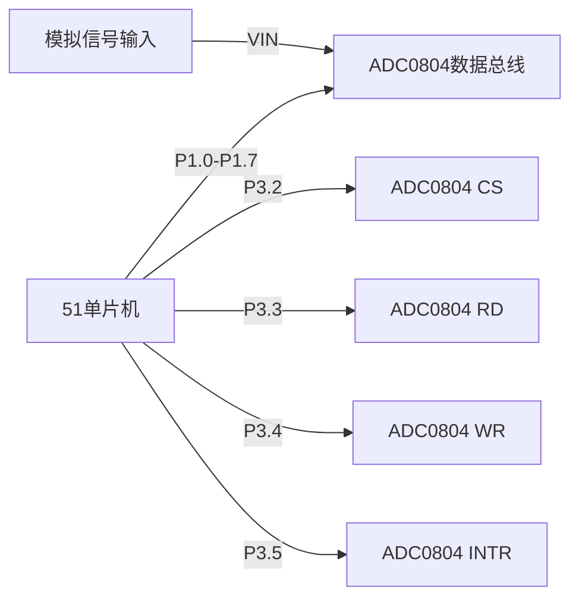

# 51单片机外部ADC接口

## 介绍

在嵌入式系统中，模拟信号（如温度、光强、电压等）的采集是一个常见的需求。51单片机本身通常不具备内置的模数转换器（ADC），因此需要通过外部ADC芯片来实现模拟信号的采集与转换。本文将详细介绍如何使用51单片机与外部ADC接口进行通信，并实现模拟信号的采集。

## 什么是ADC？

ADC（Analog-to-Digital Converter，模数转换器）是一种将模拟信号转换为数字信号的设备。模拟信号是连续变化的信号，而数字信号是离散的。通过ADC，我们可以将现实世界中的模拟信号（如电压、电流等）转换为单片机可以处理的数字信号。

## 外部ADC接口的基本原理

外部ADC接口通常通过串行通信协议（如SPI、I2C）或并行接口与51单片机进行通信。51单片机通过发送控制信号和读取数据来获取ADC转换后的数字值。

### 常见的ADC芯片

- **ADC0804**：8位并行输出ADC芯片，适用于简单的模拟信号采集。
- **ADS1115**：16位I2C接口ADC芯片，精度高，适用于需要高精度采集的场景。

## 51单片机与外部ADC的连接

以ADC0804为例，以下是51单片机与ADC0804的连接示意图：



### 连接说明

- **数据总线**：ADC0804的8位数据输出连接到51单片机的P1口。
- **CS**：片选信号，连接到P3.2。
- **RD**：读信号，连接到P3.3。
- **WR**：写信号，连接到P3.4。
- **INTR**：中断信号，连接到P3.5。

## 代码示例

以下是一个简单的代码示例，展示如何使用51单片机读取ADC0804的转换结果。

```c
#include <reg51.h>

sbit CS = P3^2;  // 片选信号
sbit RD = P3^3;  // 读信号
sbit WR = P3^4;  // 写信号
sbit INTR = P3^5; // 中断信号

void delay(unsigned int time) {
    unsigned int i, j;
    for(i = 0; i < time; i++)
        for(j = 0; j < 120; j++);
}

unsigned char read_adc() {
    unsigned char adc_value;
    
    CS = 0;  // 选中ADC0804
    WR = 0;  // 启动转换
    delay(1); // 延时等待转换完成
    WR = 1;
    
    while(INTR == 1); // 等待转换完成
    
    RD = 0;  // 读取转换结果
    adc_value = P1;  // 读取数据总线
    RD = 1;
    CS = 1;  // 取消选中
    
    return adc_value;
}

void main() {
    unsigned char result;
    while(1) {
        result = read_adc();
        // 处理result，例如显示在LCD上或通过串口发送
    }
}
```

### 代码说明

1. **delay函数**：用于产生一个简单的延时，确保ADC有足够的时间完成转换。
2. **read_adc函数**：负责启动ADC转换并读取转换结果。
3. **main函数**：循环读取ADC的值，并可以进一步处理这些值。

## 实际应用案例

### 温度监测系统

假设我们需要设计一个温度监测系统，使用热敏电阻作为温度传感器。热敏电阻的阻值随温度变化，通过分压电路将阻值变化转换为电压变化，然后通过ADC0804将电压值转换为数字信号，最后由51单片机读取并处理。


### 系统工作流程

1. 热敏电阻的阻值随温度变化，导致分压电路的输出电压变化。
2. ADC0804将模拟电压转换为数字信号。
3. 51单片机读取ADC0804的输出，并根据预设的温度阈值进行判断，决定是否触发报警或显示当前温度。

## 总结

通过本文的学习，你应该已经掌握了如何使用51单片机与外部ADC接口进行通信，并实现模拟信号的采集与转换。外部ADC接口在嵌入式系统中有着广泛的应用，尤其是在需要高精度模拟信号采集的场景中。

## 附加资源与练习

- **练习1**：尝试使用不同的ADC芯片（如ADS1115）与51单片机进行通信，并比较其精度与速度。
- **练习2**：设计一个简单的光强监测系统，使用光敏电阻作为传感器，并通过ADC0804采集光强数据。
- **资源**：查阅ADC0804和ADS1115的数据手册，了解其详细的工作原理与寄存器配置。

:::tip
在实际项目中，选择合适的ADC芯片非常重要。高精度的ADC芯片可以提供更准确的测量结果，但也会增加系统的复杂性和成本。
:::